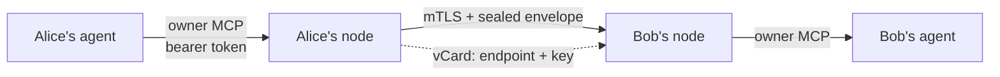

# pact-gateway

**Give your AI agent an address other people's agents can reach.**

One static Go binary that runs a personal, permission-gated
[MCP](https://modelcontextprotocol.io) server on the open internet — so someone
else's assistant can message you, ask when you are free, and book time with you,
with no platform in the middle deciding who may talk to whom.

[](https://github.com/tech-sumit/pact-gateway/actions/workflows/ci.yml)
[](../LICENSE)
[](go.mod)
[](https://github.com/tech-sumit/pact-protocol)
[](#no-telemetry-ever)


> **Status: feature-complete against [`SPEC.md`](SPEC.md), not yet released.** The
> repository is private while the last owner-only checks are done, so there is no
> public issue tracker yet — see [SUPPORT.md](SUPPORT.md). If you are reading
> this, you were invited: [CONTRIBUTING.md](CONTRIBUTING.md) is the place to start.

---

## The problem

Two people each have an assistant. Today those assistants cannot talk to each
other unless both people chose the same product — and then that product sits in
the middle of every word.

The fix is not another chat app. It is what email already proved: **everyone runs
their own endpoint, and addresses are portable.** PACT is that idea for agents,
and `pact-gateway` is the endpoint you run.



No server in that picture has to be trusted by both parties. Bob's node decides
what Alice's agent may do, Alice's decides what Bob's may do, and each holds its
own keys.

## What makes it different

- **You are a keypair, not an account.** Your identity is the SHA-256 of your
  public key. Nothing to sign up for, no username, no provider to be locked out of.
- **Every capability is an MCP tool behind a per-contact switchboard.** A close
  friend can book time. A stranger who redeemed a one-time invite can send one
  message and discover nothing else — `tools/list` is filtered per caller.
- **Sealed end to end.** Payloads are HPKE-sealed and signed, so tunnels and edges
  carry ciphertext. They learn which key a message is for and when — never who sent
  it, and never what it says.
- **It works from behind CGNAT.** Direct, Tailscale, frp, ngrok, Cloudflare, or your
  own domain. With no inbound path at all you need one of those tunnels — or a host:
  there is no store-and-forward relay, because one would see every sender, recipient
  and timestamp for its trouble (PACT §9).
- **One binary, SQLite by default.** No cluster, no broker, no queue. Postgres
  when you want it.

## What a contact actually is

A **vCard** — the format your phone already understands, plus two fields.
Sharing your agent's address is sharing a contact.


`X-PACT-CERT` is one certificate — the **leaf** your own root issued this host —
and it carries everything: where to reach you, the key to seal to, the
fingerprint of the root that is your identity, and how long it is good for. What
a contact pins is that root, never the host's key, which is what lets you change
hosts without changing who you are. `X-PACT-SEAL` says whether to seal. That is
the whole address book.

---

## Quickstart

Five minutes from nothing to a working node. You need Docker with Compose.

```
cd pact-gateway/pact-gateway
docker compose up -d
docker compose logs pact-gateway | grep -A2 "setup"
```

The log prints your portal URL and a **one-time setup token**. Open it — the
wizard registers your first **passkey**, which is the node's only login, on every
bind including loopback. Register a second on another device: there is
deliberately no online recovery path. If you lose them all, recovery needs shell
access on the host — `pact-gateway passkey reset-wizard` mints a one-time link
that re-opens registration.

Then create the identity people will reach:

```
docker compose exec pact-gateway pact-gateway account create --slug me --name "Your Name"
```

Open *Card* in the portal and download `me.vcf`. That is what you hand to people.

> This quickstart is not prose someone hopes still works. An automated scenario
> builds these images, drives the portal through a real Chrome, registers a
> passkey with a virtual authenticator, and pairs a contact. Running it as written
> is how three bugs in it were found.

## How-to

### Invite someone

*Invites* → **Create** gives you a `/i/<token>` link and a QR to send however you
like. An invite is server-side state: it can expire, be limited to one use, carry
a permission preset, and be revoked. Nothing sensitive rides in the URL itself.

### Add someone who invited you

Mint a token for your agent, over the admin socket:

```
pact-gateway token create -owner <owner-id> -label "my agent"
```

Then, from your agent on the owner MCP:

```json
{"name": "add_contact",
 "arguments": {"account_id": "…", "invite_url": "https://their.example/i/abc123"}}
```

Your node fetches their card, checks that the key hashes to the fingerprint the
card claims, verifies the card's signature, and only then redeems — pinning them.

### Let your own agent run the node

The owner MCP is a second surface, separate from the public one, with **33 tools**
on a running node: read the inbox, send to a contact, approve or reject requests,
block, unblock and remove contacts, answer a contact waiting at a new address, create, list and revoke invites, set
permissions, manage integrations, query the audit chain. It requires named, revocable bearer tokens on
every bind, loopback included.

### Decide what each contact may do

Permissions are dotted and per-contact — `message.text`, `message.media`,
`calendar.availability`, `calendar.book`, `integration.<name>` — set from a preset
or one by one. Availability answers with at most five policy-filtered slots and
never your raw free/busy.

### Expose a tool from another MCP server

Connect an upstream server (streamable-HTTP, SSE, or a supervised stdio child) and
publish **only the tools you choose**, either passthrough or mapped onto PACT's own
vocabulary through a recipe. Exposing a write-capable tool takes a recorded
acknowledgment, and an upstream that changes underneath you is narrowed, never
silently widened.

### Manage your passkeys, and get back in if you lose them

A passkey is the node's only login, on **every** bind including loopback — there
is no local-access shortcut. So the way back in matters. All three need the node
running; they talk over the admin unix socket, whose permissions are the host's.

```
pact-gateway passkey list                 # id, tag, owner
pact-gateway passkey remove -id <id>      # refuses the last one
pact-gateway passkey reset-wizard         # a one-time link that re-opens registration
```

`reset-wizard` is the recovery path. It prints a URL valid for 24 hours and
usable once:

```
one-time setup URL (24h, single use):
http://localhost:8080/setup?token=b0527dbe01e36eed2ef51a576b4a2e34
```

Open it and register a new passkey. It **adds** one and removes nothing, so a
device you still have keeps working. This is the only thing that re-opens the
wizard once a passkey exists — reaching loopback does not, and neither does a
leftover first-run token, or any local process could quietly register itself as
an owner.

That makes **shell access on the host the root of trust for recovery**, which is
the honest trade: there is deliberately no online recovery path, no email reset,
nobody to ask. Register a second passkey on another device before you need one.

> Running in Docker? Prefix it: `docker compose exec pact-gateway pact-gateway
> passkey reset-wizard`. And sign in at `http://localhost:<port>`, not
> `127.0.0.1` — a loopback portal presents itself as `localhost` because an IP is
> not a valid WebAuthn relying-party ID, so that is the name your passkey is
> bound to.

### Take your data with you

Your identity is the **root** in your wallet. It is never on this node, so nothing here *is* you.
What you can take away is what is yours: your **contacts** and your **chats**.

```
pact-gateway export -out alina.pact-export
pact-gateway import -from alina.pact-export
```

Both are offline (stop the node first) and both need host shell access. They work on SQLite and on
Postgres alike, because the file is written through the node's own store rather than copied out of
a database.

**An export carries contacts and chats, and nothing else.** No key of any kind — not a leaf's, not
the node's master key — and no settings, integration credentials, tokens, passkeys, invites or
audit history: those belong to the host that made them. An import refuses a file that holds
anything more, down to a single unknown field.

So every import ends the same way, whether it is a new machine, a new host, or this node after it
lost its master key: the identity is there by name with its contacts and conversations, it is
**not served**, and `serve` names the certificate request to make. Your wallet issues the new host
a leaf of its own, and that is what tells your contacts where you are now.

### Be reachable

| You have | Use |
|---|---|
| A public IP | `direct` |
| A tailnet | `tailscale`, with Funnel for the public side |
| A VPS you already run | `frp`, or the built-in **ingress role** on your own domain |
| Neither, but an account | `ngrok`, `cloudflare` |
| No inbound path at all | a tunnel from the rows above, or let a provider host the identity under a leaf you issue (PACT §9) |

Then check your work:

```
pact-gateway doctor
```

It derives your deployment mode, probes your endpoint, and reports what an
outside caller would actually see.

---

## Every call is audited

Append-only and hash-chained, recording refusals as loudly as successes. "What did
my node actually do" has an answer, and it is not one that can be quietly edited.


## No telemetry, ever

The node contacts nothing except what you configured. No phone-home, no crash
reporter, no analytics, and no build flag that turns one on.

---

## Why you might trust this with your keys

Claims are cheap, so here is what is actually checked.

**The spec comes first.** [`SPEC.md`](SPEC.md) is normative, and a wire-visible
change needs a spec edit before code. The protocol lives in a
[separate repository](https://github.com/tech-sumit/pact-protocol) so other
implementations can exist.

**Tests that run the product rather than a mock.** More than 500 test functions,
with the store's conformance suite run on **both** storage engines, and a fuzz
target, run in CI by `make fuzz`, on everything this code parses from untrusted
input — `FuzzSealedEnvelope` (an envelope's decode and the whole open),
`FuzzVCardParse`, `FuzzInviteOffer` and `FuzzRedact` — plus `govulncheck` on
every run. [SECURITY.md](../SECURITY.md) states plainly what is and
is not hardened yet.

**A harness that builds the world.** 14 live scenarios stand the real binary up
in containers and drive it as a person would:

| Scenario | What is real about it | Test |
|---|---|---|
| Pairing and messaging | The setup wizard in Chrome with a virtual authenticator, the owner MCP over a bearer token, a contact's agent over real mTLS | `TestPairingAndMessagingEndToEnd` |
| Media and the fetch guard | Inline and url media from a contact; the owner's fetch reaches a host on a routable network and is refused a private address and a redirect, with a canary on the home network never reached | `TestMessagingAndMediaUnderTheFetchGuard` |
| Both directions | After pairing, each side messages the other | `TestMessagingWorksBothWaysAfterPairing` |
| Approval | The owner approves over the owner MCP, and both nodes then say active | `TestApprovingAContactReachesThePeer` |
| Rejection | The requester's own node learns it was rejected; an unblock lets them ask again | `TestRejectingAContactReachesThePeerAndUnblockLetsThemAskAgain` |
| Adversarial probes | A stranger, an over-reaching contact, and the audit chain intact through every refusal — over a real socket | `TestAdversarialProbesAreRefused` |
| Portal affordances | Every action an owner needs, found on the page Chrome draws for a signed-in owner | `TestPortalOffersEveryAffordanceAnOwnerNeeds` |
| Portal themes | Every portal page rendered in Chrome, light and dark | `TestEveryPortalPageRendersInBothThemes` |
| Impairment | Latency and loss, and a partition that severs the node and then heals | `TestResilienceUnderImpairment` |
| A move under a partition | A contact cut off while the move campaign runs is named, and told on resume | `TestAMoveCampaignSurvivesAPartition` |
| Own-domain ingress | A containerised ACME CA and an authoritative DNS zone | `TestOwnDomainIngressServesPassthroughAndTerminate` |
| Tunnel | A self-hosted `frps`; the node's own certificate has to survive the hop | `TestNodeIsReachableThroughSelfHostedFrps` |
| Cloudflare | Two people over two real Cloudflare tunnels on a real domain (an owner run: it needs an account) | `TestTwoUsersOverRealCloudflareTunnels` |
| Calendar | A real CalDAV server behind a third-party MCP server nobody here wrote | `TestContactBooksIntoRealCalDAV` |

Under them, the harness's own live tests prove the ground they stand on: isolated segments that are
genuinely unreachable (`TestLiveInternalNetworkIsGenuinelyUnreachable`), NAT that
gives outbound and no inbound (`TestLiveNATGivesOutboundButNoInbound`), and a guest
whose clock is set elsewhere (`TestGuestClockTravelsAndTheNodeBelievesIt`).

**It finds real bugs in this code.** That is what it is for, and the findings stay
in the open in [`PLAN.md`](PLAN.md) — including the embarrassing ones: a whole
deployment mode that could not serve a single request, a memory cap that killed
every Node-based integration, credentials written to disk in the clear. Each entry
records how the defect was *proved*, not merely that it was fixed.

**A small dependency surface.** 25 direct dependencies, each a maintained library
doing something deliberately not hand-rolled: `certmagic` for ACME, `frp` and
`ngrok` for tunnels, `cedar-go` for authorization, `pgx` for Postgres.

---

## Documentation

| Document | What it is |
|---|---|
| [`SPEC.md`](SPEC.md) | Normative behaviour — the source of truth |
| [`PLAN.md`](PLAN.md) | The build record: every task, every defect, how each was proved |
| [`docs/operations.md`](docs/operations.md) | Running a node: reachability, export and import, recovery |
| [`docs/threat-model.md`](docs/threat-model.md) | Adversaries, assets, trust boundaries, and what is deliberately out of scope |
| [`docs/crypto-review-brief.md`](docs/crypto-review-brief.md) | The envelope construction, exactly, and the questions we want a reviewer to answer |
| [`docs/conformance.md`](docs/conformance.md) | The conformance checklist, each item citing its test |
| [`docs/harness-design.md`](docs/harness-design.md) | The scenario harness and what each topology proves |
| [`CONTRIBUTING.md`](CONTRIBUTING.md) | Build, test, and what a change must carry |
| [`RELEASING.md`](RELEASING.md) | Cutting a release, and how to verify one you downloaded |
| [`SECURITY.md`](../SECURITY.md) | Report a vulnerability privately — never as an issue |

## Honest trade-offs

Written down because they do not disappear by going unmentioned:

- **Tunnels and edges see metadata** — which node is called, size, timing. Sealed
  content stays ciphertext to them; the fact of a conversation does not.
- **No forward secrecy at the envelope layer.** A compromised leaf key opens
  envelopes an attacker kept from while it was current — bounded by the leaf's
  life, at most 398 days, and shorter if you renew.
- **Lose your root, lose that identity.** The root lives in your wallet and
  nowhere else — no host holds a copy and nobody can mint you another. Losing the
  host's *leaf* key is different and recoverable: your wallet issues a new one.
- **Card trust is channel trust.** A card handed over a hostile channel is a
  hostile card. The fingerprint is the thing to check.

## License

[Apache-2.0](../LICENSE).
