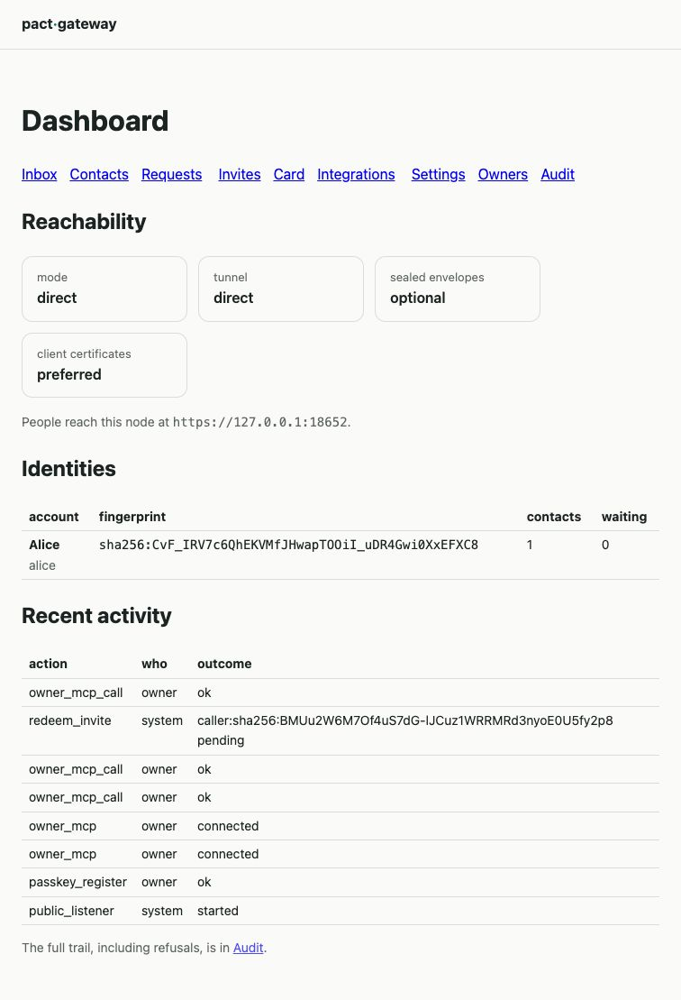
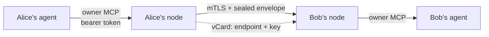
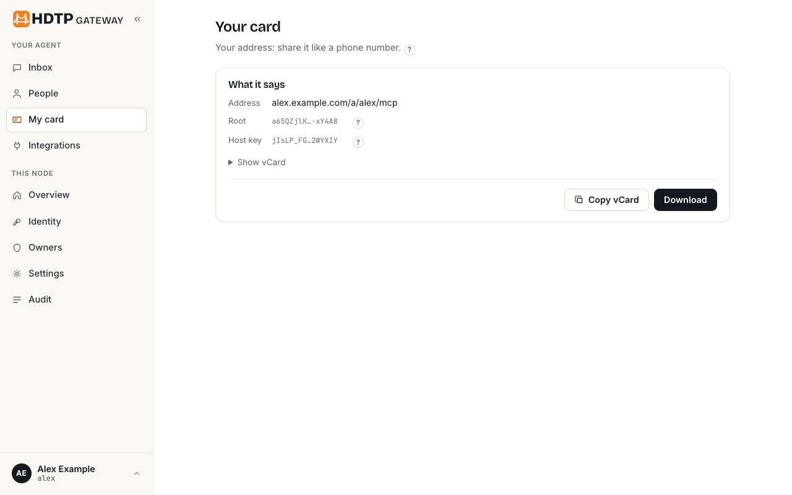
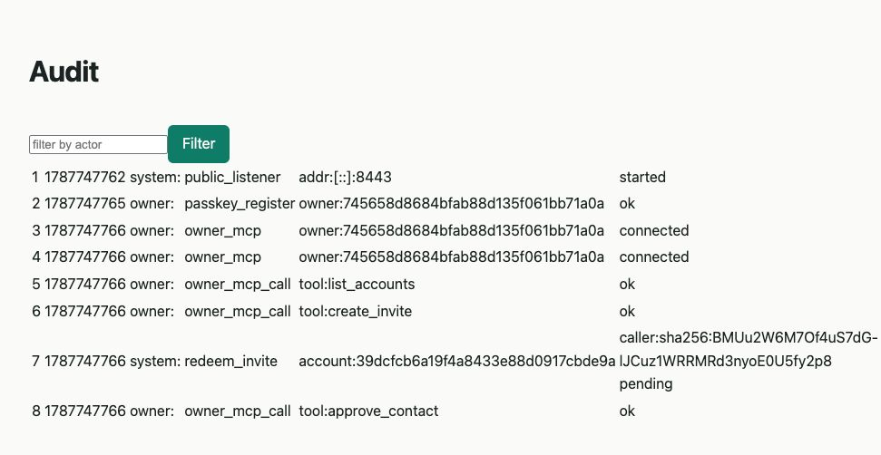

# pact-gateway

**Give your AI agent an address other people's agents can reach.**

One static Go binary that runs a personal, permission-gated
[MCP](https://modelcontextprotocol.io) server on the open internet — so someone
else's assistant can message you, ask when you are free, and book time with you,
with no platform in the middle deciding who may talk to whom.

[](LICENSE)
[](go.mod)
[](https://github.com/pact-cloud/pact-protocol)
[](#no-telemetry-ever)



> **Status: feature-complete against [`SPEC.md`](SPEC.md), not yet released.** The
> repository is private while the last owner-only checks are done, so there is no
> public issue tracker yet — see [SUPPORT.md](SUPPORT.md). If you are reading
> this, you were invited: [CONTRIBUTING.md](CONTRIBUTING.md) is the place to start.

---

## The problem

Two people each have an assistant. Today those assistants cannot talk to each
other unless both people chose the same product — and then that product sits in
the middle of every word.

The fix is not another chat app. It is what email already proved: **everyone runs
their own endpoint, and addresses are portable.** PACT is that idea for agents,
and `pact-gateway` is the endpoint you run.



No server in that picture has to be trusted by both parties. Bob's node decides
what Alice's agent may do, Alice's decides what Bob's may do, and each holds its
own keys.

## What makes it different

- **You are a keypair, not an account.** Your identity is the SHA-256 of your
  public key. Nothing to sign up for, no username, no provider to be locked out of.
- **Every capability is an MCP tool behind a per-contact switchboard.** A close
  friend can book time. A stranger who redeemed a one-time invite can send one
  message and discover nothing else — `tools/list` is filtered per caller.
- **Sealed end to end.** Payloads are HPKE-sealed and signed, so tunnels and edges
  carry ciphertext. They learn which key a message is for and when — never who sent
  it, and never what it says.
- **It works from behind CGNAT.** Direct, Tailscale, frp, ngrok, Cloudflare, or your
  own domain. With no inbound path at all you need one of those tunnels — or a host:
  there is no store-and-forward relay, because one would see every sender, recipient
  and timestamp for its trouble (PACT §9).
- **One binary, SQLite by default.** No cluster, no broker, no queue. Postgres
  when you want it.

## What a contact actually is

A **vCard** — the format your phone already understands, plus two fields.
Sharing your agent's address is sharing a contact.



`X-PACT-CERT` is one certificate — the **leaf** your own root issued this host —
and it carries everything: where to reach you, the key to seal to, the
fingerprint of the root that is your identity, and how long it is good for. What
a contact pins is that root, never the host's key, which is what lets you change
hosts without changing who you are. `X-PACT-SEAL` says whether to seal. That is
the whole address book.

---

## Quickstart

Five minutes from nothing to a working node. You need Docker with Compose, Go, Rust (cargo), and
SSH access to the private identity module (see [CONTRIBUTING.md](CONTRIBUTING.md#the-identity-module)).

```
make identity-proxy     # fetch the identity module on this machine, for the image build
make limitd-vendor      # and the limits sidecar's crates, which include the identity's pact-limits
docker compose up -d    # the node and its limits sidecar (SPEC §5.7)
docker compose logs pact-gateway | grep -A2 "setup"
```

The log prints your portal URL and a **one-time setup token**. Open it — the
wizard registers your first **passkey**, which is the node's only login, on every
bind including loopback. Register a second on another device: there is
deliberately no online recovery path. If you lose them all, recovery needs shell
access on the host — `pact-gateway passkey reset-wizard` mints a one-time link
that re-opens registration.

Then create the identity people will reach, and have your wallet certify this node for it (see
[Your wallet](#your-wallet)):

```
docker compose exec pact-gateway pact-gateway account create --slug me --name "Your Name"
docker compose exec -T pact-gateway pact-gateway account csr --slug me > me.csr
pact id create --name "Your Name" --vault me.pact-vault.json
pact id issue --vault me.pact-vault.json --csr me.csr --chain-out chain.pem
docker compose cp chain.pem pact-gateway:/tmp/chain.pem
docker compose exec pact-gateway pact-gateway account install-leaf --slug me --chain /tmp/chain.pem
```

Open *Card* in the portal and download `me.vcf`. That is what you hand to people. Until the chain is
installed there is no card: the page says the account has no certificate yet.

> This quickstart is not prose someone hopes still works. An automated scenario
> builds these images, drives the portal through a real Chrome, registers a
> passkey with a virtual authenticator, and pairs a contact. Running it as written
> is how three bugs in it were found.

## How-to

### Invite someone

*Invites* → **Create** gives you a `/i/<token>` link and a QR to send however you
like. An invite is server-side state: it can expire, be limited to one use, carry
a permission preset, and be revoked. Nothing sensitive rides in the URL itself.

### Add someone who invited you

Mint a token for your agent, over the admin socket:

```
pact-gateway token create -owner <owner-id> -label "my agent"
```

Then, from your agent on the owner MCP:

```json
{"name": "add_contact",
 "arguments": {"account_id": "…", "invite_url": "https://their.example/i/abc123"}}
```

Your node fetches their card, checks that the key hashes to the fingerprint the
card claims, verifies the card's signature, and only then redeems — pinning them.

### Let your own agent run the node

The owner MCP is a second surface, separate from the public one, with **33 tools**
on a running node: read the inbox, send to a contact, approve or reject requests,
block, unblock and remove contacts, answer a contact waiting at a new address, create, list and revoke invites, set
permissions, manage integrations, query the audit chain. It requires named, revocable bearer tokens on
every bind, loopback included.

### Decide what each contact may do

Permissions are dotted and per-contact — `message.text`, `message.media`,
`calendar.availability`, `calendar.book`, `integration.<name>` — set from a preset
or one by one. Availability answers with at most five policy-filtered slots and
never your raw free/busy.

### Expose a tool from another MCP server

Connect an upstream server (streamable-HTTP, SSE, or a supervised stdio child) and
publish **only the tools you choose**, either passthrough or mapped onto PACT's own
vocabulary through a recipe. Exposing a write-capable tool takes a recorded
acknowledgment, and an upstream that changes underneath you is narrowed, never
silently widened.

### Manage your passkeys, and get back in if you lose them

A passkey is the node's only login, on **every** bind including loopback — there
is no local-access shortcut. So the way back in matters. All three need the node
running; they talk over the admin unix socket, whose permissions are the host's.

```
pact-gateway passkey list                 # id, tag, owner
pact-gateway passkey remove -id <id>      # refuses the last one
pact-gateway passkey reset-wizard         # a one-time link that re-opens registration
```

`reset-wizard` is the recovery path. It prints a URL valid for 24 hours and
usable once:

```
one-time setup URL (24h, single use):
http://localhost:8080/setup?token=b0527dbe01e36eed2ef51a576b4a2e34
```

Open it and register a new passkey. It **adds** one and removes nothing, so a
device you still have keeps working. This is the only thing that re-opens the
wizard once a passkey exists — reaching loopback does not, and neither does a
leftover first-run token, or any local process could quietly register itself as
an owner.

That makes **shell access on the host the root of trust for recovery**, which is
the honest trade: there is deliberately no online recovery path, no email reset,
nobody to ask. Register a second passkey on another device before you need one.

> Running in Docker? Prefix it: `docker compose exec pact-gateway pact-gateway
> passkey reset-wizard`. And sign in at `http://localhost:<port>`, not
> `127.0.0.1` — a loopback portal presents itself as `localhost` because an IP is
> not a valid WebAuthn relying-party ID, so that is the name your passkey is
> bound to.

### Your wallet

Your identity is a **root**, and the root lives in your **wallet**, never on this node. The node
holds a **leaf**: a certificate your root issues to this host, for one address, until one date
(PACT §9, §14.1). The node makes the request, the wallet signs it, the node installs the answer:

```
pact-gateway account csr -slug me > me.csr              # the request: this host's key and address
pact id issue --vault me.pact-vault.json --csr me.csr --chain-out chain.pem
pact-gateway account install-leaf -slug me -chain chain.pem
```

The wallet a self-hoster uses is the `pact` CLI from pact-identity. `pact id create` makes the root
once, in a vault file under a passphrase; `pact id issue` shows what a request names and asks
before it signs. `account csr` prints only the request on its standard output (what it is for goes
to standard error), and `install-leaf` takes the two certificates `--chain-out` writes, leaf then
root. `account csr -slug me -purpose renew` asks for the next leaf before this one runs out, and
`-purpose move` for a leaf at a new address.

The root never comes to this node, and nothing here can make one: losing the vault and its
passphrase is losing that identity.

**A web wallet, from the portal.** Once an identity has its first leaf, *Identity → Sign with my
web wallet* asks a web wallet (`PACT_WALLET_URL`, pact-cloud's ceremony page by default) for the
next one: a renewal, or a move when the address changes. The page shows what it will ask and
changes nothing until you continue; a request already waiting is replaced only if you confirm it.
The wallet sends its answer back to this node's `/wallet/return` in the same browser, and the
portal installs it with your session. This is the node's side of it. The wallet's `/sign` page is
pact-cloud's and is not live yet, and how browsers treat a public page sending you back to
`http://localhost` has not been measured, so until both are, use the `pact` CLI.

**After a move.** When an install moves the identity to a new address, both the CLI and the portal
say so, and say to run `pact-gateway account announce -slug me` until no contact is waiting: the
previous certificate stays valid until its own date for contacts not yet told. When the identity
came from another host, that is also when to delete it there. When this node itself moved to a new
address, there is nothing to delete: the previous certificate goes on answering here until it
expires.

### Leave this node

When you have moved an identity to another host, tell this one to forget it:

```
pact-gateway account leave -slug me          # shows what it would erase, erases nothing
pact-gateway account leave -slug me -yes     # erases it
```

It refuses an identity this node serves at its own address for it right now — which is what
"delete it at the old host" would name after a move to another address on this same node — unless
you add `-force-current`.

It erases every record of the identity at once: its contacts, chats, media no other identity here
uses, invites, integrations and their OAuth client credentials, tokens scoped to it, its settings,
and every leaf key this node held for it. The live node stops answering for it straight away, as for an address it never served.

The audit trail is the one thing the erase does not reach at once: it is append-only (by trigger)
and hash-chained. PACT §9 asks a host to "keep nothing beyond what law compels", so the rows that
name the identity by its account id — with its slug and its contacts' fingerprints as they wrote
them — stay in the live trail for `audit_archive_after` (90 days unless you set it:
`PACT_AUDIT_ARCHIVE_AFTER=30d`, or `audit_archive_after` in the config file), long enough to review
the leave on the portal's audit page. Then the hourly sweep moves every one of them to
`<data_dir>/audit-archive/<account-id>-<first>-<last>.jsonl` (mode 0600) and writes one
`audit_archive` row that names the segment and its hashes, not the identity. (Rows you had
already moved to the head archive with `audit archive -through N` stay in that file.) `pact-gateway audit
verify` (node stopped) checks the table and the archives as one chain and reports a changed or
missing archive as broken. The archive is kept. If law requires its rows to go,
`pact-gateway audit erase-archive -file <name>` keeps only each row's seq and hashes, so the chain
still verifies, and records that it did (SPEC §3.11, §11.6).

On SQLite the leaf keys are destroyed, not only deleted: the node zeroes deleted rows
(`secure_delete`) and truncates its write-ahead log after the leave. On Postgres it cannot: a
deleted row stays as a dead tuple until VACUUM reuses its space, in the write-ahead log until the
segment is recycled, and in every backup — sealed under the node's keyring, but not destroyed. SPEC
§3.9 names this divergence.

The address stays **reserved** until the last leaf issued for it expires (PACT §9): until then no
identity can be created under that slug here, and no signing request can name that address. The
command prints each address it reserved and until when. It is refused while a move campaign for
that identity is running (`account announce -slug me` says when it has finished). There is no undo,
and no portal or owner-MCP button: like `import`, it needs shell access on the host.

### Take your data with you

Your identity is the **root** in your wallet. It is never on this node, so nothing here *is* you.
What you can take away is what is yours: your **contacts**, your **chats** and the **files** in
them — one identity at a time, in one zip that the cloud and any other PACT host read too.

```
pact-gateway export -slug alina -out alina.zip
pact-gateway import alina.zip -slug alina          # shows what it would write, writes nothing
pact-gateway import alina.zip -slug alina -yes     # writes it
```

Both are offline (stop the node first) and both need host shell access. They work on SQLite and on
Postgres alike, because the file is written through the node's own store rather than copied out of
a database.

**The file is not encrypted.** Anyone who gets it can read your contact list and all your
conversations and files; `export` says so before it writes. It holds no keys, so it cannot be used
to speak as you — no leaf's key, not the node's master key — and no settings, integration
credentials, tokens, passkeys, invites or audit history: those belong to the host that made them.
Keep it where you keep private documents, and delete it once it has been imported.

**An import checks the whole file before it writes anything,** and refuses it whole at the first
fault. Into a slug that is not here, the identity arrives with its root and nothing more — **not
served** until your wallet issues this host a leaf; into the identity it belongs to, it merges,
and every pin this host already holds stands. Either way it ends with a request for a new leaf that
the import makes itself (complete it in your web wallet from the portal, or with the CLI wallet from
the request it prints; `account certificate` and `doctor` keep naming it until it is done), and
installing that leaf tells the imported contacts where you are now. An export reads its own file
back before it reports it, and warns when the file is more than PACT Cloud takes back in.

### Be reachable

| You have | Use |
|---|---|
| A public IP | `direct` |
| A tailnet | `tailscale`, with Funnel for the public side |
| A VPS you already run | `frp`, or the built-in **ingress role** on your own domain |
| Neither, but an account | `ngrok`, `cloudflare` |
| No inbound path at all | a tunnel from the rows above, or let a provider host the identity under a leaf you issue (PACT §9) |

Then check your work:

```
pact-gateway doctor
```

It derives your deployment mode, probes your endpoint, and reports what an
outside caller would actually see.

---

## Every call is audited

Append-only and hash-chained, recording refusals as loudly as successes. "What did
my node actually do" has an answer, and it is not one that can be quietly edited.



## No telemetry, ever

The node contacts nothing except what you configured. No phone-home, no crash
reporter, no analytics, and no build flag that turns one on.

---

## Why you might trust this with your keys

Claims are cheap, so here is what is actually checked.

**The spec comes first.** [`SPEC.md`](SPEC.md) is normative, and a wire-visible
change needs a spec edit before code. The protocol lives in a
[separate repository](https://github.com/pact-cloud/pact-protocol) so other
implementations can exist.

**Tests that run the product rather than a mock.** More than 500 test functions,
with the store's conformance suite run on **both** storage engines, and a fuzz
target, run under `-fuzz` by `make fuzz` in the pre-push gate, on everything this code parses from untrusted
input — `FuzzSealedEnvelope` (an envelope's decode and the whole open),
`FuzzVCardParse`, `FuzzInviteOffer` and `FuzzRedact` — plus `govulncheck` on
every push. [SECURITY.md](https://github.com/pact-cloud/.github/blob/main/SECURITY.md) states plainly what is and
is not hardened yet.

**A harness that builds the world.** 23 live scenarios stand the real binary up
in containers and drive it as a person would:

| Scenario | What is real about it | Test |
|---|---|---|
| First run | A pristine node serving its portal on every interface over TLS: the setup token admits the wizard, survives its first requests, and dies with the passkey Chrome registers | `TestFirstRunFromAPristineImage` |
| Pairing and messaging | The setup wizard in Chrome with a virtual authenticator, the owner MCP over a bearer token, a contact's agent over real mTLS | `TestPairingAndMessagingEndToEnd` |
| Media and the fetch guard | Inline and url media from a contact; the owner's fetch reaches a host on a routable network and is refused a private address and a redirect, with a canary on the home network never reached | `TestMessagingAndMediaUnderTheFetchGuard` |
| Both directions | After pairing, each side messages the other | `TestMessagingWorksBothWaysAfterPairing` |
| Approval | The owner approves over the owner MCP, and both nodes then say active | `TestApprovingAContactReachesThePeer` |
| Rejection | The requester's own node learns it was rejected; an unblock lets them ask again | `TestRejectingAContactReachesThePeerAndUnblockLetsThemAskAgain` |
| Adversarial probes | A stranger, an over-reaching contact, and the audit chain intact through every refusal — over a real socket | `TestAdversarialProbesAreRefused` |
| The intrusion battery | pact-identity's live battery (`pact vectors intrude`): forged, tampered, replayed and expired envelopes and every chain shape, from an attacker with new keys each run, with one call that must get through; each refusal on the audit trail | `TestTheIntrusionBatteryIsRefusedByANode` |
| The conformance battery | The cloud's Go battery of the wire, aimed at a node through its owner MCP: the guest tier, the per-root budget, envelopes, invites, a key past its leaf's life answered `certificate_renewed`, the audit rows hashed as the reference hashes them | `TestTheConformanceBatteryPassesAgainstANode` |
| Journeys between two nodes | An owner's own invite refused, a revoked invite refused, every contact-naming owner tool refusing a contact nobody holds, block and unblock, a removal that reaches the peer, a token scoped to one identity, and an identity that leaves | `TestTheJourneysTheNodeHadNoScenarioFor` |
| The hostile export corpus | Every file of pact-identity's shared corpus handed to the shipped image's `import`, each over a data directory of its own: refused in the corpus's words with nothing written, the valid files reviewed and then taken whole | `TestTheHostileCorpusIsRefusedByTheShippedImage` |
| Behind Envoy | The node, its limits sidecar and Envoy running `deploy/envoy`: one address flooding the MCP endpoint and the rest refused 429 at the edge and past its budget `rate_limited` behind it — a forged address header changes nothing — while a second address is let through both; a chain presented to Envoy proven at the node, the same chain forged as a header through Envoy or straight to the node proving nothing; and a sealed call answered end to end | `TestTheNodeBehindEnvoyIsLimitedPerCallerAtBothLayers` |
| The real wallet page | pact-cloud's local cloud (the real Worker under workerd): an identity certified through the real wallet page, imported into a node, its move signed on the node's portal through the real `POST /sign` with the same passkey, replayed and forged returns refused, and back into the cloud | `TestTheRealWalletSignsANodesMove` |
| Portal affordances | Every action an owner needs, found on the page Chrome draws for a signed-in owner | `TestPortalOffersEveryAffordanceAnOwnerNeeds` |
| Portal themes | Every portal page rendered in Chrome, light and dark | `TestEveryPortalPageRendersInBothThemes` |
| Impairment | Latency and loss, and a partition that severs the node and then heals | `TestResilienceUnderImpairment` |
| A move under a partition | A contact cut off while the move campaign runs is named, and told on resume | `TestAMoveCampaignSurvivesAPartition` |
| A move by export and import | An identity exported offline from one host and imported onto another that never held it; the new host's first leaf hands a peer that pins it the new address | `TestAPeerFollowsAnIdentityImportedOntoANewHost` |
| A peer that blocked the identity | The same move, and a peer that had blocked the identity: the handshake's request meets its block, and its pin does not move | `TestAPeerThatBlockedTheIdentityDecidesUnderItsOwnPolicy` |
| Own-domain ingress | A containerised ACME CA and an authoritative DNS zone | `TestOwnDomainIngressServesPassthroughAndTerminate` |
| Tunnel | A self-hosted `frps`; the node's own certificate has to survive the hop | `TestNodeIsReachableThroughSelfHostedFrps` |
| Cloudflare | Two people over two real Cloudflare tunnels on a real domain (an owner run: it needs an account) | `TestTwoUsersOverRealCloudflareTunnels` |
| Calendar | A real CalDAV server behind a third-party MCP server nobody here wrote | `TestContactBooksIntoRealCalDAV` |

Under them, the harness's own live tests prove the ground they stand on: isolated segments that are
genuinely unreachable (`TestLiveInternalNetworkIsGenuinelyUnreachable`), NAT that
gives outbound and no inbound (`TestLiveNATGivesOutboundButNoInbound`), and a guest
whose clock is set elsewhere (`TestGuestClockTravelsAndTheNodeBelievesIt`).

**It finds real bugs in this code.** That is what it is for, and the findings stay
in the open in [`PLAN.md`](PLAN.md) — including the embarrassing ones: a whole
deployment mode that could not serve a single request, a memory cap that killed
every Node-based integration, credentials written to disk in the clear. Each entry
records how the defect was *proved*, not merely that it was fixed.

**A small dependency surface.** 25 direct dependencies, each a maintained library
doing something deliberately not hand-rolled: `certmagic` for ACME, `frp` and
`ngrok` for tunnels, `cedar-go` for authorization, `pgx` for Postgres.

---

## Documentation

| Document | What it is |
|---|---|
| [`SPEC.md`](SPEC.md) | Normative behaviour — the source of truth |
| [`PLAN.md`](PLAN.md) | The build record: every task, every defect, how each was proved |
| [`docs/operations.md`](docs/operations.md) | Running a node: reachability, export and import, recovery |
| [`docs/threat-model.md`](docs/threat-model.md) | Adversaries, assets, trust boundaries, and what is deliberately out of scope |
| [`docs/crypto-review-brief.md`](docs/crypto-review-brief.md) | The envelope construction, exactly, and the questions we want a reviewer to answer |
| [`docs/conformance.md`](docs/conformance.md) | The conformance checklist, each item citing its test |
| [`docs/harness-design.md`](docs/harness-design.md) | The scenario harness and what each topology proves |
| [`CONTRIBUTING.md`](CONTRIBUTING.md) | Build, test, and what a change must carry |
| [`RELEASING.md`](RELEASING.md) | Cutting a release, and how to verify one you downloaded |
| [`SECURITY.md`](https://github.com/pact-cloud/.github/blob/main/SECURITY.md) | Report a vulnerability privately — never as an issue |

## Honest trade-offs

Written down because they do not disappear by going unmentioned:

- **Tunnels and edges see metadata** — which node is called, size, timing. Sealed
  content stays ciphertext to them; the fact of a conversation does not.
- **No forward secrecy at the envelope layer.** A compromised leaf key opens
  envelopes an attacker kept from while it was current — bounded by the leaf's
  life, at most 398 days, and shorter if you renew.
- **Lose your root, lose that identity.** The root lives in your wallet and
  nowhere else — no host holds a copy and nobody can mint you another. Losing the
  host's *leaf* key is different and recoverable: your wallet issues a new one.
- **Card trust is channel trust.** A card handed over a hostile channel is a
  hostile card. The fingerprint is the thing to check.

## License

[Apache-2.0](LICENSE).
