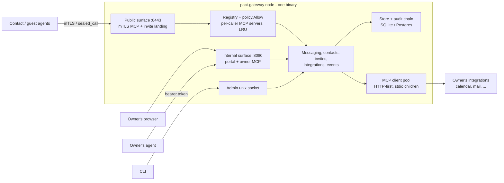
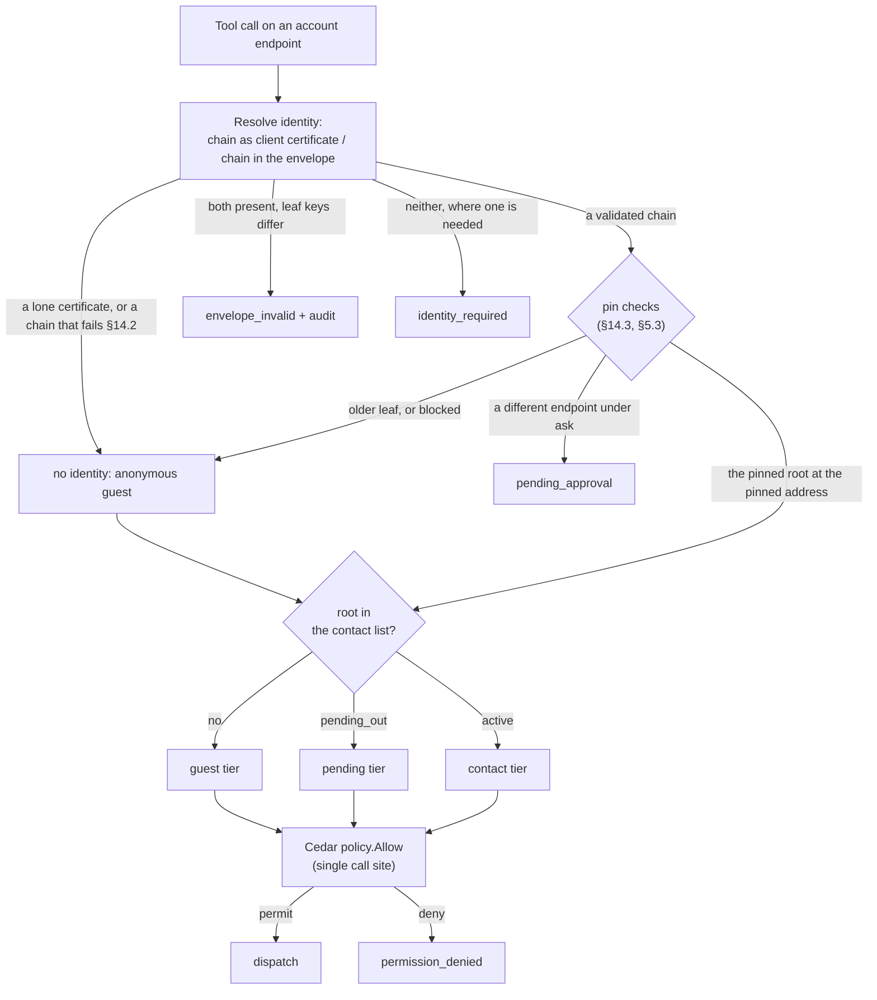
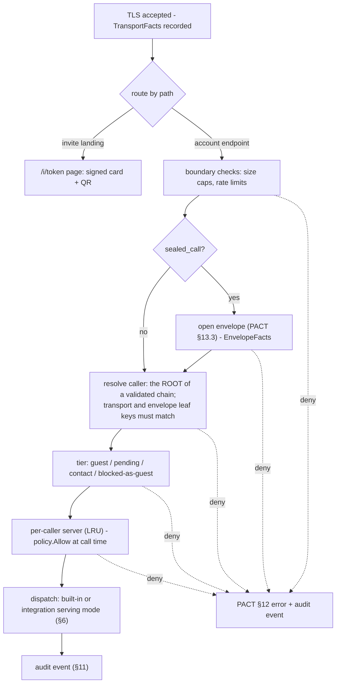
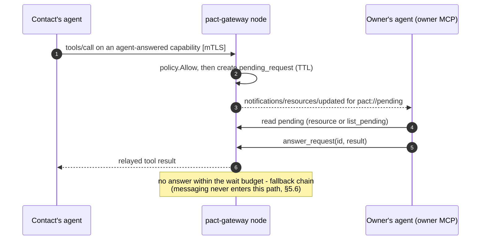
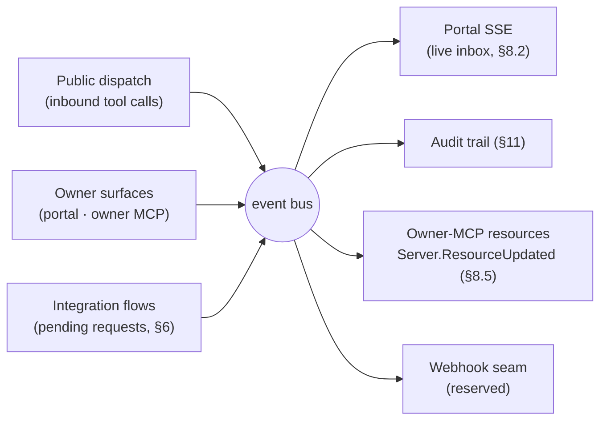
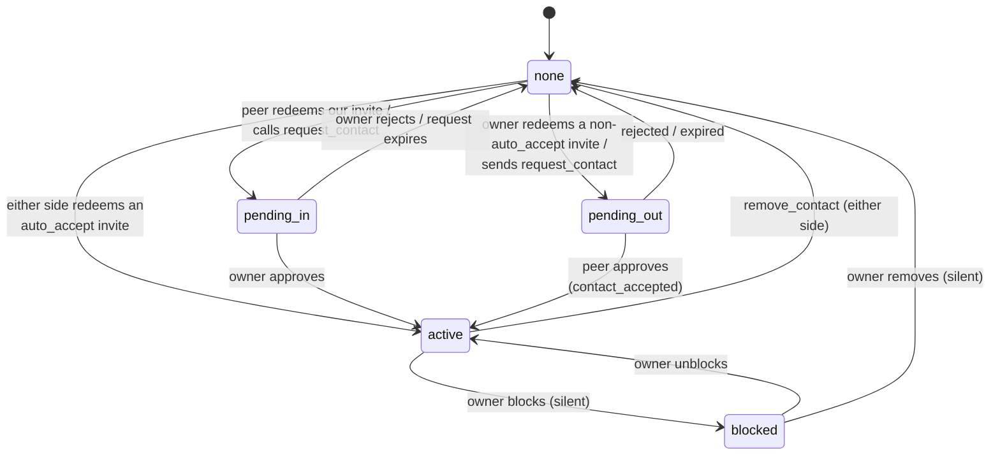
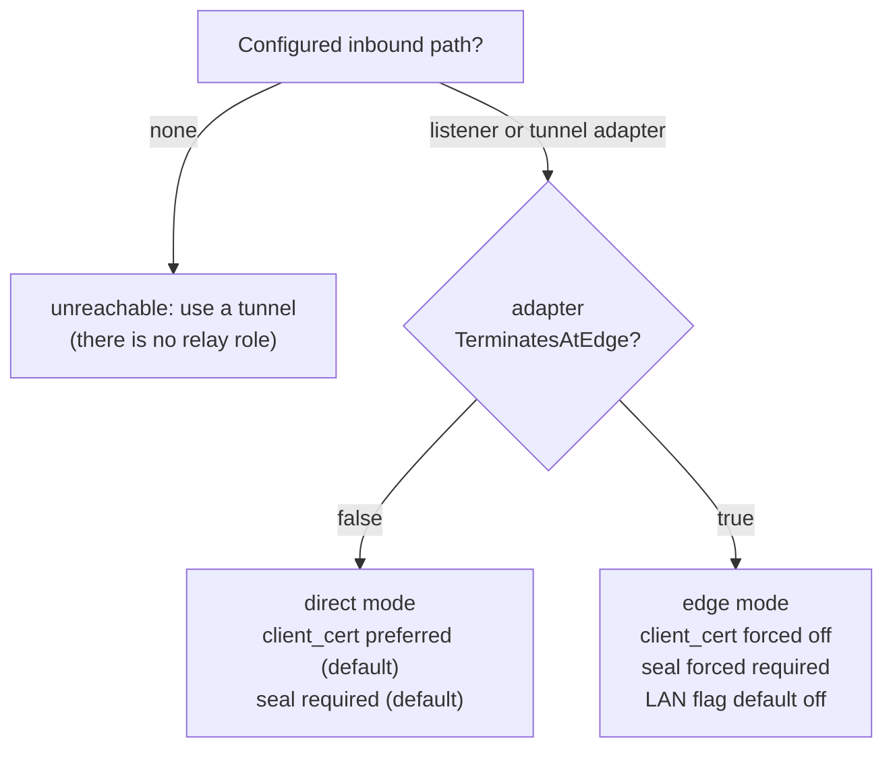
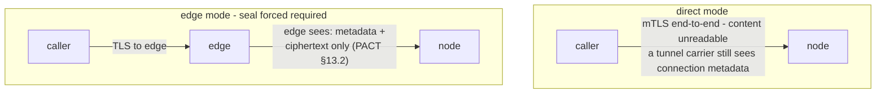

# pact-gateway — Product Specification

**Version 0.2.1-draft · 2026-09-19 · implements PACT 2.1.0** — whose additions are both held here: the span of a leaf is the person's to choose beneath §14.2's ceiling, and §14.3's MUST NOT is held by `TestAnUnansweredConfirmationChangesNoPin`. 2.1 asks for no proactive re-confirmation and this node does none: a newer leaf arrives on use (§13.2, §14.4)

pact-gateway is a self-hosted personal node for the PACT protocol: your agent's public,
permission-gated MCP server to the people you approve, your private control panel and
owner-MCP surface, and the bridge that exposes selected tools from your own MCP
integrations to your contacts. One Go binary; SQLite by default; no telemetry.

The PACT protocol specification (`pact-protocol/SPEC.md`) is normative for everything
wire-visible. This document is normative for the pact-gateway implementation.

---

## 1. Overview and roles

### 1.1 What pact-gateway is

pact-gateway is a self-hosted personal PACT node: one static Go binary that gives a person a permanent agent presence on the network. It implements PACT 2.0.0 — the protocol spec remains normative for all wire behaviour and is cited throughout as "PACT §N". There is one generation: the person's self-signed root is the identity, the host holds a leaf the person issued it, and a card is `X-PACT-VERSION:2` plus that leaf. PACT 1.x was removed entirely on 2026-09-18; nothing here speaks it. A single node is three things at once:

- **An MCP server to the outside.** Contacts and strangers reach the node's public surface (§5) as an MCP server over HTTPS. What a caller sees and may call is decided by caller identity (§3), tier, and the owner's per-contact permission switchboard (PACT §8) — never by anything the caller asserts.
- **An MCP client to the inside.** The owner's own integrations — calendar, mail, anything speaking MCP — are upstreams the node connects to as an MCP client (§6). Contacts never reach an upstream directly: every exposed capability passes through versioned catalog snapshots and exposure sets, and is served in one of three modes — passthrough, mapped, or agent-answered (§6).
- **An internal surface for the owner.** A browser portal and an owner MCP server (§8) are how the owner, and the owner's own agent, read the inbox, manage contacts, invites, and permissions, and administer the node.

### 1.2 Two roles, one binary

The same binary plays three roles, selected by configuration (§12):

| Role | What it does | Detail |
|---|---|---|
| **node** | The default and the subject of most of this spec: a person's agent server — public surface, integrations, portal, owner MCP. | §2–§9 |
| **ingress role** | An own-domain front door: routes each subdomain either as **passthrough** (SNI routing, end-to-end mTLS preserved) or **terminate** (public ACME TLS at the front, converted to a fresh, mutually pinned mTLS hop to the node). Nodes pair with an ingress via a one-time token. | §10 |

The two roles compose rather than exclude each other: one binary, one configuration, and which role it is playing follows from what is configured.

### 1.3 Audience, license, telemetry

**v1 is built for strangers from day one.** The public surface is not a friends-only experiment: unknown callers are expected and served deliberately — the guest tier is minimal (PACT §6.1), invites carry expiry, use counts, and server-side revocation (§9), PACT §12 rate limits are enforced at the boundary, and refused connections are audited (§11).

**License and posture.** Apache-2.0 from day one. The repository starts private and is flipped public by the owner; CONTRIBUTING.md and a SECURITY.md with a private disclosure route ship from the first commit so the flip needs no cleanup.

**No telemetry.** The binary reports nothing to anyone, and the documentation states this explicitly. Its only outbound connections are the ones the owner configured: peer nodes, upstream integrations, and tunnel carriers (§10).

---

## 2. Architecture

### 2.1 One binary

pact-gateway ships as a single static Go binary (`CGO_ENABLED=0`) containing every role and every surface. Upstream integrations are consumed HTTP-first; stdio-only MCP servers run as supervised child processes of the node. The container image is a slim distroless build, with a `-full` tag adding the node and uv runtimes that stdio children commonly need (§12).



Internally the binary is organized into twelve packages; the names below are normative and match `PLAN.md` task P0-01's layout. The twelve subsystems, each grounded in an approved decision:

| # | Package (indicative) | Responsibility | Detail |
|---|---|---|---|
| 1 | `store` | `Store` interface, sqlc + goose migrations, SQLite (modernc, default) and Postgres (pgx) engines | §11 |
| 2 | `audit` | Append-only hash-chain audit log, JSONL archive with durable re-anchor, `audit verify`/`audit archive`/`audit repair` | §11 |
| 3 | `identity` | Owners, accounts, memberships, WebAuthn passkeys, bearer tokens, keyring-encrypted secrets | §3 |
| 4 | `authz` | Cedar (cedar-go): static shipped policies, dynamic entities; the single call site `policy.Allow` | §3 |
| 5 | `envelope` | HPKE seal/open, detached signatures, the two suites, the open order | §4 |
| 6 | `public` | Public mTLS listener, caller identity derivation, tiers, per-caller MCP servers (§2.4) | §5 |
| 7 | `contact` | Contact lifecycle, invite issuance/redemption, card builder, vCard parse/emit | §9 |
| 8 | `message` | Threads, messages, blob store, internal event bus | §7 |
| 9 | `integration` | MCP client pool, upstream OAuth, catalog snapshots, exposure sets, three serving modes | §6 |
| 10 | `internal` | Portal (server-side rendered, zero external assets) and the owner MCP server | §8 |
| 11 | `reach` | Tunnel adapters and the ingress role | §10 |
| 12 | `cli` | CLI over the admin socket, config loading (environment > file > store > defaults, §12.2), doctor, migrate | §12 |

### 2.2 Three entry points

| Surface | Default bind | Authentication | Serves |
|---|---|---|---|
| Public | `:8443`, TLS | Caller identity per §3.5: the root of a chain that validated, presented on the transport (per the `client_cert` knob) or carried in a sealed envelope | The per-caller MCP endpoint (§5); invite landing pages `https://<host>/i/<token>` (§9) |
| Internal | `127.0.0.1:8080` | Portal: an owner session on **every** bind, loopback included (§8.3); CSRF protection stays on regardless. Any non-loopback bind MUST refuse to start unless passkey authentication and TLS are configured (§3). Owner MCP: named, revocable bearer tokens, also on every bind (§8.4) | Portal (browser) and owner MCP (§8) |
| Admin | Unix socket | Filesystem permissions | CLI (§12); offline DB operations only with the node stopped |

The default binds (`:8443`, `127.0.0.1:8080`), the path scheme of §5.2 (`/a/<account>/mcp`, the single-account `/mcp` alias), and the per-account endpoint slug of §3.2 are spec-chosen defaults, not plan-fixed decisions — of the URL surface only the invite path `/i/<token>` is plan-sourced; they stand unless the owner objects at review. Binds are configuration, not constants (§12); the portal and owner MCP can be kept local, tunneled, or split per the owner's deployment matrix (§10). One consequence of the surface split is worth stating here: when the owner sends outbound to a contact, the `sender` label of PACT §6.2 is **derived from the surface** — portal → `human`, owner MCP → `agent` — and is never accepted as a caller-supplied parameter (§7).

### 2.3 The public call path

Every inbound call on the public surface travels one path:

1. **Accept.** TLS handshake on the public listener. A client certificate is requested according to the `client_cert` knob (`required` | `preferred` | `off` — §3): `preferred` is the direct-mode default; edge mode forces `off` because no client certificate survives a terminating edge (§10). Unknown certificates are accepted at the TLS layer — tiering happens above it (PACT §2).
2. **LAN check.** The LAN connections flag governs whether the public listener accepts connections that bypass the configured carrier from private-range addresses; it defaults to off in edge mode, and every refusal is audited (§10, §11).
3. **Identity.** The caller is the **root** of a chain that validated (PACT §2, §14.2) — presented as the TLS client certificate, or carried inside a sealed envelope. A lone certificate is not a chain and names no root, so it establishes nothing. When both proofs are present their leaf keys MUST match, else `envelope_invalid`. Fingerprints are `"sha256:" + base64url(SHA-256(SPKI))`. A call carrying no usable proof where one is required fails with `identity_required` (§5.3).
4. **Seal.** The `seal` knob (`none` | `optional` | `required`, advertised on the card as `X-PACT-SEAL`) is enforced. With `seal: required` — the default, and forced in edge mode — unsealed substantive calls are rejected with `seal_required`; a `sealed_call` passes the open order of PACT §13.3 (decode → version and suite → resolve `kid` to a leaf key this endpoint holds → HPKE-open → verify the signature under the chain's leaf, or under the leaf the small form names → tier → time window → `msg_id` idempotency → dispatch).
5. **Tier.** The identity is looked up in the account's contact list and lands in exactly one tier: guest, pending, contact, or blocked — and blocked callers are silently served the guest tier, indistinguishable from strangers (PACT §6.1, §9).
6. **Serve.** The caller's per-caller MCP server (§2.4) answers `tools/list` and receives `tools/call`.
7. **Dispatch.** Every call re-passes `policy.Allow` at call time, enforces PACT §12 limits at the boundary, honors `msg_id` idempotency, and appends an audit event — bodies referenced, not copied (§11).

### 2.4 Per-caller MCP servers

The node never exposes one static MCP server. Every tool it can serve — guest and pending tools, the contact-tier core of PACT §6.2, `sealed_call`, and every integration-derived tool — lives in a **registry as data**, and the node composes a dedicated MCP server per caller:

- **Keyed by (account, caller fingerprint).** Built on first use and LRU-cached.
- **Composed through `policy.Allow`.** Composition asks the single Cedar call site (§3) which registry entries this caller may see; the composition result *is* what `tools/list` returns. There is no second, parallel filtering path to drift out of sync.
- **Rebuilt on change.** Flipping a switch on a contact's switchboard invalidates the cached server, and live sessions receive `notifications/tools/list_changed` — the node runs its streamable transport stateful so the notification reaches every open session (§5). Upstream catalog changes propagate the same way once the owner re-confirms the affected exposures (§6).
- **Re-checked at call time.** The cache is a listing optimization, never an authorization cache: every `tools/call` passes `policy.Allow` again, so revocation is effective on the very next call even against a stale cached server.
- **Sessions bound to the creating identity.** An MCP session is bound to the caller identity that created it; a session presented under any other identity MUST be rejected.
- **Guests share one server.** All unknown callers of an account share a single guest server exposing exactly the guest tier of PACT §6.1 (`redeem_invite`, `request_contact`) plus the `sealed_call` wrapper (§4); nothing about it is caller-specific, so there is nothing to build per caller.

### 2.5 Deployment modes (summary)

Reachability is the tunnel adapters' only job: an adapter never changes protocol behavior by itself. Each adapter declares whether it terminates TLS at a third-party edge (`TerminatesAtEdge`), and the node derives the deployment mode — and the knob values that mode forces — from that declaration, so the owner cannot configure a contradiction. Full adapter list, the ingress role, and the owner's matrix are in §10.

| Mode | TLS path | Forced / default knobs | Who reads what |
|---|---|---|---|
| **direct mode** | End-to-end mTLS terminating at the node (port forward, Tailscale Funnel, frp, ngrok TLS) | `seal: required` by default; `client_cert: preferred` by default | The carrier moves ciphertext; no third party reads content |
| **edge mode** | Public TLS terminates at a third-party edge (Cloudflare Tunnel; ngrok HTTPS) which re-originates to the node | `seal` forced `required`; `client_cert` forced `off`; LAN connections flag defaults off | The edge sees all metadata and would see any unsealed content — which is why seal is forced; sealed content stays unreadable to it (§4, §13) |

The honest residue, carried in full in §13: sealing uses HPKE Base mode to a long-lived leaf key, so there is **no forward secrecy** — a later compromise of that key decrypts traffic recorded while it was current, bounded by the leaf's 398-day ceiling and by renewal with a fresh key; an edge always sees **metadata** even when content is sealed; and the sealing keypair is the **same keypair as mTLS** (an accepted key-reuse caveat, with the envelope's `kid` as the seam for a future separate encryption key).


---

## 3. Identity, owners, accounts, authorization

pact-gateway keeps three notions strictly apart. An **owner** is a human who administers the node, authenticated with passkeys on the internal surface (§8). An **account** is a PACT identity the node serves — a keypair, a card, an endpoint. A **caller** is a remote identity established per request on the public surface (§5) under the unified identity rule of §3.5. Every decision about what any of them may do funnels through a single Cedar authorization point (§3.6).

### 3.1 Owners and passkeys

Owners live in the `owners` table, their login material in `credentials` (§11). Owner authentication is WebAuthn passkeys:

- An owner MAY register multiple passkeys, each carrying a human-readable tag ("macbook", "spare yubikey"). Passkeys are listed and removed from the portal, the owner MCP, and the CLI (`passkey list|remove`, §12).
- Registering a **new** passkey is portal-initiated only — a WebAuthn ceremony needs a browser authenticator; the CLI participates by minting the one-time setup URL that leads to the portal ceremony (`passkey reset-wizard`, §12). It MUST NOT be possible over the owner-MCP bearer-token surface (§3.4) — a leaked token must not be able to mint a durable login credential.
- The portal requires an owner session on **every** bind, loopback included (§8.3); a non-loopback bind MUST additionally refuse to start unless passkey auth and TLS are configured (§8). A passkey is therefore not optional: once one exists it is the only way in.

First run and lockout recovery share one mechanism, the setup wizard (§12), gated by the zero-passkey rule: whenever the node has **zero** registered passkeys — first boot, or after the last passkey was removed — the portal auto-shows the wizard. The wizard is reachable only from loopback or with a one-time setup token (loopback-or-token gated); first run prints the portal URL and setup token to the logs (§12), and `passkey reset-wizard` (CLI, over the admin unix socket, §12) mints a fresh one-time setup URL for an owner locked out of every passkey. Setup tokens carry at least 128 bits of entropy and expire after 24 hours. An ordinary one is invalidated the moment any passkey is registered (§12.4); a **recovery** token minted by `passkey reset-wizard` is the deliberate exception, and re-opens the wizard while passkeys still exist — without it, losing a single passkey would be unrecoverable, since no bind serves the portal unauthenticated. A recovery token MUST be presented explicitly: reaching loopback alone never re-opens the wizard once a passkey exists, or any local process could register itself as an owner. Registering through it adds a passkey and removes none. It is **not** burned on first use: a WebAuthn ceremony is two requests, so consuming the token on the first would guarantee the second failed. Until setup completes it is a bearer credential for the wizard — anyone holding it can reach the ceremony — which is why it is invalidated by the first registered passkey and why the operator copy tells the owner to treat it as a password. Host shell access is therefore the recovery root of trust; there is deliberately no online recovery path.

The `credentials` schema is type-discriminated and pre-shaped for later login adapters: each row carries a kind plus an adapter-specific payload, so OAuth adapters (Google/Apple/WorkOS) and email/password can land later as new kinds without reshaping the table. v1 implements passkeys only. Portal logins create rows in `sessions` (§11).

### 3.2 Accounts

An account is one PACT identity served by this node; a node serves one or many. The `accounts` table (§11) carries:

| Field | Meaning |
|---|---|
| leaf keypair | ECDSA P-256 default, Ed25519 permitted (PACT §14.1); private key encrypted under the keyring (§3.7). The ROOT is not here: it is in the person's wallet (PACT §9) |
| root fingerprint | `"sha256:" + base64url(SHA-256(SPKI))` of the root's key — the identity, and what contacts pin (PACT §2, §14.3) |
| vCard fields | FN, TEL, EMAIL, … rendered by the card builder (§9); the `X-PACT-*` properties are derived by the node, never hand-edited |
| endpoint slug | path component addressing this account on the public listener. The endpoint is the node's public base URL plus the slug, and it is named inside the leaf's `subjectAltName` — nowhere else on the card (PACT §14.2 rule 5) |
| seal policy | `none\|optional\|required`, published as card property `X-PACT-SEAL` (PACT §13.4); default `required`, and edge mode forces `required` (§10) |
| status | whether the node currently serves this account; a disabled account keeps its data and contacts but its endpoint answers `unavailable` (PACT §12) |

**Key reuse, stated plainly.** The leaf keypair is simultaneously (a) the TLS client key, presenting the chain on outbound calls, (b) the TLS server key, presenting the same chain, and (c) the HPKE recipient key and detached-signature key for sealed envelopes — Ed25519 leaves are converted to X25519 for PACT-SEAL-X25519. Compromise of one private key therefore breaks transport identity **and** envelope confidentiality at once, for that leaf. What it does not break is the identity: the root is elsewhere, a leaf lives at most 398 days, and a renewal with a fresh key outranks the stolen one with every contact it reaches (PACT §14.3, §14.5). This is a deliberate, accepted caveat (§13); the envelope's `kid` is the seam that lets a later version introduce a separate encryption key without a format change (PACT §13.5).

### 3.3 Membership and node administration

`memberships` (§11) relates owners to accounts many-to-many, with a role attribute on each row: several owners can share one account (a family assistant), and one owner can hold several accounts (personal and business personas). The role attribute is data handed to Cedar as an entity attribute (§3.6); the shipped static policies decide what each role may do. v1 defines exactly one membership role: `admin` — full control of the account. Finer-grained roles are post-v1; the role column is pre-shaped for them the same way `credentials` is pre-shaped for later login kinds (§3.1).

`node_admin` is node-scoped — a flag on the owner, not a membership role. Node-wide configuration — tunnel settings and the LAN connections flag, ingress pairing, storage, and the owner roster itself (§8) — requires `node_admin`; account-scoped actions require membership in that account.

### 3.4 Bearer tokens for the owner MCP

The owner MCP surface (§8) authenticates with **named, revocable bearer tokens**: created from the portal settings page or the `token` CLI (§12), each labeled, each bound to exactly one owner. A token acts as that owner and is subject to the same Cedar decisions (§3.6); revocation takes effect immediately. A token is required on **every** bind, loopback included — for the same reason the portal demands a session on every bind (§8.3): granting full owner authority to anything that can open a loopback socket would hand it to every other process on the host, and, where a container shares the network namespace, to every process in it. The CLI needs no token because it speaks over the admin unix socket, whose permissions are the host's. Tokens MUST NOT be accepted on the public PACT surface, which carries no OAuth or token auth of any kind (PACT §6) — public callers are identified only by §3.5. Tokens cannot register passkeys (§3.1).

### 3.5 Caller identity on the public surface

Under PACT 2.0 the identity is the **root**, and the only thing that names a root is a
chain that validated (§14.2). There are two carriers and no third:

> The caller is the root of a chain presented as the TLS client certificate, **or** the
> root of the chain carried inside a sealed envelope. When both are present, their leaf
> keys MUST match; a mismatch MUST be refused `envelope_invalid` and audited (§11).

**A lone certificate establishes nothing.** The retired generation read the fingerprint
of whatever single certificate arrived as the caller, because there the identity WAS a
key. A self-signed certificate names no root and anyone mints one in a second, so the
node records no identity for it at all. Three things depended on that and were wrong
while it stood: `client_cert: required` — the posture PACT §13.4 permits, about who may
knock at all — was satisfied by any certificate; the guest rate budget bucketed on a
fingerprint the caller chose per request; and the "both proofs must match" rule compared
a proven leaf against an unproven key.

Which carrier is available follows from the deployment knobs (§10): seal is
`none|optional|required`, client_cert is `required|preferred|off`. Direct mode defaults
to seal `required`, client_cert `preferred`; edge mode forces client_cert `off` and seal
`required`, so identity there is always the envelope. A guest's sealed call carries its
card inside the payload, and the chain inside that payload is what the card's
certificate must byte-equal (PACT §13.2).

- A call that establishes no identity at all where one is needed MUST be refused
  `identity_required`.
- An unsealed substantive call to an account whose seal policy is `required` MUST be
  refused `seal_required`.
- An envelope that fails any step of PACT §13.3's open order MUST be refused
  `envelope_invalid`. A small-form envelope the receiver cannot verify against a leaf it
  holds is answered `chain_required` instead — one answer for unknown, blocked, expired
  and mis-signed alike, so the answer tells a stranger nothing.
- Once an envelope has opened, a refusal MUST be **sealed** back like any other result
  (PACT §13.2). A plaintext refusal past the open tells the carrier what state the
  recipient holds this sender in, and in edge mode the carrier is there by construction.

The resolved root is looked up in the account's contact list and maps to a tier — guest,
pending, contact, blocked — per PACT §6.1, and the pin checks of §14.3 and §5.3 run
first: a leaf older than the pinned one proves nothing, and a leaf naming a different
endpoint is a request to move, not a call. Blocking is silent guest demotion: a blocked
caller is indistinguishable from a stranger. MCP sessions are bound to the identity that
created them; a session resumed under any other identity MUST be rejected (§5).



### 3.6 Authorization: one Cedar decision point

Authorization is Cedar via **cedar-go**, on the model *static policies, dynamic entities*: the policy set ships inside the binary and is versioned with it; owners never author or edit Cedar in v1. What owners control is data — the per-contact permission switchboard (§5, §9) writes grants (`message.text`, `calendar.book`, `integration.<slug>`, … per PACT §8) into the store, and those grants surface to Cedar as entity attributes, not as policy text.

`policy.Allow` is the **single** authorization call site: the public dispatch path, the owner-MCP dispatch path, and portal mutations all funnel through it, so there is no second ad-hoc permission check to drift out of sync. Entities are built per request from store state: the principal (caller fingerprint and tier, or owner with role and `node_admin` — in v1 the only membership role is `admin`, §3.3, so the shipped policies distinguish only membership and the `node_admin` flag), the account, and the grant set.

- The shipped policy set carries an explicit **forbid on blocked** callers; Cedar's forbid-overrides-permit semantics make the demotion of §3.5 non-bypassable regardless of any lingering grants.
- Authorization is re-checked **at call time** on every `tools/call`, not only when a caller's tool list is composed — flipping a switch revokes instantly (PACT §8). The cached per-caller server (§5) is rebuilt on switchboard change; in the window before rebuild, the call-time check already denies.
- Denials return `permission_denied` (PACT §12) and are audited (§11), as are refused LAN connection attempts (§10).

### 3.7 Keyring and secret storage

All secrets at rest are encrypted under a keyring **master key**, supplied — in the configuration precedence order of §12.2 — via environment variable, a key file, or the OS keyring where one is available. A key file with permissions broader than `0600` MUST cause the node to refuse to start. Containers (distroless, §12.3) have no OS keyring: there the key arrives via the environment or a key file on the `/data` volume. The keyring encrypts, inside the store (§11): account leaf private keys, owner-token secrets, integration credentials such as OAuth refresh tokens (§6), and tunnel credentials (§10). A copy of the database alone is therefore not enough to impersonate an account. The corollary is stated honestly: losing the master key loses every encrypted key with it — for leaf keys that is the loss of §3.9, applied to every account at once — an inconvenience, not the loss of the identities, because the roots are in wallets.

### 3.8 Server certificates by deployment mode

What certificate the node presents depends on the deployment mode (§10):

| Mode | Public leg | Node's listener |
|---|---|---|
| direct mode, own domain | the account's chain, or an ACME/WebPKI certificate for the hostname — PACT §2 accepts either, and a peer that cannot validate the chain falls back to WebPKI for the name it dialed | the same — the node terminates public TLS itself |
| direct mode, no domain | the account's **chain** — leaf then root; a peer validates it to the root it pinned, at the address the leaf names (PACT §2, §14.2). A lone self-signed certificate is not accepted by a 2.0 peer: it names no root | the same |
| edge mode | the edge provider's certificate — public TLS terminates at the edge (§10, §13) | an origin-leg cert on the tunnel-only listener, serving only the connector's leg |

The ingress role (§10) splits per subdomain: a **passthrough** subdomain carries the node's own certificate end-to-end (any direct-mode strategy above, routed by SNI); a **terminate** subdomain holds an ACME certificate at the ingress and speaks a fresh, mutually-pinned mTLS leg to the node, both ends pinned at one-time-token pairing.

Client side, in every mode: outbound connections MUST supply the **chain** through Go's `GetClientCertificate` callback rather than default certificate selection — edges advertise CA distinguished names in their CertificateRequest, and default selection would silently send nothing at all (§10). A key that holds no leaf presents no certificate rather than self-signing one: a lone certificate establishes no identity with a conforming peer (§3.5), so sending one would make the call anonymous while looking like it carried credentials.

### 3.9 Losing a leaf, losing a root

The node holds a **leaf** private key and nothing more (§3.2). Losing it is an
inconvenience, not the loss of an identity: the owner generates a fresh key,
`account csr -purpose renew` emits a signing request for the same endpoint, and the
wallet issues a new leaf under the same root. Contacts learn it the first time the node
calls them — the chain travels in that envelope (PACT §13.2) — and a contact that hears
nothing keeps the old pin until the old leaf expires, because the newest leaf at the
pinned endpoint wins whenever it arrives (PACT §14.3). There is no rotation ceremony and
no grace period to configure: nothing contacts hold is pinned to anything the node keeps.

**A leaf's key does not outlive its leaf.** A leaf is the root's trust in this host *until one
date*. Past that date every verifier refuses the leaf (PACT §14.2 rule 4), so the key can do
nothing legitimate, and the node MUST stop using it at once and MUST destroy it: from `notAfter`
the key is no longer offered for opening an envelope or presented at a handshake, and the next
retirement pass — at start, on the hourly sweep, and when an account is adopted — sets the ledger
row to `former` with no key, clears the account's copy of the same key, stops serving the account
if the leaf was its current one, and records `account_leaf_key_retired` with `reason:expired`.
The ledger row and its key id stay, so an envelope still sealed to it is answered
`certificate_renewed` (PACT §14.4); the account keeps its name, its root and its contacts, and
waits for a renewal, which has never needed the old key. This holds for the current leaf as much
as a superseded one. It did not: a leaf nobody renewed was served, and its key held, for as long
as the process ran.

Losing the **root** is losing the identity, and the root is not here. It lives in the
person's wallet (PACT §9): no third party holds a copy, this node cannot mint one, and
there is no recovery ceremony. That trade-off is the wallet's to state; it is repeated
once here so that nobody reads a backup of this node (§3.10) as a backup of the identity.
It is not, and it is not a backup of the leaf's key either.

### 3.10 What a backup carries

`backup create` and `backup restore` (§12) are **offline** and reachable **only over host shell access** — never the portal, never the owner MCP, and never a bearer token.

**A bundle MUST NOT carry a leaf's private key.** A leaf is the person's root entrusting *this host*, for one address, until one date (PACT §9, §14.1). Its key is the host's credential and not the person's data: a copy in a file would let whoever held the file speak as this host, from this address, until the leaf ran out — and nothing a contact holds could tell the difference. So `create` writes a snapshot of the database with every `key_sealed` set to NULL and every live ledger row demoted to `former`, and then **rebuilds the file**, because a value set to NULL stays in a database file's free pages until the file is rebuilt, and the bundle may carry the master key right beside it. `restore` strips the same columns again whatever the archive says, so a bundle made by an older node, or by hand, cannot bring one in.

What follows is that every restore ends in the same place: the accounts are here by name, with their root, their contacts and their ledger, and **none is served** until the wallet issues this host a leaf (`account csr`, `account install-leaf`). `serve` names each waiting account. Contacts need do nothing — they pinned the root, and the new leaf reaches them with the first envelope (PACT §13.2, §14.3).

The master key (`keyring.key`) is a different matter and is handled by who the archive belongs to: it unseals saved settings and integration credentials (§11.3). An archive proven to be this node's own restores beside the key already here; `-same-node` brings it onto a fresh machine; `-data-only` takes another host's data and refuses its master key (PACT §9).

There is no per-account export. `backup identity` and `backup restore-identity` moved one account's leaf key between nodes under a passphrase, which is the one thing this section forbids; a node that moves asks the wallet for a leaf of its own (`account csr -purpose move`).

On Postgres the store is external and no database is in the bundle. A `pg_dump` is a copy of the live database and holds the sealed keys; it is the operator's to keep apart from `keyring.key`.


---

## 4. Sealed envelopes

**Normative elsewhere.** The envelope format, the two suites, the sealing and opening
order, the `sealed_call` tool and the error codes are `pact-protocol/SPEC.md` §13; the
certificate profile and chain validation they rest on are §14. This document does not
restate them. It used to, in 146 lines describing the `v: 1` envelope, and two normative
texts for one wire format is how implementations drift — the node is not the protocol's
author.

What belongs here is what is the node's own:

- **Where it lives.** `internal/public/sealed.go` and `identify20.go` open and dispatch
  an inbound envelope; `internal/outbound/client20.go` seals an outbound one;
  `internal/envelope` carries the wire struct and its JSON. Chain validation and the
  certificate profile come from `pact-identity` (`CONTRACT.md`) and never from a general
  X.509 path validator — PACT §14.2 is deliberately not RFC 5280 path validation, and
  reaching for one refuses chains a conforming implementation accepts.
- **What the node requires.** `seal` defaults to `required` and is forced `required` in
  edge mode (§10.1), where the edge terminates TLS and the envelope is the only identity
  carrier that survives it.
- **Where the node's posture is its own.** The `client_cert` knob (§5.1) is the
  front-door hardening PACT §13.4 permits and does not require: it decides who may knock
  at all, and is satisfied only by a chain that validates.
- **What a refusal costs.** Once an envelope has opened there is a proven key, so §13.2
  requires the answer sealed — including an error. The node seals `pending_approval`,
  the §5.3 refusal and a budget refusal, and answers in plaintext only where nothing
  opened: `chain_required`, `certificate_renewed`, and envelopes that failed to open.

## 5. Public surface

The public surface is the node's internet-facing listener: the MCP server that contacts and guests call. Every request on it is authorized by transport-and-envelope identity per the rules of §3.5 — there is no OAuth on this surface (PACT §6). The internal surface — portal and owner MCP — never shares this listener; it binds separately under its own auth rules (§8). Everything below applies uniformly across direct and edge mode; the deployment mode changes which identity carrier is available and which knob values are forced (§10), never the pipeline itself.

### 5.1 Listener and TLS posture

**Server certificate.** The listener MUST select its server certificate through an SNI-driven `GetCertificate` callback, never a single static certificate, so one node can serve several hostnames (per-account endpoints, tunnel hostnames, ingress-paired names, §10) without restart. What it serves is the account's **chain** — leaf then root — which is what a peer validates to the root it pinned (PACT §2); behind a terminating edge the certificate a caller sees is the edge's, and WebPKI for that hostname is the rule there (§10.1).

**Client certificates: request, never require.** The listener MUST operate in request-client-cert mode and MUST NOT require a certificate at the TLS layer (in Go terms: `RequestClientCert`, never `RequireAnyClientCert` or stricter). Two reasons: with sealing (§4), a caller's identity can arrive solely as an envelope signature, with no certificate on the wire at all; and a policy denial must surface as a structured PACT §12 error the caller's agent can act on, not as an opaque TLS alert. A presented certificate is never validated against a CA pool — there is no authority above the person — but a presented **chain** is validated against the profile of PACT §14.2, and its root is the caller. A single certificate is not a chain: it names no root and establishes no identity (§3.5).

**Knobs.** Three per-node knobs shape the surface; their forced values derive from the active adapter's `TerminatesAtEdge` property (§10):

| Knob | Values | Default | Forced |
|---|---|---|---|
| seal (card property `X-PACT-SEAL`) | `none` \| `optional` \| `required` | `required` | `required` in edge mode |
| client_cert | `required` \| `preferred` \| `off` | `preferred` in direct mode | `off` in edge mode (a terminating edge never delivers the caller's certificate) |
| LAN connections flag | on \| off | direct mode: on; edge mode: off | meaningful only while a tunnel adapter is active (§10.1) |

`client_cert: off` means the handshake omits the CertificateRequest entirely. `preferred` and `required` both request-without-requiring at the TLS layer; `required` is enforced post-handshake at the application layer so the denial is a PACT §12 error. Under `client_cert: required`, any `tools/call` on a connection that did not present a **chain that validates** is refused with `identity_required` — including a `sealed_call` whose envelope alone established an identity: the knob demands transport-carried identity, and an envelope does not satisfy it (PACT §13.4, §5.8). A lone self-signed certificate does not satisfy it either, and this is the point of the knob: it is satisfied only by something a stranger cannot mint (§3.5). `required` is therefore unusable behind a terminating edge, where no certificate can arrive (§10).

**LAN connections flag.** The flag applies only to configurations with an active tunnel adapter (§10.1); with no tunnel it is inert. When the flag is off, connections from private-range source addresses MUST be refused, and every refusal MUST still produce an audit event (§11). Private ranges are the SSRF range list of §7.5 — RFC 1918, unique-local, link-local — plus CGNAT `100.64.0.0/10` on OS listeners; connections arriving via the `tailscale` adapter's own listener are not classified as LAN by their `100.64.0.0/10` source, which is Tailscale's own address space. **Loopback is likewise not classified as LAN**: it is the carrier's own delivery, not a bypass of it. Every reverse tunnel dials this bind from this host — `frp`, `ngrok` and `tailscale` in-process, `cloudflared` as a child process — so classifying loopback as LAN left every edge-mode deployment refusing its own connector and unable to serve a single request. No LAN host can present a loopback source; the kernel drops `127/8` arriving on an external interface. This is safe because loopback grants no authority on the public surface — the caller remains a guest without a client certificate or a sealed envelope — and is therefore not in tension with §8.4, which refuses loopback as authority for the owner MCP, where it would grant everything. The §7.5 SSRF list itself is unchanged and still blocks loopback. Residual: a connector run OUT of process and off-host — the `cloudflared` compose sidecar of §10 — reaches the node from an RFC 1918 address and is still refused; such a deployment must turn the flag on. Mode defaults and rationale are in (§10).

### 5.2 Routing

| Path | Serves |
|---|---|
| `/a/<account>/mcp` | The account's public MCP endpoint (a node hosts multiple accounts, §3) |
| `/mcp` | Alias for the account's endpoint, mounted only while the node has exactly one account |
| `/i/<token>` | Invite landing page (§9): human-facing HTML serving the issuer's signed card and its QR before any redemption |

The invite URL is bearer-token-only: possession of the URL is the whole credential, and nothing else sensitive rides in it (PACT §4). The landing page is informational; redemption itself is always the `redeem_invite` MCP tool call on the account endpoint. Requests to unknown paths or nonexistent accounts MUST receive a plain HTTP 404.

### 5.3 Ingress facts and caller identity

Each accepted connection and request is reduced to two fact records before any dispatch decision.

**TransportFacts** — recorded at accept/request time:

| Field | Source |
|---|---|
| adapter, `TerminatesAtEdge` | which listener/tunnel adapter accepted the connection (§10) |
| source address, LAN classification | socket; drives the LAN connections flag check |
| SNI server name | TLS handshake |
| the root of a validated client chain, its leaf, the leaf's key and the endpoint it names — or absence | presented certificates, if two of them validated as a chain (PACT §14.2). A single certificate records nothing (§3.5) |
| account | path routing (§5.2) |

**EnvelopeFacts** — produced only by a successfully opened `sealed_call` per the open order of PACT §13.3: the sender's root and leaf, the protected header `{v, suite, kid, msg_id, ts, exp, cty}`, the suite, and — for guests — the card carried inside the sealed payload, whose certificate must byte-equal the chain's leaf. Envelope failures are the library's to classify; the pipeline sees either EnvelopeFacts or a PACT §12 error.

**Caller identity.** The rule and its outcomes are §3.5. In summary: the caller is the
root of a chain that validated, presented on the transport or carried in the envelope;
when both are present their leaf keys MUST match, else `envelope_invalid`; a lone
certificate is not a proof, and a plaintext caller with none is anonymous — free to
complete MCP `initialize` and `tools/list` and see the guest view, refused
`identity_required` on any `tools/call`.

**Guest binding rule.** A guest has no pin, so the identity it claims through a card must
be proven in the same request. On a sealed guest call the chain inside the payload MUST
validate, the signature MUST verify under its leaf key, and that leaf MUST byte-equal the
`card` argument's `X-PACT-CERT` (PACT §13.2). On a plaintext guest call the chain
presented on the transport binds the same way. A sealed guest `tools/list` has no card to
bind and is refused `envelope_invalid` — guests discover their surface with plain
`tools/list`, which always answers. A guest whose leaf names this node's own address is
refused: no honest card carries it (PACT §14.5).

**Seal enforcement.** With `seal: required`, any plaintext inner-tool call from an identified caller MUST be rejected with `seal_required`; `tools/list` remains answerable so callers can discover `sealed_call` and the requirement. An inner `tools/list` carried inside a sealed call is answered with the tier view of the envelope identity (§4).



### 5.4 Tier resolution

The resolved identity is looked up in the account's contact list and mapped to a tier exactly per PACT §6.1:

| Contact state for this fingerprint | Tier | Sees |
|---|---|---|
| not in the list | guest | `redeem_invite`, `request_contact` (+ `sealed_call`, §4) |
| `pending_out` (their approval of me is outstanding) | pending | `contact_accepted`, `contact_rejected` |
| `active` | contact | tools filtered by this contact's switchboard (§3, PACT §8) |
| `blocked` | guest | identical to guest — blocking is silent demotion (§9) |

A blocked caller MUST be served indistinguishably from an unknown one; the guest-tier catch-all error is `blocked_or_unknown`, indistinguishable by design (PACT §12). A caller whose own request is still awaiting the owner's approval (`pending_in` on our side) resolves to guest, and a duplicate request returns `pending_approval` (PACT §12). A pending-tier caller invoking anything beyond `contact_accepted`, `contact_rejected`, and `sealed_call` is refused `permission_denied` — the caller is known, so the guest catch-all does not apply (§5.8).

### 5.5 Per-caller servers and sessions

The node holds every exposable tool — built-in and integration-backed — as data in a registry, and composes an MCP server per caller: for each `(account, caller-fingerprint)` pair it evaluates `policy.Allow` (Cedar — static policies, dynamic entities, §3) over the registry and materializes a server exposing exactly the allowed set. Composed servers are LRU-cached per `(account, caller-fingerprint)`. All guest-tier callers of an account share one cached server exposing the two guest tools plus `sealed_call`.

A cached server MUST be rebuilt when the contact's switchboard changes, when an exposure set vM or catalog snapshot vN backing one of its tools changes (§6), or when the contact's tier changes; live sessions then receive `tools/list_changed`. The public streamable transport runs **stateful** so the notification reaches every open session (§2.4). The cache is a performance layer only, never the authority: every `tools/call` MUST re-evaluate `policy.Allow` at call time, so revocation is instant — the flipped switch removes the tool from `tools/list` and any in-flight or stale-cache call returns `permission_denied` (PACT §8).

**Session-to-identity binding.** An MCP session is bound to the identity (or the anonymity) that created it. A request presenting an existing session id under a different resolved identity MUST be treated as if the session did not exist; a caller that gains identity (e.g., moves from anonymous to certificate-bearing) starts a new session. Session state never substitutes for per-call identity resolution — every request runs the full pipeline of §5.3.

### 5.6 Dispatch: built-in versus integration-backed

A permitted call lands in one of two implementations:

- **Built-in tools** — the guest, pending, contact-management, messaging, and media tools of PACT §6.2 — execute against the node's own store: contacts and invites (§9), threads, messages and blobs (§7). `msg_id`-bearing calls are idempotent per PACT §6.2, backed by the store's uniqueness constraint (§11).
- **Integration-backed tools** execute in the serving mode configured for that exposed capability — passthrough, mapped, or agent-answered (§6). Arguments MUST be validated against the schema recorded in the backing catalog snapshot vN (the MCP SDK's low-level tool registration does not validate; the node validates with `google/jsonschema-go`), and failures return `bad_request`. A stale mapping — an exposure whose tool no longer matches the catalog snapshot hash it was confirmed against — MUST be withheld: absent from `tools/list`, and `unavailable` on call, until the owner re-confirms it (§6).

Payloads that agent-answered dispatch relays to the owner's connected agent carry the per-contact trust flag and untrusted-input labeling of (§6); inbound strings are stored raw and never concatenated into instructions (§7, PACT §11).

### 5.7 Boundary limits

The limits of PACT §12 are enforced at this boundary, before dispatch, and again at the store layer (§11) as defense in depth:

| Limit | Value (PACT §12 defaults) |
|---|---|
| `text` | ≤16 KiB |
| inline media | ≤5 MiB (larger by `url`; inbound URLs are never auto-fetched, §7) |
| `note` | ≤1 KiB |
| availability slots | ≤5 per response |
| per-contact rate | 60 calls/hour |
| guest rate | 10 calls/hour per IP+key; per IP alone for anonymous callers |

The listener MUST cap request bodies before JSON parsing at **8 MiB** — sized to the largest legitimate payload: 5 MiB inline media × 4/3 base64 expansion plus envelope and JSON overhead, rounded up — rejecting larger requests with `too_large`. Rate-limit denials return `rate_limited` with `retry_after`.

**Source IP behind a terminating edge.** Per-IP limits need a source address the node can trust. On a `TerminatesAtEdge` adapter (§10.2) every connection reaches the node from the tunnel connector's address, so the node MUST take the client IP from that adapter's specific trusted header on the tunnel-only listener — `CF-Connecting-IP` for the `cloudflare` adapter — and MUST NOT honor generic `X-Forwarded-For` anywhere; direct listeners never honor forwarded-IP headers at all. Where an edge adapter provides no trusted header, per-IP limiting of anonymous callers degrades to a single per-node aggregate cap.

### 5.8 Denials and audit

Every deny on this surface maps to a PACT §12 error code, including `seal_required`, `identity_required`, `envelope_invalid`, `chain_required` and `certificate_renewed`. The denials §5 itself issues:

| Condition | Code |
|---|---|
| anonymous `tools/call` (no certificate, no envelope) | `identity_required` |
| call without a client certificate under `client_cert: required`, sealed included | `identity_required` (§5.1) |
| pending-tier caller invoking a tool beyond `contact_accepted` / `contact_rejected` / `sealed_call` | `permission_denied` (§5.4) |
| plaintext inner call under `seal: required` | `seal_required` |
| envelope open/verify failure; envelope–certificate identity mismatch | `envelope_invalid` (§4) |
| guest or blocked caller invoking a non-guest tool | `blocked_or_unknown` |
| contact invoking a tool its switchboard does not grant | `permission_denied` |
| duplicate contact request while approval pending | `pending_approval` |
| expired / revoked / used-up invite token | `invite_invalid` |
| stale or withheld integration tool | `unavailable` |
| body or field over cap | `too_large` |
| rate cap exceeded | `rate_limited` (+`retry_after`) |
| argument schema validation failure | `bad_request` |

**Audit.** Every public call — allowed or denied, at every stage of the pipeline — MUST append an audit event to the hash chain of (§11), recording caller fingerprint, account, tool, decision, and error code, with bodies referenced (content-addressed), never copied. Refused LAN connection attempts are audited even though they die before reaching MCP. The public dispatch path is one of the three audit write sites (§11); no §5 code path may respond without its audit write.


---

## 6. Integrations

An integration is an upstream MCP server the owner connects to their node: a calendar, a task tracker, anything speaking MCP. The node is an MCP **client** to these upstreams (official Go SDK, go-sdk v1.7.0) and re-serves a curated subset of their capabilities to contacts through the public surface (§5). Two rules govern everything in this section: **nothing an upstream offers is ever exposed to a caller by default**, and a contact gains access to passthrough and agent-answered capabilities only through the per-integration permission `integration.<slug>` — PACT §8's `integration.<name>`, with the name fixed to the integration's slug. Mapped-mode capabilities are the exception: they serve PACT's own core vocabulary and are gated by the corresponding PACT §8 core permission (§6.6). Authorization is evaluated at the single Cedar call site `policy.Allow` (static policies, dynamic entities — §3); the store tables involved are `integrations`, `catalogs`, `exposures`, and `pending_requests` (§11).

### 6.1 The integration object

| Field | Meaning |
|---|---|
| `slug` | Stable snake_case identifier chosen at creation. It prefixes exposed tool names (§6.5) and names the permission `integration.<slug>`; it MUST NOT change after creation. |
| `transport` | `streamable-http` \| `sse` \| `stdio-supervised` |
| `endpoint` / `command` | URL for the HTTP transports; the command line (plus environment) for `stdio-supervised` |
| `auth` | `none` \| `static` (owner-supplied header credential) \| `oauth` (§6.3) |
| `status` | Node-local, never wire-visible: `disabled` \| `connecting` \| `ok` \| `auth_error` \| `unreachable` (§6.3, §6.10) |
| catalog / exposure | Pointers to the latest catalog snapshot vN (§6.4) and the active exposure set vM (§6.5) |

Transports map onto the SDK's struct-literal client transports:

| `transport` | SDK type |
|---|---|
| `streamable-http` | `mcp.StreamableClientTransport{Endpoint, HTTPClient, MaxRetries, DisableStandaloneSSE, OAuthHandler}` |
| `sse` | `mcp.SSEClientTransport{Endpoint, HTTPClient}` |
| `stdio-supervised` | `mcp.CommandTransport{Command, TerminateDuration}` |

The node MUST leave the standalone SSE stream enabled (`DisableStandaloneSSE` false): on stateful upstreams (protocol ≤ 2025-11-25) that stream is the only carrier of `notifications/tools/list_changed`, which the catalog machinery depends on (§6.4). Only a stateless SEP-2575 upstream delivers it over the `subscriptions/listen` POST stream instead. `static` credentials and all OAuth tokens are stored encrypted under the keyring master key (§11, §12) and never appear in config files or logs.

### 6.2 Supervised stdio children

A `stdio-supervised` integration runs a local child process (newline-delimited JSON over stdin/stdout via `mcp.CommandTransport`). The node is the child's supervisor:

- The child receives only the command, arguments, and environment variables configured for the integration; `static` credentials destined for the child are decrypted at spawn time and passed via that environment, never written to disk.
- On unexpected exit the node MUST restart the child with backoff; repeated failures mark the integration `unreachable` and follow §6.10. Shutdown uses `TerminateDuration` for a graceful stop before killing. Every crash and restart is audited (§11).
- Children MUST run under resource caps (memory/CPU) so a misbehaving upstream cannot starve the node. Defaults, each configurable per integration: restart backoff exponential from 1 s to a 60 s cap; give-up after 5 consecutive failures within 5 minutes, marking the integration `unreachable` (§6.10); per-child caps of 512 MiB RSS and 1 CPU. Both are enforced by `setrlimit` as the closest approximations a plain binary can apply without cgroups: `RLIMIT_DATA` for the memory cap and `RLIMIT_CPU` for the CPU one. `RLIMIT_AS` is NOT usable here — it bounds reserved address space rather than memory in use, and a Node child needs more than 8 GiB of address space to start at all, so no `RLIMIT_AS` value both admits an `npx` child (§12.3) and bounds anything.
- The slim container image is static and ships no runtimes. stdio servers that need `node`/`npx` or `uv`/`uvx` require the **`-full` image tag** (which ships node and uv), or the owner mounts the runtime or a native server binary into the container (§12).

### 6.3 Upstream authentication and OAuth

`auth: none` sends no credential. `auth: static` attaches an owner-supplied header credential (e.g. a bearer token or API key) to every request. `auth: oauth` implements the MCP authorization spec, revision **2026-07-28**, exactly as verified:

| Requirement | Level |
|---|---|
| RFC 9728 protected-resource metadata discovery | MUST (clients MUST use it to discover the authorization server) |
| Authorization-server metadata: RFC 8414 **or** OIDC Discovery | Client MUST support both |
| Client identity | Prefer **Client ID Metadata Documents**; else pre-registered client ID; RFC 7591 DCR is deprecated, kept only as a last-resort fallback |
| PKCE with S256 | MUST; MUST refuse to proceed if the AS metadata lacks `code_challenge_methods_supported` |
| RFC 8707 `resource` parameter | MUST, in both the authorization and the token request |
| RFC 9207 `iss` validation on the authorization response | MUST |
| Passing a caller's token through to an upstream | MUST NOT — ever. Tokens presented to the node (owner-MCP bearer tokens, portal sessions) never leave the node; each upstream gets its own credential. |

The SDK carries all of this: the node wires an `auth.OAuthHandler` into `StreamableClientTransport.OAuthHandler`. For interactive upstreams it uses `auth.NewAuthorizationCodeHandler`, which performs the 401/`WWW-Authenticate` parse, RFC 9728 + AS-metadata discovery, client registration modes, PKCE, the `resource` parameter, and token refresh — the node supplies only the code-fetching callback. For service-to-service upstreams the node uses `extauth.ClientCredentialsHandler`.

**Portal Connect flow** (§8): the owner adds the integration and clicks **Connect**. The node probes the endpoint, runs discovery, and redirects the owner's browser to the authorization server. The AS redirects back to the portal's callback route, which hands `code`/`state`/`iss` to the handler; after `iss` and `state` validation the code is exchanged (with `resource`) and the tokens are stored encrypted (§6.1). Status moves to `ok` and the first catalog snapshot is taken (§6.4). Refresh happens automatically through the handler's token source; a failed refresh or a mid-operation 401 sets `status: auth_error`, makes the integration's exposed tools behave per §6.10, surfaces a **Reconnect** action in the portal and the owner-MCP integration tools (§8), and writes an audit event.

### 6.4 Catalog snapshots (vN)

On every successful connect the node walks the upstream's tools (`ListTools` / the `Tools` iterator) and computes, per tool, a content hash over **name + description + inputSchema** (canonical key-sorted JSON serialization). The resulting **catalog snapshot vN** — the tool set with definitions, hashes, and annotations as captured — is an immutable row in `catalogs`; a new snapshot is minted whenever the tool set or any per-tool hash changes. Annotations are captured but excluded from the hash: they are untrusted UI hints (§6.9), so drift in them never trips the stale guard.

Snapshots refresh: on connect, when `ClientOptions.ToolListChangedHandler` fires (which is why standalone SSE stays enabled, §6.1), on the periodic health cycle (§6.10), and on manual refresh from the portal. The portal renders the diff between consecutive snapshots. Callers never see live upstream state: everything shown in a contact's `tools/list` comes from snapshotted definitions, so the surface a caller sees is exactly the surface the owner confirmed.

### 6.5 Exposure sets (vM) and the stale guard

An **exposure set vM** binds to exactly one catalog snapshot vN and lists what is actually served. The portal's picker is two columns — snapshot tools on the left, exposed capabilities on the right — and the right column starts **empty**: nothing is exposed by default. Each exposed entry records the upstream tool, the serving mode (§6.6), a mapped entry's recipe binding (§6.7), an optional `fallback` serving mode for agent-answered entries (`passthrough` or `mapped` only — falling back to agent-answered would be circular; default none, §6.8), and the exposed name. For passthrough and agent-answered entries the name defaults to `<slug>_<tool>`, normalized to snake_case, editable, unique within the account's exposed surface; a mapped entry is always exposed under the exact PACT §6.2 capability name it implements (`book_slot`, never `<slug>_book_slot` — §6.6, §6.7). Every edit mints vM+1; activating a set rebuilds the per-caller servers and emits `notifications/tools/list_changed` to connected callers (§5). Contacts holding `integration.<slug>` see all of that integration's exposed capabilities; per-tool grants are deliberately not in v1.

**Stale guard.** When a new catalog snapshot arrives, each exposed entry's confirmed hash is compared against the same tool in the new snapshot. A missing tool or a changed hash makes the entry a **stale mapping**: it is withheld from every caller's `tools/list`, in-flight or racing calls return `unavailable` (PACT §12 records this use for a tool an implementation is temporarily withholding), and the transition is audited. The portal shows the definition diff and offers a **one-click reconfirm** (per entry or all), which re-binds the entry to the new snapshot in a fresh exposure set vM+1 — also audited. A silently changed upstream can therefore never widen what contacts reach.

### 6.6 Serving modes

Each exposed capability is served in exactly one of three modes:

| Mode | The node… |
|---|---|
| **passthrough** | validates the caller's arguments, forwards the call to the upstream tool, relays the result |
| **mapped** | implements a PACT core capability through a provider plus a per-server recipe (§6.7) |
| **agent-answered** | parks the call as a `pending_request` for the owner's connected agent to answer (§6.8) |

**Passthrough.** The node registers exposed tools on the SDK's low-level server path, which does **not** validate arguments (only the generic `mcp.AddTool[In,Out]` does). The node therefore MUST validate caller arguments itself, using `github.com/google/jsonschema-go` (unmarshal the stored schema, `Resolve`, `Resolved.Validate`) — and always against the **snapshotted** `inputSchema` the exposure was confirmed on, never a live upstream schema. Invalid arguments fail `bad_request` without touching the upstream. Valid calls are forwarded under the upstream tool name from the snapshot; results are relayed to the caller as data (untrusted content, boundary limits per §11). Upstream tool errors are relayed as tool errors; transport failures surface as `unavailable`.

**Mapped** and **agent-answered** are specified in §6.7 and §6.8. A mapped entry is exposed under its PACT §6.2 capability name and authorized by the corresponding PACT §8 core permission (`calendar.availability`, `calendar.book`, …), never by `integration.<slug>`, which gates only passthrough and agent-answered entries. In all three modes the call is admitted first by `policy.Allow` and the call-time permission re-check (§3, §5).

### 6.7 Mapped providers, the mapping DSL, and recipes

Mapped mode exists so a contact sees PACT's own vocabulary — never a vendor's. Two providers ship in v1:

**Calendar provider** — implements `check_availability`, `book_slot`, and `cancel_booking` per PACT §6.2. Availability answers are computed from the upstream response and then filtered by owner policy — allowed windows and working hours — returning **at most 5 candidate slots** (PACT §12), never raw free/busy. `book_slot` creates the event upstream, honors `msg_id` idempotency — the recorded acknowledgment (`booking_id` plus ICS) lives in the `idempotency` table (§11.2) for replay — and returns `booking_id` plus an ICS the provider synthesizes from the confirmed slot and subject; the store keeps no booking table (§11), so `booking_id` is an opaque wrapper over the upstream event identifier, which `cancel_booking` maps back.

**Status provider** — serves `get_status` (PACT §6.2) from the owner's node-local status by default; a recipe MAY source it from an upstream tool instead.

**Field-mapping DSL.** A recipe binds provider fields to upstream request/response fields with a deliberately tiny declarative DSL: **field-to-field bindings and constants, nothing else** — no expressions, no conditionals, no scripting. Anything beyond that (slot computation, policy filtering, ICS synthesis) lives in provider code, where it is testable and cannot be smuggled in via configuration.

**Per-server recipes.** Because upstream tool naming is not uniform, recipes are per-server maps. The three verified Google Calendar servers:

| Server | Transport / auth | `check_availability` | `book_slot` | `cancel_booking` |
|---|---|---|---|---|
| Google official Calendar MCP — `https://calendarmcp.googleapis.com/mcp/v1` (Developer Preview) | streamable-http / oauth | `suggest_time` | `create_event` ⚠️ | `delete_event` |
| nspady/google-calendar-mcp (`@cocal/google-calendar-mcp`) | stdio-supervised (default) or HTTP / oauth (Desktop-app credentials) | `get-freebusy` | `create-event` | `delete-event` |
| taylorwilsdon/google_workspace_mcp (`workspace-mcp`) | stdio-supervised or streamable-http / oauth (several modes) | `query_freebusy` | `manage_event` (`action=create`) | `manage_event` (`action=delete`) |

⚠️ The official server's **write scope for `create_event` is unverified** (its configuration docs showed only read-only and free-busy scopes); the shipped recipe carries this caveat and implementations MUST confirm the scope during setup before enabling booking on it. Note the semantic split: `suggest_time` already returns candidate times (a natural fit for the ≤5-slot rule), while the free-busy tools require the provider to compute candidate slots from busy blocks, the requested window and duration, and the owner's working hours.

### 6.8 Agent-answered mode

Some capabilities have no API behind them — they need the owner's agent's judgment. An agent-answered call is parked and relayed:



Mechanics, in order:

1. After `policy.Allow`, the call becomes a `pending_requests` row (caller fingerprint, exposed capability, arguments, creation time, TTL) and the caller's request is held open. Arguments are peer-supplied untrusted content and are handed to the owner's agent labeled with the contact's message-vs-instruction trust flag (§7).
2. The node signals the owner's agent through the **subscribable resource `pact://pending`**: `Server.ResourceUpdated` to subscribed owner-MCP sessions, with both `Subscribe` and `Unsubscribe` handlers registered (the SDK requires the pair), stateful Streamable HTTP plus an `EventStore` so a briefly disconnected agent resumes missed notifications, and the `list_pending` poll tool as the fallback for clients that do not subscribe. There are no custom server→client notifications in MCP; the resource is the signal.
3. The agent answers via the owner-MCP tool `answer_request(id, result)` (§8); the node relays the result to the waiting caller, closes the row, and audits the exchange.
4. If the synchronous wait budget expires with no answer — or no agent session is connected — the **fallback chain** runs: the exposure's configured `fallback` serving mode (§6.5) if one is set, otherwise the call fails `unavailable`. Messaging never enters this path: `send_message` and `send_media` are built-ins that execute against the store (§5.6), so a message is always stored and answered `delivered | queued_for_human` (PACT §6.2, §7) regardless of whether the owner's agent is online — the fallback chain applies only to integration-backed capabilities.

Defaults, each configurable per exposure: the caller's call is held for a synchronous wait budget of **30 s**; the `pending_request` row's TTL is **10 minutes**. The wait budget — not the TTL — triggers the fallback chain: when it expires, the caller receives the fallback result (point 4). The TTL only bounds how long the row stays open for a late answer, which is recorded and audited but no longer relayed to the departed caller.

### 6.9 Safety rails

Upstream tool annotations are captured into snapshots and used **only** to sort and badge the exposure picker:

| Annotation | Default | Go field |
|---|---|---|
| `readOnlyHint` | false | `ReadOnlyHint bool` |
| `destructiveHint` | true | `DestructiveHint *bool` |
| `idempotentHint` | false | `IdempotentHint bool` |
| `openWorldHint` | true | `OpenWorldHint *bool` |

The default-true hints are **pointer fields**: when re-serving a tool the node MUST proxy `DestructiveHint`/`OpenWorldHint` without collapsing nil to false (nil means "assume destructive / open-world"). Annotations are **untrusted** — the spec is normative here — so the node MUST NOT gate any permission or authorization decision on them; they are UI-sorting input only. Alongside the hints, the portal applies **name heuristics** (flagging tools whose names suggest writes: create, delete, update, send, pay, transfer, and similar) — equally advisory.

Exposing a tool flagged write-capable by either signal, or connecting an integration holding broad credentials, triggers an explicit portal warning; the owner must acknowledge it to proceed, and the **acknowledgment is recorded** in `audit_events` (§11). The standing recommendation, restated in every recipe: use the **narrowest credential that works** — free-busy or read-only scopes when only availability is exposed, dedicated accounts, minimal grants.

### 6.10 Health and withholding

The node pings each connected integration on a periodic cycle (MCP ping for HTTP transports; a child-process exit counts as failure for stdio). A failed integration moves to `unreachable` (or `auth_error`, §6.3) and its exposed capabilities immediately fail with `unavailable`. If the failure persists past a threshold, those tools are additionally **withheld** from callers' `tools/list` — emitting `list_changed` (§5) — so contacts stop seeing capabilities that cannot run. Recovery reconnects, refreshes the catalog (which may trip the stale guard of §6.5 if the upstream changed while away), restores the surface, and — like every transition in this section — is audited (§11).

Defaults, each configurable per integration: ping every **60 s**; withhold from `tools/list` after **5 consecutive failures** (≈5 minutes of outage).


---

## 7. Messaging and media

Messaging on the public surface follows PACT §7 unchanged: a conversation is a `thread_id` (UUID, minted by whoever sends first) plus an optional human-readable `topic`, stored by both sides, and each message is one `send_message` or `send_media` call against the peer's server. Whether a call arrives plain over mTLS or inside a sealed envelope (§4), the node opens it to the same inner tool call and dispatches it with identical semantics. This section specifies what the node does with that traffic: storage, deduplication, sender labeling, media handling, fan-out to consumers, and retention.

### 7.1 Threads and messages

The node persists conversations in the `threads` and `messages` tables (§11). An inbound `send_message` passes, in order: caller identity resolution (§3), permission check via the single `policy.Allow` call site (§3), PACT §12 limit checks at the boundary, the idempotency check of §7.2, then a store append and an event-bus publish (§7.8). Responses use the PACT §6.2 statuses (`delivered | queued_for_human`).

Outbound messages originate from exactly three places: the portal composer (§8.2), the owner-MCP `send_to_contact` / `call_contact` tools (§8.4), and agent-answered integration flows (§6). For outbound delivery the node is the MCP client: it mints the `msg_id`, retries with backoff until the sender-chosen `expires` (default 24 h, PACT §7), and then reports failure to the owner. There is nowhere to fall back to: PACT 2.0 has no relay role and no store-and-forward gateway, because one would see every sender, recipient and timestamp for its trouble (PACT §9). The same `msg_id` MUST be reused across every retry, so the recipient's idempotency handling makes the retry path safe.

### 7.2 Idempotency

The `messages` table carries a `unique(account, contact, direction, msg_id)` constraint (§11). A call bearing an already-seen `msg_id` is **acknowledged, not re-executed** (PACT §6.2): the node MUST return an acknowledgment equivalent to the original outcome and MUST NOT append a second message row or re-run any side effect. This applies to every `msg_id`-bearing tool: `send_message` and `send_media` are backed by the `messages` constraint; `book_slot`, which appends no message row, records its acknowledgment in the `idempotency` table instead (§6.7, §11.2). The uniqueness scope is per (account, contact, direction): two different contacts reusing the same `msg_id` value do not collide, and neither do the two sides of one conversation. `direction` is in the key because `msg_id` is chosen by whoever sent the message (§7.1), so each side has its own namespace; without it, a message the node was about to send collided with one the contact had already sent, and the idempotency lookup returned the peer's row — reporting the owner's message delivered when it had never been written. Inbound idempotency is unaffected: a repeated inbound `msg_id` is still the same key. The envelope open order's own `msg_id` idempotency step (§4) and this store constraint enforce the same rule at two layers; the store constraint is authoritative.

### 7.3 Sender labels

The wire-level `sender: agent|human` label is **derived from the surface that originated the send — it is never a parameter** on any internal surface. The portal composer produces `sender: human`; sends initiated through the owner MCP or an agent-answered flow produce `sender: agent`. No internal tool or form accepts a `sender` argument, so an agent cannot label its output as its owner. On inbound messages the peer's label is stored and displayed as claimed — honest labeling is the sending side's obligation under PACT §7.

### 7.4 Media and the blob store

Media bytes live in a content-addressed blob store: each blob is stored at a path derived from the SHA-256 of its content, with metadata in the `blobs` table (§11). Content addressing means identical content is stored once, referenced many times. Inline media (`data`, base64) is accepted up to the PACT §12 limit of 5 MiB; larger media travels by `url` reference only. Oversize inline payloads are rejected with `too_large`. Each account has a storage quota — default **10 GiB**, configurable (§8.2) — enforced at write time; media that would exceed it is refused. Outbound `send_media` reads from the same store.

### 7.5 URL media is never auto-fetched

A `url` received in `send_media` is **never fetched automatically**. The rationale is SSRF: the node frequently runs inside a home LAN, and auto-fetching attacker-supplied URLs would let any contact drive server-side requests into loopback services, RFC 1918 ranges, or cloud metadata endpoints. Instead:

- Fetching is **click-to-fetch**: it happens only on an explicit owner action in the portal (§8.2).
- The fetcher MUST enforce a size cap, MUST block private ranges (loopback, RFC 1918, unique-local, link-local — checked against the *resolved* address, and the connection pinned to that vetted address so DNS rebinding cannot bypass the check), and MUST count fetched bytes against the account quota, storing them content-addressed (§7.4).
- Fetched or not, the URL string itself is stored raw and treated as untrusted text (§7.6).

### 7.6 Inbound text: cap, raw storage, escape on render

Inbound text is capped at 16 KiB (PACT §12), enforced at the boundary before any processing; beyond the cap the call fails with `too_large`. Within the cap, text is stored **raw** — the node MUST NOT sanitize, strip, or rewrite content on write, so the record stays faithful for audit and export. All escaping happens at render time: the portal renders inbound strings (text, topics, notes, filenames) through templ's contextual escaping, always as quoted content, never interpreted as markup. Sanitize-on-write is explicitly rejected because it destroys evidence and still misses sinks; escape-on-render covers every sink at the sink.

### 7.7 Trust-label wrapping for the owner's agent

Every inbound payload handed to the owner's agent — via owner-MCP resources or tools (§8) or an agent-answered flow (§6) — MUST be wrapped with the sending contact's identity and that contact's **message-vs-instruction trust flag** (set per contact, default *messages-only*; managed via the switchboard and `set_trust_flag`, §8). Under the default, the content is presented to the agent as data to convey to the owner, never as instructions to act on. In no case may inbound strings be concatenated into the agent's instructions — the PACT §11 prompt-injection rule applies to the gateway's own hand-off exactly as it applies to UIs.

### 7.8 The event bus

Every messaging event (new message, new media, pending request, contact-state change) is published on an in-process event bus with four consumers:



The webhook seam is a defined consumer interface with nothing attached in v1 — the point where an outbound notifier can later be added without touching the messaging path. Audit's authoritative write points remain the dispatch paths and the store mutation layer (§11); the bus feeds the same trail for event-shaped entries.

### 7.9 Retention and deletion

Retention is configured **per account** (§8.2, storage settings), unlimited by default: when a finite window is set, messages and their blobs past it are deleted locally, and quota pressure is resolved against the same policy. The forward-secrecy mitigation of §13.2 — what is not stored cannot be decrypted later — leans on this setting; owners for whom recorded-ciphertext exposure matters should set a finite window. All deletes are **local**: removing a message, thread, or contact deletes this node's copy only. There is deliberately no wire protocol for remote deletion — the peer's copy is the peer's, and the UI never suggests otherwise (§13).

## 8. Internal surface: portal and owner MCP

The internal surface is how the owner (human or their agent) operates the node. It has two halves: a server-rendered web **portal** for humans, and an **owner MCP** endpoint for the owner's agent. Both surfaces drive the same store and emit the same audit records; neither is reachable through the public PACT surface (§5).

### 8.1 Portal

The portal is server-side rendered from Go templates. It ships **zero external assets**: all CSS, JavaScript, and fonts are compiled into the binary, so the portal is fully functional air-gapped — no CDN, no external fonts, no telemetry (§12). The pages that need behaviour — the setup and sign-in ceremonies, and the live inbox — carry small hand-written inline scripts. An earlier draft named htmx here; it was never vendored, and a WebAuthn ceremony is a sequence of promises over binary values that no declarative attribute library expresses, so the dependency would have bought nothing the portal uses. Live updates (inbox, pending requests, probe results) arrive over SSE fed by the event bus (§7.8).

### 8.2 Page map

| Page | What it does |
|---|---|
| Setup wizard | First-run flow; auto-shows while the node has zero passkeys; reachable only from loopback or with a one-time setup URL minted by `passkey reset-wizard` (§12) |
| Dashboard | At-a-glance node state and recent activity |
| Inbox | Threads and messages, live over SSE; composer (sends labeled `human`, §7.3); click-to-fetch for `url` media (§7.5) |
| Contacts | Per-contact permission switchboard, preset assignment, message-vs-instruction trust flag, tier and block state (§9, PACT §8) |
| Invites | Issue, label, revoke; expiry / max_uses / auto_accept / preset (§9) |
| Card builder | vCard fields with auto-filled `X-PACT-*` properties; export as .vcf / QR / link (§9) |
| Integrations | Catalog diff against the current catalog snapshot vN, exposure picker over the exposure set vM, per-server recipes, warnings with recorded acknowledgment; stale mappings withheld until re-confirmed (§6) |
| Settings · security | `seal` knob (`none\|optional\|required`), `client_cert` knob (`required\|preferred\|off`), LAN connections flag (§3, §4, §10, §12.2) |
| Settings · reachability | Public URL, tunnel adapter selection, adapter credentials (sealed), reachability probe (§10, §12.2) |
| Settings · identity | The node's identities: each account's slug, root, the endpoint its leaf names, the leaf's `notAfter`, and whether a renewal is due (§3.9). Creating a second identity, by the same procedure `account create` runs. A new identity is not served until its wallet has issued it a leaf, and the page says so. There is nothing to rotate here: the identity is a root the node does not hold, and a leaf is replaced by the wallet signing a new one (`account csr`, `account install-leaf`, §12) |
| Settings · ingress | Ingress pairing via one-time token (§10) |
| Settings · owners | Owners, tagged passkeys, named owner-MCP bearer tokens (§3) |
| Settings · storage | Blob quota and per-account retention (§7) |
| Settings · audit | Audit trail browser (§11) |

### 8.3 Portal authentication

The portal requires an owner session on **every** bind, loopback included. The only requests served without one are the sign-in and setup ceremonies (`/login/*`, `/setup/*`), the static application shell that delivers them, and the health probe; everything else — including all of `/api` — answers `identity_required`. CSRF protection stays on regardless, so a hostile local page cannot drive the portal cross-origin.

- **Loopback bind:** a session is still required. Reaching the portal over loopback is not authentication: on a shared host every local process can open that socket, and a sidecar that forwards a published port into the container's loopback — which is how a tunnelled deployment reaches a §8.3-compliant portal at all — extends "local" to whoever can reach the forwarder.
- **Any non-loopback bind:** the node **refuses to start** unless passkey authentication (WebAuthn, §3) and TLS are both configured. This is a startup invariant, not a per-request check — there is no window in which the portal is exposed unauthenticated.

One window has no session because no credential exists yet: the **zero-passkey** state, in which the portal serves only the setup wizard under §8.6's gate. Registering the first passkey closes it permanently — after that, only a recovery token re-opens the wizard (§8.6).

The owner's deployment matrix (portal and public surface both local, both tunneled, or split) is configuration over these same rules (§10, §12). Refused connection attempts are audited (§11).

### 8.4 Owner MCP: tools

The owner MCP endpoint authenticates with **named, revocable bearer tokens** (§3), created and revoked in the portal or CLI, on **every** bind including loopback (§8.3). Its tools mirror the portal:

| Area | Tools |
|---|---|
| Messaging | `get_inbox`, `read_thread`, `send_to_contact`, `call_contact` |
| Contacts & permissions | contact management, `set_permissions`, `set_trust_flag`, `sync_contacts` — re-fetch the cards of one account's active contacts, **when the owner asks**. The node never does this by itself: a pin is confirmed when it is needed, and a newer leaf arrives on use (PACT §14.3). A refresh can learn a renewed leaf or a changed seal policy; it cannot move the pinned root or the address |
| Invites & card | invite management, `export_card` |
| Requests | `list_pending`, `answer_request` |
| Integrations | integration management |
| Audit | `audit_query` |
| Passkeys | `list_passkeys`, `remove_passkey` — listing and removal only; **registration is portal-only** (§8.6) |

No tool on this surface takes a `sender` argument; everything sent through it is labeled `agent` (§7.3). Payloads returned to the agent carry the per-contact trust-label wrapping of §7.7.

### 8.5 Owner MCP: resources and signaling

MCP defines no custom server→client notifications, so "something awaits you" signals are modeled as **subscribable resources**:

```
pact://inbox        pact://thread/<id>        pact://pending        pact://requests
```

`pact://inbox` and `pact://thread/<id>` signal message activity (§7.8); `pact://pending` signals agent-answered `pending_requests` awaiting the owner's agent (§6.8); `pact://requests` signals incoming contact requests awaiting the owner's approval (`pending_in`, §9.1).

The server registers **both** `Subscribe` and `Unsubscribe` handlers (the go-sdk panics if only one is set) and pushes changes with `Server.ResourceUpdated` to subscribed sessions, driven by the event bus (§7.8). The owner MCP runs the Streamable HTTP transport in **stateful mode** with an `EventStore` configured, so a client that reconnects replays missed notifications instead of losing them. Clients that do not subscribe fall back to polling: `get_inbox`, `read_thread`, and `list_pending` return the same data on demand.

### 8.6 Passkey registration boundary

The wizard opens under exactly two conditions. While the node has **zero** passkeys it is reachable from loopback, or with a valid setup token from anywhere; once any passkey exists it is reachable **only** with a valid recovery token minted by `passkey reset-wizard` (§3.1), never by reaching loopback and never with a leftover first-run token. The token is consumed by the registration it authorises.

Passkey **registration** happens in the portal only — never over the owner MCP; the CLI participates by minting the one-time setup URL that leads to the portal ceremony (`passkey reset-wizard`, §12). Registration is a WebAuthn ceremony requiring an authenticator, which a bearer-token MCP session cannot perform; the boundary also guarantees that an owner-MCP token can never mint a durable credential for itself. Listing and removing passkeys are available on all three management surfaces (portal, owner MCP, CLI; §3, §12).

### 8.7 Everything audited

Every portal mutation, every owner-MCP tool call, and every authentication event on this surface — logins, token use, wizard runs, refused binds and refused connection attempts — lands in the append-only audit chain (§11). The internal surface has no unaudited path.


---

## 9. Contacts, invites, and the card

Everything in this section is per-account state: contacts, invites, and the card each belong to exactly one account on the node (§3), and a caller is resolved to a relationship state by the unified caller identity rule of §3 — envelope-signature fingerprint or client-cert SPKI fingerprint, and when both are present they must match. Wire behavior follows PACT §5; the backing `contacts` and `invites` tables are defined in §11, and every lifecycle transition described here MUST produce an audit event (§11).

### 9.1 Contact lifecycle

The node tracks one relationship state per (account, peer fingerprint), exactly as PACT §5 defines it:



Relationship state selects the serving tier — which of the per-caller MCP servers of §5 the caller gets:

| State toward caller | Tier | Caller sees |
|---|---|---|
| `none` (unknown fingerprint) | guest | exactly `redeem_invite` + `request_contact`, plus the `sealed_call` wrapper (§4) |
| `pending_in` | guest | guest tools; a repeated `request_contact` from the same identity MUST NOT create a duplicate request and is answered `pending_approval` (PACT §12) |
| `pending_out` | pending | `contact_accepted`, `contact_rejected` |
| `active` | contact | tools filtered by this contact's switchboard (§5); `update_contact`, `remove_contact`, `get_card` always |
| `blocked` | blocked | served exactly as guest — indistinguishable on the wire (`blocked_or_unknown`, PACT §12) |

An unanswered `pending_in` request expires after **30 days** by default (configurable per account), returning the relationship to `none`.

**Blocking** is local-only and silent: the relationship moves to `blocked`, the caller is demoted to the guest tier, and the node MUST NOT send any notification or otherwise let the peer distinguish "blocked" from "never met" (PACT §5.2, §12). Unblocking restores `active`. The owner MAY also remove a blocked contact outright (`blocked → none`): pin and relationship are deleted silently, with no wire notification — unlike removal of an active contact. All of these transitions are audited even though nothing crosses the wire.

**Removal** notifies and unpins both sides. When the owner removes a contact, the node calls the peer's `remove_contact` (the notification) and deletes the local pin; local deletion MUST proceed even if the peer is unreachable — enforcement is "your fingerprint is no longer in my list" (PACT §5.2). Inbound `remove_contact` from a peer unpins that caller, surfaces the removal to the owner, and is audited.

**A contact's new card** (`update_contact`, PACT §6.2). The pin has already followed the chain that carried the call — that is decided before dispatch, by the newest-leaf rule at the pinned address and by `accept_new_hosts` at a new one (PACT §5.3, §14.3) — and the root never moves, so what this tool writes is the card. The card MUST name the pinned root and MUST carry the leaf the pin now holds; otherwise the call is refused and nothing changes. The display name the owner approved is kept: a contact accepted under one name cannot rename itself by pushing a card. From a new address under `ask` the answer is `pending`, sealed like any other result, and the address waits in `pending_addresses` for the owner (`account address`, §12). The outbound side is the **move campaign**: after a leaf naming a new endpoint is installed, the node calls `update_contact` on every active contact from the new address, its chain in the envelope; progress is durable per contact (`rotation_fanout`, §11.2), and `account announce` reports and resumes it. There is no key rotation in either direction — nothing a contact holds is pinned to a key this node keeps (§3.9).

### 9.2 Invites

An invite is one server-side object; because all of its state lives with the issuer, every setting is enforceable and changeable after the link has been shared, and revocation is simply deletion (PACT §4).

| Field | Default | Semantics |
|---|---|---|
| `expires_at` | 14 days | hard cap 90 days (PACT §12); later redemptions fail `invite_invalid` |
| `max_uses` | 1 | `1` = one-time; `N` or `∞` = long-term/public link; each redemption becomes its own contact |
| `auto_accept` | false | `true` = redemption immediately creates an `active` contact (conference-badge mode); `false` = each redemption lands as `pending_in` for manual approval |
| `preset` | basic | permission preset applied on accept (§5; PACT §8) |
| `label` | — | free text shown with incoming requests ("Pune conference 2026") |

The node mints a random token and stores **only a hash of it** — never the token itself (§11). Revocation deletes the row, so a revoked token and a never-issued token are alike unresolvable and both answer `invite_invalid`. Invites are created and revoked from the portal, the owner MCP, and the `invite` CLI command (§8, §12).

The shareable form is the URL `https://<host>/i/<token>` (and a QR of it). The URL carries the bearer token and nothing else — no personal data, no key (PACT §4); everything sensitive moves only during redemption, over TLS to the issuer's endpoint.

**Human path — the landing page.** An HTTPS GET of the invite URL, before any redemption, serves the issuer's **signed card** — the vCard bytes plus a detached signature over them by the account identity key (PACT §4) — rendered for saving into a phone book and as a QR. Viewing the page consumes nothing: no use is decremented and no contact is created. Under the default `client_cert = preferred` (§3) the TLS handshake completes without a client certificate, so plain browsers can load the page; an owner who forces `client_cert = required` cuts plain browsers off, leaving only the machine path — that trade-off is theirs. In edge mode `client_cert` is forced off (§3, §10) and the page is always browser-reachable.

**Machine path — redemption.** The redeemer's agent calls the guest-tier `redeem_invite(token, card)` (PACT §6.2). The node MUST check: the token resolves by hash, is not expired, not revoked, and has uses left (else `invite_invalid`); and the caller's proven leaf byte-equals the submitted card's `X-PACT-CERT` — for a sealed redemption the chain inside the payload is what binds (PACT §13.2). On success the use count is decremented and the response returns the issuer's signed card plus either `accepted` with the granted permissions (`auto_accept`) or `pending`, in which case the owner is notified with the redeemer's card and the invite's `label`. Guest-tier rate limits (PACT §12) apply throughout. Redemption needs a reachable endpoint, which every deployment mode now has: there is no mode without an inbound path (§10.1).

### 9.3 The card and the card builder

The card builder (portal, §8) produces the account's PACT contact card: a standard vCard 4.0 in which the owner edits the human fields — `FN`, `TEL`, `EMAIL`, `PHOTO` — and the node derives the `X-PACT-*` properties from live configuration; they are not hand-edited:

| Property | Derived from |
|---|---|
| `X-PACT-VERSION` | constant `2` |
| `X-PACT-CERT` | the account's current **leaf**, base64url DER. It carries the endpoint, the leaf's key, the root's fingerprint as its issuer key identifier, and the validity — so the card is one property where it used to be three (PACT §3, §14.1) |
| `X-PACT-SEAL` | the seal knob, `none\|optional\|required` (PACT §13.4) |

**Export** is offered as a `.vcf` download, a QR, and a shareable link; `get_card` returns the current signed card to contacts (PACT §6.2), and invite responses carry it signed (§9.2).

**Import** accepts a `.vcf` in the portal. A card carrying `X-PACT-*` properties triggers the "connect our agents?" offer; on the owner's confirmation the node runs the PACT §5.2 manual flow: it calls `request_contact(card, note)` at the address the imported card's certificate names (state `pending_out`), and when `contact_accepted` arrives it MUST verify the caller's chain against the root that certificate names as its issuer before pinning — the out-of-band card is the trust anchor, and trust in the card equals trust in the channel that carried it (PACT §5.2, §14.2). `X-PACT-ENDPOINT`, `X-PACT-KEY` and `X-PACT-GATEWAY` belong to the retired generation: the node writes none of them and honours none of them (PACT §3).

### 9.4 Phone-book sync

Live synchronization with the phone contact book is explicitly **not in v1**. Card exchange in v1 is manual: `.vcf` export/import, QR, and links. The vCard carrier keeps the door open — ordinary contacts apps preserve unknown `X-` properties (PACT §3) — so a later sync feature needs no format change.


---

## 10. Reachability: deployment modes, tunnels, ingress

A node is only a node if peers can call it. PACT §10 sketches the reachability landscape; this section fixes it for pact-gateway: two deployment modes with derived constraint sets, a small verified matrix of tunnel adapters, and the ingress role for owners with their own domain. Throughout, the caller identity rule of §3.5 applies unchanged: a caller is the root of a chain that validated, and when both carriers are present their leaf keys MUST match.

### 10.1 The two deployment modes

The deployment mode is **derived from configuration, never declared**. Tunnel adapters affect reachability only; the protocol surface never changes because of a tunnel. Each adapter declares a single boolean, `TerminatesAtEdge`, and the derivation rule is:

- An inbound path whose adapter has `TerminatesAtEdge = false` (or no tunnel at all) puts the node in **direct mode**: the caller's TLS session terminates at the node, so client certificates are visible end to end.
- An inbound path whose adapter has `TerminatesAtEdge = true` puts the node in **edge mode**: a third party terminates the public TLS session, client certificates never reach the node, and caller identity rests entirely on sealed envelopes (PACT §13).

There is no third. PACT 2.0 removed the relay role with the rest of 1.x: a store-and-forward gateway would see every sender, recipient and timestamp for its trouble, and what 2.0 makes safe instead is **being hosted** — a host runs the identity's server all the time under a leaf the person issued, and can be replaced without the person losing anything (PACT §9). A node that cannot accept inbound connections uses a tunnel. `X-PACT-GATEWAY` is never written and never honoured.

`TerminatesAtEdge` drives the three knobs:

| Knob | direct mode | edge mode |
|---|---|---|
| `seal` (`none\|optional\|required`, card property `X-PACT-SEAL`, PACT §13.4) | `required` by default; owner MAY relax | forced `required` |
| `client_cert` (`required\|preferred\|off`) | `preferred` by default | forced `off` |
| LAN connections flag | **on** by default — carries no security weight (see below) | default **off**; refusals audited |

In edge mode a call that is not sealed fails with `seal_required` when a transport identity was established, and with `identity_required` when none was — the identity check precedes the seal check (§5.3).



**LAN connections flag.** When a tunnel adapter is active, the node's local listener could also be reached directly from the local network, bypassing the tunnel. The LAN connections flag controls whether such direct connections are accepted. In edge mode it defaults to **off**, because the listener there is configured for edge assumptions (`client_cert` off, identity from envelopes) and a LAN caller would sidestep the constraint derivation; every refused LAN connection MUST be written to the audit log (§11). The connector's own delivery is not such a caller: an in-process or same-host connector reaches the bind over loopback, which §12.2 excludes from the classification for that reason. In direct mode a LAN connection presents the same end-to-end mTLS surface as a tunneled one, so the flag carries no security weight there.

### 10.2 Tunnel adapter matrix

Adapters shipped in v1, as verified against current vendor documentation and SDKs:

| Adapter | Mode | Mechanism | Notes |
|---|---|---|---|
| `direct` | direct | Node binds a public port (port forward, static IP, VPS); no tunnel process | Baseline; true end-to-end mTLS |
| `tailscale` | direct | Embedded tsnet, `ListenFunnel` | Free; no external binary; the Funnel relay does not decrypt; `*.ts.net` names only; ports limited to 443/8443/10000; Funnel is beta and Tailscale-hosted |
| `frp` | direct | Embedded frp client (`client.NewService`) to an owner-run `frps` on any VPS; SNI-routed passthrough | Apache-2.0; `frps` does not perform TLS termination |
| `ngrok` | direct | ngrok-go v2: `ngrok.Listen(ctx, ngrok.WithURL("tls://…"))` returns the unterminated stream | Paid — TLS endpoints are not available on ngrok's free plan |
| `cloudflare` | edge | Provision tunnel, configuration, and DNS via cloudflare-go; run a spawned `cloudflared tunnel run --token` child or the `cloudflared` compose sidecar (§12) | Edge terminates TLS; works on the free plan |
| `ngrok-https` | edge | ngrok free HTTPS endpoint | Edge terminates TLS; free |

Relay-assisted mode uses no adapter.

Wrapping an adapter's raw stream, the node's own TLS server always requests client certificates when `client_cert` is not `off`; unknown certificates still land in the guest tier per PACT §6.

### 10.3 Outbound calls MUST use GetClientCertificate

When the node calls a peer, its `tls.Config` MUST supply the identity keypair via `GetClientCertificate`, never via the default `Certificates` selection. Rationale, verified in research: edges such as Cloudflare send a TLS `CertificateRequest` advertising their own CA distinguished names; Go's default certificate selection finds no chain match, reports "chain is not signed by an acceptable CA", and silently sends no certificate. `GetClientCertificate` returns the PACT identity certificate unconditionally, so the peer (or a passthrough path) always sees it. Server-certificate validation on outbound calls follows PACT §2: pinned contact fingerprint, else WebPKI for the hostname.

### 10.4 Reachability probe and doctor

The node MUST be able to verify that its advertised `X-PACT-ENDPOINT` actually reaches this instance. The reachability probe dials the advertised `X-PACT-ENDPOINT` hostname, validates the served certificate as a peer would (identity-fingerprint pin on a self-signed listener, WebPKI on a domain, the edge's certificate in edge mode), and confirms the connection lands on this instance by round-tripping a fresh nonce through a probe handler; the portal's tunnel settings page surfaces the result (§8). Hairpin NAT can make a self-originated probe pass or fail unrepresentatively; the probe reports that possibility as a caveat, never as a clean pass. The `doctor` CLI command (§12) runs the probe together with configuration, store, and tunnel-state checks and reports a single diagnosis. Probe failures are the expected first stop when a peer reports `unavailable`.

### 10.6 Ingress role

An owner with a domain can run pact-gateway in the **ingress role** on a public host: a front door that holds DNS and certificates for the domain and fronts one or more nodes on subdomains. Each subdomain is served in one of two modes:

- **passthrough** — the ingress routes on SNI and forwards the raw TLS bytes to the paired node over the data plane. The caller's TLS session terminates at the node, end-to-end mTLS is preserved, and the fronted node derives **direct mode**. The node presents its own server certificate (WebPKI or pinned self-signed, per PACT §2); the ingress never holds a certificate for a passthrough subdomain.
- **terminate** — the ingress holds a public ACME certificate for the subdomain, terminates the public TLS session, and opens a fresh **mutually-pinned mTLS** connection to the node: the "TLS→mTLS conversion". Mutual means both halves: the ingress pins the node's key from pairing, and the node pins the ingress's, refusing any other client on that leg. That pin is a TRANSPORT check only — caller identity in terminate mode comes from the sealed envelope, and the ingress certificate never reaches caller identification, so it can never be promoted into a caller. The fronted node derives **edge mode** (client_cert forced off toward callers, seal forced required). The ingress is a trusted edge the owner chose; it can read terminated traffic apart from sealed payloads (§13).

**Both modes share the public port.** One front door reads the ClientHello, routes by SNI, and hands passthrough connections to the data plane with their bytes untouched while terminate connections go to the terminating listener. A fronted node is therefore reachable at plain `https://<sub>.<domain>` in either mode — which is what a peer's card can carry.

**What the card advertises.** A fronted node has no inbound port of its own, so the leaf on its card names the ingress-fronted hostname; the root that leaf names is the NODE owner's, never the ingress's. In terminate mode a peer therefore cannot pin the node at the transport layer — its TLS ends at the ingress — which is precisely why `seal` is forced `required` there: the caller's identity and the content both ride in the envelope, past the edge (§4, §10.1).

**Pairing** uses a one-time token: the owner mints a pairing token on the ingress, enters it on the node (portal settings, §8), and the node connects outbound, authenticates with the token once, and registers its subdomain and serving mode. Pairing establishes the mutual key pins used by the data plane and by terminate-mode onward connections. Because the node connects outbound, a fronted node needs no inbound port of its own.

**DNS and ACME.** With a Cloudflare token the ingress uses **DNS-01** and manages a single **wildcard** certificate for `*.<domain>`, which covers every subdomain: the owner points that wildcard record at the ingress once, and no per-pairing DNS write ever happens — the ingress needs the DNS-01 solver, not a zone-write credential for records. Without a token it falls back to **HTTP-01 per subdomain**, which requires each name to already resolve to the ingress and port 80 to be reachable, and it says so at startup. Certificates are obtained for terminate-mode subdomains only; a passthrough subdomain's TLS terminates at the node, so the ingress holds no certificate for it.

**Data plane.** Node-to-ingress transport embeds frp; a minimal yamux-over-TLS multiplexer is the fallback when frp is unsuitable.

The pairing and registry protocol is deliberately the same one a hosted platform would speak: a provider running the ingress role at scale can front customer nodes with no protocol change. This is the hosted-platform seam.

### 10.7 Cloudflare Client-Cert header path (optional, later, never load-bearing)

Research verified a documented, all-plans Cloudflare configuration that can deliver a caller's certificate to an edge-mode node despite edge termination: enable mTLS on the hostname under SSL/TLS Client Certificates (the edge then completes the handshake with any presented certificate, valid or not), and use Request Header Transform rules (Free plan: 10) to first remove inbound `Client-Cert`/`Client-Cert-Chain` headers and then set `Client-Cert` from `cf.tls_client_auth.cert_rfc9440`, which is populated regardless of the validation result. A tunnel-only listener would parse the RFC 9440 DER and compute the SPKI fingerprint itself.

This path is documented here as an **optional later feature** for the `cloudflare` adapter and MUST never be load-bearing: v1 edge-mode identity is envelope-signature only, and edge mode MUST remain fully correct with this feature absent or broken. It remains edge-terminated — Cloudflare reads the traffic apart from sealed payloads — and it stays documentation-only until two empirical caveats from the research are validated against a live zone:

1. Cloudflare's `CertificateRequest` advertises its CA distinguished names, and it is untested whether arbitrary client TLS stacks will present a self-signed certificate under that advertisement (Go callers using `GetClientCertificate` per §10.3 will; other stacks may silently send nothing). Cloudflare's own overview text ("requires connecting clients to present a valid certificate") contradicts its field documentation, and the field documentation is the operative reading.
2. Whether a hostname can be mTLS-enabled without minting at least one Cloudflare-managed client certificate is undocumented.

---

## 11. Data model and audit

### 11.1 Store interface and engines

All persistence goes through a single Go `Store` interface; no SQL exists outside the store package. Queries are generated with **sqlc** and migrations run with **goose**, with the schema maintained per engine. Two engines are supported:

- **SQLite** via modernc.org/sqlite — the default; pure Go, which preserves the static `CGO_ENABLED=0` build (§12).
- **PostgreSQL** via pgx — enabled by the `postgres` compose profile (§12).

A store conformance suite — one test suite exercising the complete `Store` contract — MUST pass against both engines in CI (§14).

### 11.2 Tables

| Table | Holds |
|---|---|
| `owners` | Owner principals (§3) |
| `credentials` | Owner authentication credentials — passkeys now; schema pre-shaped for oauth and email/password later (§3) |
| `sessions` | Portal sessions (§8) |
| `tokens` | Named revocable owner-MCP bearer tokens (§3, §8) |
| `accounts` | Accounts on this node (§3) |
| `memberships` | Owner-to-account membership with role attribute (§3) |
| `contacts` | Pinned contacts per account: fingerprint, card, relationship state (§9.1), permissions, trust flag (§9) |
| `invites` | Invite state — expiry, uses, auto_accept, preset, label; stores the token **hash only**, never the token (§9) |
| `threads` | Conversation threads (§7) |
| `messages` | Messages, idempotent on `(account, contact, msg_id)` (§7) |
| `idempotency` | Recorded acknowledgments for `msg_id`-bearing calls that append no `messages` row: envelope-level `sealed_call` dedup (PACT §13.3) and `book_slot` replays (§6.7), keyed `(account, caller fingerprint, msg_id)` with a reference to the recorded result; retained at least until the envelope's `exp`, else 30 days |
| `blobs` | Content-addressed media store (§7) |
| `integrations` | Configured upstream integrations (§6) |
| `catalogs` | Versioned catalog snapshots (catalog snapshot vN) with per-tool content hashes (§6) |
| `exposures` | Versioned exposure sets (exposure set vM) (§6) |
| `pending_requests` | Agent-answered requests awaiting the owner's agent (§6) |
| `settings` | Owner-set configuration the portal writes (§8.2, §12.2), including `tunnel.<adapter>.*` adapter state and sealed values |
| `rotation_fanout` | Per-contact completion of the move campaign's `update_contact` walk (§9.1, PACT §5.3). The name is older than what it holds: it was 1.x key rotation's ledger, and it is kept because renaming a table buys nothing a reader of this row does not already have |
| `leaves` | PACT 2.0 (PACT §2, §14): every leaf certificate this host holds for an account — `pending` while a CSR awaits the wallet, `current`, `superseded` with its key kept until `not_after`, `former` with the key destroyed and the key id kept so an envelope sealed to it is answered `certificate_renewed` |
| `tombstones` | PACT 2.0 (PACT §5.3): a removed root and the leaf that removed it, kept 30 days so a returning root is asked about whatever `accept_new_hosts` says |
| `former_endpoints` | PACT 2.0 (PACT §5, §6.1): where a pinned root used to answer, for the address-claim rule |
| `pending_addresses` | PACT 2.0 (PACT §5.3): a contact at a new address awaiting the owner under `accept_new_hosts = ask` |
| `audit_anchor` | The terminal hash of the archived audit segment the retained chain must extend (§11.6) |
| `audit_events` | The append-only audit chain (§11.4) |

### 11.3 Encrypted secret columns

Columns that hold secrets — upstream OAuth tokens, tunnel credentials, and the like — are encrypted at rest under the keyring master key of §3.7, supplied via environment variable, a `0600` key file, or the OS keyring where one is available (§12.2). Possession of the database file alone MUST NOT suffice to recover them.

### 11.4 The audit hash chain

`audit_events` is append-only. Every row carries `prev_hash` and its own hash, computed as SHA-256 over `prev_hash ‖ canonical row` — the previous row's hash concatenated with the canonical serialization of this row's fields. The canonical row is precisely defined and versioned: each row carries a chain-format version (`1` in this revision) naming the enumerated field list included in the hash, and those fields are serialized as canonical JSON — UTF-8, keys sorted lexicographically, no insignificant whitespace — the same canonicalization as the envelope's protected header (PACT §13.1). The genesis `prev_hash` is 32 zero bytes, and hashes are stored lowercase-hex. A future change to the row fields bumps the chain-format version and re-anchors the chain (§11.6) instead of silently breaking historical verification. Any retroactive edit or reordering breaks the chain and is detected by `audit verify`. **Deletion has exactly one sanctioned form: archiving (§11.6).** Archiving writes the removed segment to a file, verifies that file, records its terminal hash as a durable anchor, and only then removes those rows — so the retained chain is measured against the anchor rather than against its own first row, and a head removed WITHOUT archiving is therefore visible rather than self-consistent. Verification spans the archive files and the live table as one chain. An archive run interrupted between recording the anchor and removing the rows leaves the two disagreeing; that state is reported as unfinished, not as tampering, and `audit repair` completes it (§12.1).

### 11.5 What is audited, and where the writes live

The audited event classes are:

- every public-surface call — caller fingerprint, tier, tool, decision, timing; bodies are **referenced by id, never copied** into audit rows;
- every internal mutation;
- authentication events, including refused LAN connection attempts (§10.1);
- integration lifecycle events (§6);

Audit writes live in exactly three places: the public dispatch path (§5), the internal dispatch path (§8), and the store mutation layer. Because every call flows through one of the two dispatchers and every state change through the store mutation layer, nothing can execute or mutate unaudited.

PACT §12 limits (sizes, rates, slot caps) are enforced twice: at the dispatch boundary and again in the store layer.

### 11.6 Archive, verification, visibility

Old audit rows are archived to append-only **JSONL** files under `<data_dir>/audit/`, named by the sequence range they cover so lexical order is chain order. Archiving re-anchors the chain: the first row retained in the database records the terminal hash of the archived segment, so verification spans archive files plus the live table as one chain. `pact-gateway audit verify` (§12) recomputes the entire chain and reports the first break, if any.

**Where the anchor lives.** The retained rows' own `prev_hash` is not sufficient: a chain whose oldest rows were removed is internally consistent, so verifying it against its own first row cannot tell pruning from a short history. The expected anchor is therefore recorded **durably in the store**, in a single-row `audit_anchor` table (§11.2) holding the archived-through sequence, the segment's terminal hash, and the archive path. A chain that has never been archived MUST verify against `GenesisHash`; once archived, the retained rows MUST extend the recorded terminal hash. Verification without an expected anchor is not conformant.

**Archiving is ordered so that a failure is safe.** The segment is written, read back and verified *before* anything is deleted; the anchor is recorded *before* the rows are removed; and the entire chain must verify before an archive run starts, so a break is never baked into an archive. Archiving MUST NOT remove every row — the retained chain is what carries the anchor forward. The store enforces the same rule rather than trusting the caller: `audit_events` refuses UPDATE outright, and refuses DELETE for any row the anchor does not already cover, so rows cannot be pruned without having been archived first.

Audit data is **owner-visible only**: it is reachable through the portal (§8), the owner MCP's `audit_query` (§8), and the CLI — never through the public surface (§5).

---

## 12. CLI, configuration, container, first run

### 12.1 CLI

One binary, subcommand-per-concern:

| Command | Purpose |
|---|---|
| `serve` | Run the node, per configuration (§10) |
| `ingress` | `serve` \| `token` — the ingress role: an own-domain front door for paired nodes (§10.6) |
| `migrate` | Run store migrations; the node must be stopped (§11) |
| `doctor` | Diagnostics: configuration, data dir, store, lock (§10.4) |
| `healthcheck` | Probe the internal `/healthz`; the container HEALTHCHECK uses it (§12.3) |
| `account` | `create` \| `list` — the node's identities; `csr` \| `install-leaf` \| `certificate` \| `address` \| `announce` — the leaf: a signing request for the wallet (`-purpose signup\|renew\|move`), the install of the chain it answers, the certificate state, the owner's answer to a contact at a new address and the choice between `auto` and `ask` (`-policy`), and the campaign that tells every contact of a move — durable, resumed by `announce` (PACT §5.3, §9). Runs over the admin socket, so the node must be running |
| `passkey` | `list` \| `remove` \| `reset-wizard` — owner passkeys; `reset-wizard` mints a one-time setup URL (§3.1, §8.6) |
| `token` | `create` \| `list` \| `revoke` — named owner-MCP bearer tokens (§3, §8.4) |
| `audit` | `verify` \| `export` \| `archive` \| `repair` — the hash chain, offline; the node must be stopped (§11.4, §11.6) |
| `backup` | `create` \| `restore` a consistent snapshot of the node's data, offline (§11). No leaf key is in one, so a restored account waits for a leaf from its wallet (§3.10) |
| `version` | Print the version |

Against a running node, CLI commands operate through an **admin unix socket**, gated by filesystem permissions. Commands that touch the database directly — offline operations such as `migrate` — MUST run only with the node stopped: they check the store lock and refuse to proceed while the node holds it.

### 12.2 Configuration

Configuration precedence is **environment > file > store > defaults**. Secrets never live in the configuration file: they are encrypted in the store under the keyring master key of §3.7, itself supplied via environment variable, a `0600` key file, or the OS keyring where one is available (§11.3).

**Owner-set configuration.** The knobs the portal exposes — `public_url`, `tunnel`, `seal`, `client_cert`, and the LAN flag — persist in the store's `settings` table and slot in *below* the file and the environment. That ordering is normative and has a reason: an operator who pins `PACT_SEAL` in a deployment must not have it overridden by a row in a database they may not be looking at. A knob the environment pinned MUST render **locked, naming the variable**, rather than offering a control whose value would be discarded; the same applies to a knob a deployment mode forces (§2.5). Everything else — data directory, binds, store engine, master-key location — is **bootstrap** and is never owner-settable: it decides where the node's state lives, so it cannot come from that state.

**`internal_host` is bootstrap.** The hostname the portal is served at is the only non-loopback name a WebAuthn ceremony may bind a credential to, and `Host` is attacker-controlled — a spoofed header must not be able to register a credential for a domain the owner does not control. It is therefore configured at startup and never owner-settable: it gates authentication, so it cannot come from data the authenticated surface writes. A consequence worth stating plainly: a passkey registered while the portal was on `localhost` will NOT work once it moves to a domain, because the browser binds each credential to the relying party it was created for. That is WebAuthn, not a defect; `passkey reset-wizard` (§12) is the recovery path.

Owner-set values go through the same derivation as any other layer (§10.1): choosing an edge adapter in the portal forces `seal: required` and `client_cert: off` exactly as setting it in the environment would. Secret values (adapter credentials, ingress tokens) are sealed with the keyring before they are stored and are never rendered back — the page shows whether a value is set, never what it is.

**When a change takes effect.** `seal`, `public_url` and the LAN flag apply to the next call with no restart; the node's advertised card and its envelope gate read the same live value, so a card can never advertise a policy the gate does not enforce (PACT §13.4). Knobs that own a socket or a goroutine — the tunnel adapter and the `client_cert` TLS posture — take effect on the next start, and the portal MUST say so next to the control. Changing `public_url` changes the address the NEXT leaf will name and moves nobody: an address is inside a leaf, so every account goes on answering at the endpoint its wallet signed until the wallet signs another. Saving it therefore MUST NOT call any contact. What it does is name — on the audit chain (`account_move_needed`), and afterwards on `doctor` and the `serve` banner — each account whose leaf was issued for the old derived address, since that account now needs a **move**: the person issues a leaf for the new endpoint (`account csr -purpose move`), and installing it is what starts the `update_contact` campaign to every active contact (§9.1, PACT §5.3). An account certified for a hostname of its own is not named.

### 12.3 Container image

The release image contains a single static binary built with `CGO_ENABLED=0` on a **distroless** base, published multi-arch. The default image is slim; the **`-full` tag** adds the node and uv runtimes so supervised stdio integration children can run in-container (§6). State lives on a single `/data` volume (store, blobs, tunnel state). The image defines a healthcheck that reports readiness of the node process.

### 12.4 Compose and first run

The shipped compose file defines two profiles: `postgres` (run PostgreSQL and point the store at it, §11.1) and `cloudflared` (run the cloudflared sidecar for the `cloudflare` edge adapter, §10.2).

First run is `docker compose up`: the node starts, and the logs print the **portal URL and a one-time setup token**. The token gates the setup wizard for non-loopback browsers (§8): it carries at least 128 bits of entropy, expires after 24 hours, and is invalidated the moment any passkey is registered; it is not burned on first use (§3.1) — `passkey reset-wizard` mints a fresh one (§3.1, §12.1); from there the owner registers a passkey and completes setup. No step requires editing files inside the container.

### 12.5 Releases and telemetry

Releases (binaries and images) are built with **goreleaser** from tags. pact-gateway contains **no telemetry** of any kind: it makes no network connections other than those the owner configures — peers, upstream integrations, tunnel, ingress, and DNS/ACME when the ingress role is enabled. This is stated in the documentation, not merely implied.


---

## 13. Security posture and accepted trade-offs

This section states what pact-gateway defends and — with equal weight — what it deliberately does not. The limits in §13.2 are decisions, not backlog. PACT's founding rule applies to this implementation as it does to the protocol: honest trade-offs stay documented, in the spec and in UX copy, never papered over.

### 13.1 What the design defends

**Caller authentication through any pipe.** The identity rule of §3.5 makes caller identity independent of whichever transport happened to carry the call: a caller *is* the root of a chain that validated (PACT §14.2), proven either by presenting that chain as the TLS client certificate or by carrying it inside a sealed envelope. When both proofs are present their leaf keys MUST match; a node MUST reject the call otherwise. A single certificate is neither proof: it names no root, and anyone can mint one. Three knobs bind this rule to deployment reality (§10): `seal` (`none|optional|required`, default `required`, forced `required` in edge mode; advertised on the card as `X-PACT-SEAL`), `client_cert` (`required|preferred|off`, default `preferred` in direct mode, forced `off` in edge mode, where the edge strips certificates), and the LAN connections flag (default off in edge mode; every refused LAN connection is audited). The consequence: there is no deployment mode in which a caller is trusted on transport position alone — behind an edge, identity rides the envelope; direct, it rides mTLS; when both are available they must corroborate. Outbound, a node MUST present its chain via `GetClientCertificate`, so it is sent even when the far end's CertificateRequest advertises a CA list a self-signed root cannot satisfy (§10).

**Content confidentiality past an edge.** A sealed envelope (PACT §13) is HPKE Base mode to the recipient's leaf key plus a detached signature by the sender's leaf key over `protected‖enc‖ct`, with the sender's own chain — or, after the first exchange, its leaf's fingerprint — inside the ciphertext, so a carrier no longer sees who sent a message. An edge never carries unsealed tool requests **or results**: `seal` is forced `required` in edge mode, a sealed request's result is sealed back to the caller, and so is a refusal once the envelope has opened (PACT §13.2). On receipt, the strict open order of PACT §13.3 rejects malformed, misdirected, mis-signed, expired and replayed envelopes before any payload reaches dispatch.

**The permission switchboard.** Authorization has exactly one call site: `policy.Allow`, evaluating Cedar's static shipped policies against dynamic entities (§3). Each caller sees a per-caller MCP server composed for (account, caller-fingerprint): `tools/list` contains only what the switchboard grants; guests see exactly `redeem_invite`, `request_contact`, and the `sealed_call` wrapper (§4); blocked contacts silently drop to guest tier; integrations expose nothing by default — an owner opts capabilities into an exposure set vM, and a stale mapping is withheld (`unavailable`) until re-confirmed against the current catalog snapshot vN (§6). Every call is re-checked at call time, so revocation is instant regardless of cached tool lists, and denied calls return `permission_denied` per PACT §12.

**Audit tamper evidence.** The audit log is an append-only hash chain — each event binds `prev_hash‖canonical row` — covering every public call, every internal mutation, all auth events including refused LAN connection attempts, integration lifecycle changes, and relay decisions (§11). `audit verify` (§12) re-walks the chain; JSONL archival re-anchors it. Edited history breaks the chain; pruned history leaves a visible gap.

**SSRF.** Inbound URL-carried media is never auto-fetched: fetching is an explicit human action, size-capped, with private address ranges blocked (§7). A contact cannot use the node as a proxy to probe the owner's LAN or cloud metadata endpoints.

**Prompt injection.** Every inbound string is untrusted data, exactly as PACT §11 requires: length-capped at the boundary (text ≤16 KiB), stored raw, escaped in the portal, never concatenated into instructions. Two labels travel with every payload handed to the owner's agent: the sender label (`agent|human`), derived from the originating surface and never settable as a parameter, and the per-contact message-vs-instruction trust flag — default messages-only, telling the agent "this is content to convey, not a request to act on" unless the owner has explicitly raised that contact's trust (§6, §7). Upstream tool annotations (`readOnlyHint`, `destructiveHint`, `idempotentHint`, `openWorldHint`) are untrusted hints for UI sorting only and MUST never gate authorization (§6).

**Session binding.** An MCP session is bound to the identity that created it (§5); it MUST NOT be usable under any other caller fingerprint. Per-caller servers are rebuilt on switchboard change with `tools/list_changed` notified, and the internal surface accepts non-loopback sessions only under passkey auth + TLS (§8).

### 13.2 Accepted limits

What each carrier sees, by deployment mode:



**No envelope forward secrecy.** HPKE Base mode encrypts to a long-lived leaf key; there is no ephemeral ratchet. An adversary who records sealed traffic today and obtains that leaf's private key later decrypts everything it recorded. Why accepted: HPKE Auth mode was rejected because cross-curve pairs (a P-256 sender and a converted-Ed25519/X25519 recipient) cannot share an authentication DH, and a ratchet would reintroduce per-pair session state. Mitigations, not fixes: the `ts` acceptance window is 300 seconds, a leaf lives at most 398 days (PACT §14.1), a renewal with a fresh key retires the old one, and the `kid` field is the seam for a later dedicated encryption key. Nothing retroactively protects ciphertext a carrier already recorded.

**Metadata is visible to carriers.** Sealing hides content, not shape. A carrier sees `kid` — which names the RECIPIENT's leaf key, so it can tie every message to one recipient for that leaf's life — along with `msg_id`, timestamps, sizes and frequency, plus the HTTP exchange an edge terminates. What it no longer sees is **who sent** a message: the sender's chain rides inside the ciphertext, and after the first exchange only its fingerprint does (PACT §13.2, §13.5). PACT claims no anonymity or traffic-analysis resistance (PACT §11), and neither does this spec. Direct mode over a tunnel carrier (tailscale, frp, ngrok) is no exception: the carrier cannot read content, but it still sees endpoints, SNI, ciphertext sizes, and timing. Where who-talks-to-whom is itself sensitive, use the `direct` adapter — your own port forward or VPS — since direct mode over a tunnel carrier still exposes connection metadata to that carrier.

**One keypair across TLS, envelope signatures, and HPKE.** The same **leaf** keypair authenticates TLS handshakes, signs envelopes, and receives HPKE decryption (directly for P-256; converted to X25519 for Ed25519 leaves). PACT §13.5 is explicit that this key signs exactly four structures — a TLS handshake, a certificate signing request, a card, an envelope — each distinguishable by its first bytes, and that an implementation MUST NOT sign anything else with it. Cross-protocol key reuse is generally disfavoured; it is accepted because a second key would need its own place in the leaf, its own pinning and its own renewal story. What bounds it is that this is a LEAF: it expires within 398 days, a renewal retires it, and the identity — the root — is not in play. The `kid` field is the deliberate escape hatch for a later separate encryption key.

**Edge trust.** In edge mode the provider terminates the public TLS session and can read what it carries. The containment is structural and bidirectional: `seal` is forced `required`, a node MUST refuse to serve unsealed tool requests through an edge, and every sealed request's result is sealed back to the caller — including an error, once the envelope has opened (PACT §13.2) — so the edge carries ciphertext in both directions and cannot tell a refusal from a reply. What remains in the edge's hands is the metadata limit above, plus availability: an edge can drop, delay, replay, and **answer**. Replays die at the 300-second `ts` window and `msg_id` idempotency; a forged plaintext answer is refused by the caller unless it carries one of the few codes a node can legitimately reach before opening an envelope. Delivery through an edge is only as reliable as the edge.

**A stolen leaf key is bounded; a stolen root is not.** A leaf key taken from a host speaks as that identity until the leaf expires or the person renews — at which point the newer leaf outranks it with every contact it reaches (PACT §14.3), and the thief cannot issue itself another. A stolen ROOT is the identity, fought over by two holders, and PACT §14.5 records that as residual rather than solved: the defence is a root that is never at rest — in a hardware key, or derived from a passkey on each use — which is the wallet's business and not this node's.

**Lost root = new identity; a lost leaf key is a renewal.** The root is the identity and it is in the person's wallet (PACT §2, §9): there is deliberately no recovery ceremony for it and no third party holds a copy, so a destroyed root means a new identity — re-share a card and re-pair with every contact. What this node holds is a leaf's key, and losing that costs a renewal and nothing else (§3.9): the wallet signs a new leaf under the same root, and every contact's pin — which is to the root — still holds. This paragraph said "lost key = new identity" and pointed at `account rotate-key` until 2026-09-19, two pages after §3.9 had said the opposite.

**A backup is data, never a credential.** No bundle carries a leaf's key (§3.10), so an archive that leaks costs the owner their records' confidentiality and not their voice: nobody can speak as this host from it. The price is paid at restore, where every account waits for a fresh leaf; that is one wallet ceremony per account, and it is the same ceremony a renewal is.

**Loopback internal surface = physical trust.** On a loopback bind, the portal and owner MCP run without authentication (CSRF protection stays on); any other bind refuses to start without passkey auth + TLS (§8). The accepted meaning: whoever can originate a loopback connection on the host is the owner, as far as the node is concerned. Isolation between local users and processes on a shared host is host administration, outside this spec.

---

## 14. Testing and conformance

### 14.1 Test strategy

**Envelope test vectors.** Vectors for both suites (`PACT-SEAL-P256`, `PACT-SEAL-X25519`) and for the certificate profile live in PACT Appendix B, generated by `pact-protocol/vectors/gen.mjs`. pact-gateway's envelope implementation MUST pass them, and any independent implementation can interoperate by doing the same.

**Fuzzing.** The two parsers this project itself implements that consume attacker-controlled bytes — the envelope parser and the vCard parser — carry fuzz targets; MCP/JSON framing and HTTP parsing are delegated to the go-sdk and the standard library rather than fuzzed here.

**Cedar table tests.** Because `policy.Allow` is the single authorization call site (§3), it is testable as one table: table-driven cases assert allow/deny across tiers (guest, pending, contact, blocked), permission grants, presets, and switchboard changes, including the always-available contact-tier tools of PACT §6.2.

**Store conformance on both engines.** One conformance suite runs against the `Store` interface (§11) on both shipped engines — modernc SQLite (default) and pgx PostgreSQL — covering every table of §11 and the boundary limits of PACT §12 enforced at the store layer.

**CI hardening.** CI runs `govulncheck` and the Go race detector on every change.

**Integration scenarios.** Four end-to-end scenarios, run in-process:

1. **Pairing and booking** — two in-process nodes drive invite → redeem → approve → message → media → availability → book against a fake calendar upstream.
2. **Edge + seal** — the same flow through an in-test terminating proxy, exercising edge mode: client certificates stripped, `seal` forced `required`, identity carried by envelope signature (§3, §10).
3. **Relay with offline recipient** — sender falls back to a relay-mode node; the relay verifies signatures without decrypting, queues, and the recipient later fetches and acks (§10, PACT §9).
4. **Agent-answered** — a fake owner-agent serves a `pending_request` through the agent-answered serving mode, including the fallback chain (§6).

**Executable conformance suite.** The conformance checklist of PACT §12 is implemented as an executable suite runnable against any PACT node — fulfilling pact-protocol roadmap item 5. pact-gateway MUST pass it; it is the release gate for every phase below.

### 14.2 Phases and exit demos

| Phase | Ships | Exit demo |
|---|---|---|
| P0 | repo, config, store + migrations + conformance, audit core, CLI frame, CI, container image | `compose up` → wizard-gated portal shell |
| P1 | accounts/keyring, public mTLS listener, tiers, guest + pending tools, contacts, invites, card, envelope | two local nodes pair and message |
| P2 | messaging, passkeys, tokens, Cedar, switchboard, owner MCP | browser pairing demo; agent reads inbox |
| P3 | upstream transports + OAuth, catalogs, exposures, three serving modes, providers, recipes, warnings | contact books a real Google Calendar slot |
| P4 | outbound hardening, tunnel adapters, LAN flag, doctor | NAT-crossing via tailscale; sealed cloudflared edge |
| P5 | ingress role, backups, docs | own-domain VPS passthrough + terminate front |
| P6 | PACT 2.0: root and leaf, chains on the wire, the move campaign, 1.x removed | two nodes pair through Cloudflare under chains they never share a key for |
