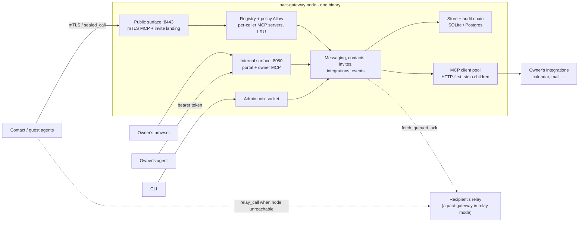
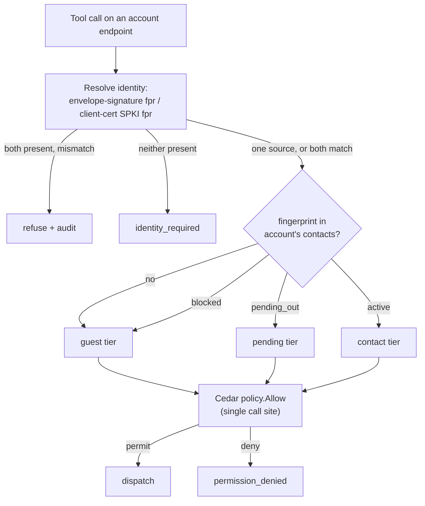
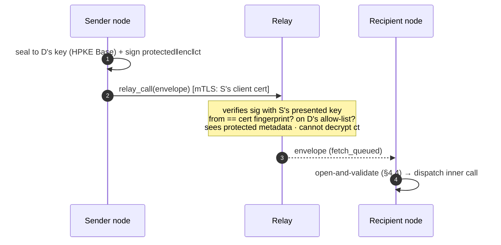
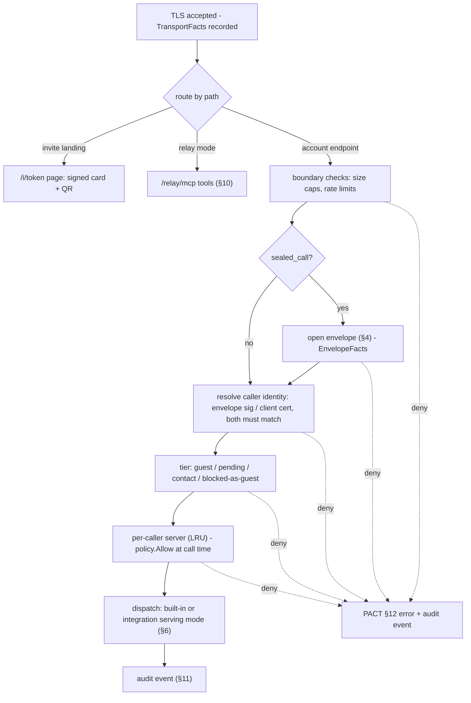
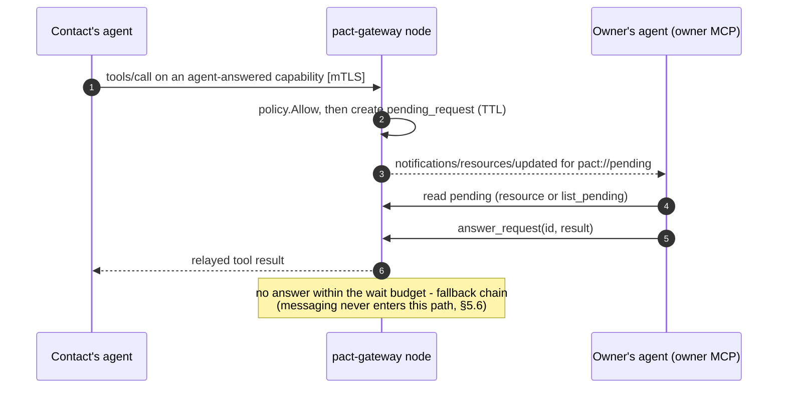
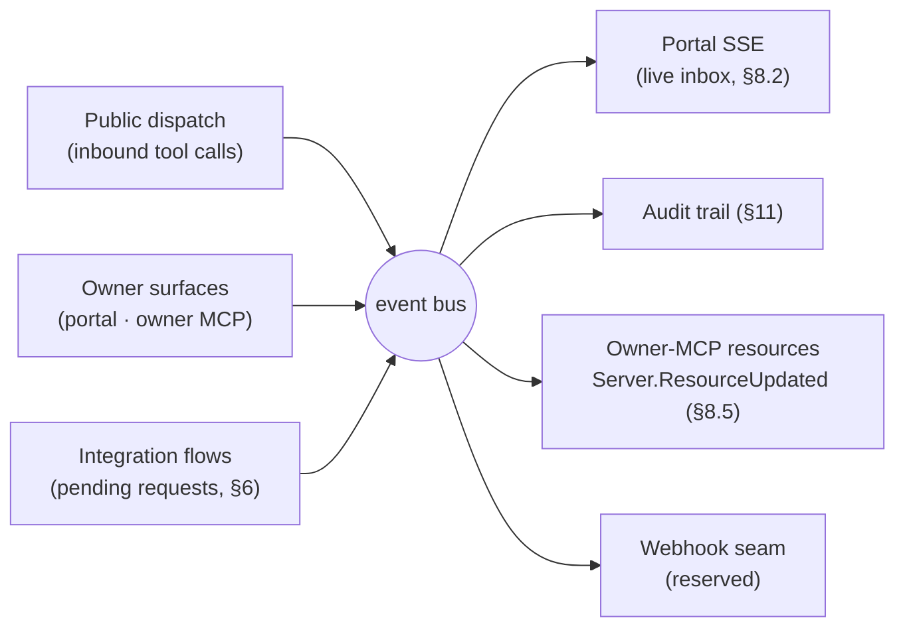
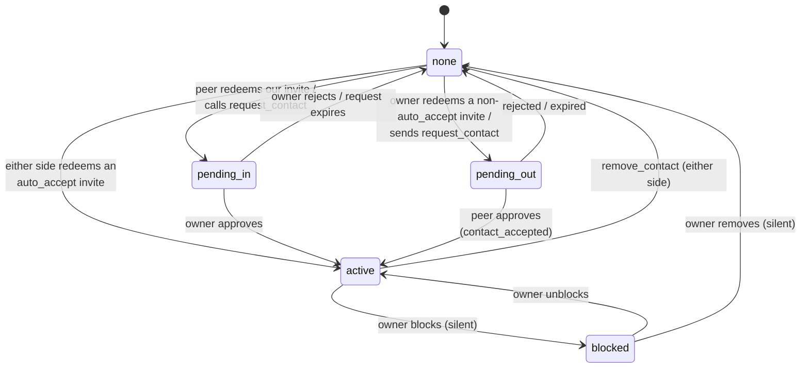
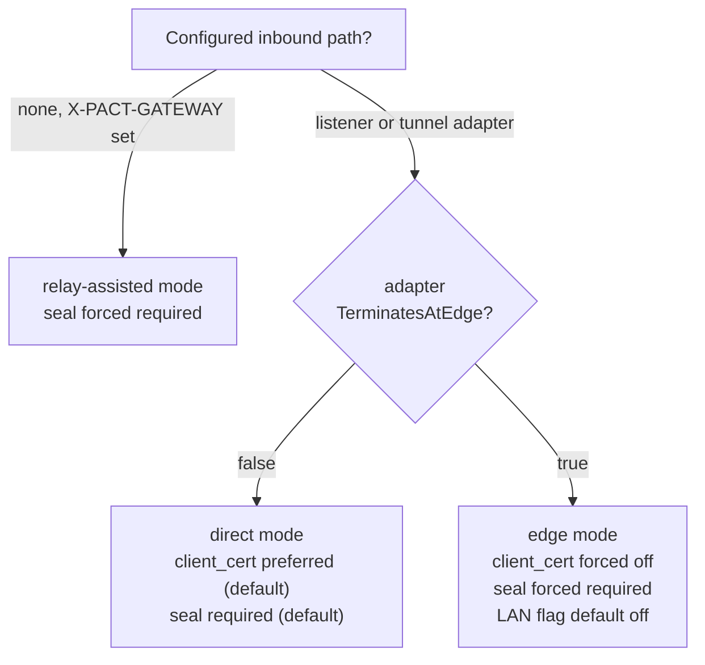
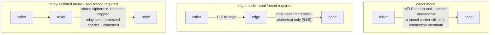

# pact-gateway — Product Specification

**Version 0.1.0-draft · 2026-08-24 · implements PACT 1.0 + the 1.1 delta (§15)**

pact-gateway is a self-hosted personal node for the PACT protocol: your agent's public,
permission-gated MCP server to the people you approve, your private control panel and
owner-MCP surface, and the bridge that exposes selected tools from your own MCP
integrations to your contacts. One Go binary; SQLite by default; no telemetry.

The PACT protocol specification (`pact-protocol/SPEC.md`) is normative for everything
wire-visible. This document is normative for the pact-gateway implementation.

---

## 1. Overview and roles

### 1.1 What pact-gateway is

pact-gateway is a self-hosted personal PACT node: one static Go binary that gives a person a permanent agent presence on the network. It implements PACT 1.0 — the protocol spec remains normative for all wire behavior and is cited throughout as "PACT §N" — plus the PACT 1.1 delta this product required, summarized in §15. A single node is three things at once:

- **An MCP server to the outside.** Contacts and strangers reach the node's public surface (§5) as an MCP server over HTTPS. What a caller sees and may call is decided by caller identity (§3), tier, and the owner's per-contact permission switchboard (PACT §8) — never by anything the caller asserts.
- **An MCP client to the inside.** The owner's own integrations — calendar, mail, anything speaking MCP — are upstreams the node connects to as an MCP client (§6). Contacts never reach an upstream directly: every exposed capability passes through versioned catalog snapshots and exposure sets, and is served in one of three modes — passthrough, mapped, or agent-answered (§6).
- **An internal surface for the owner.** A browser portal and an owner MCP server (§8) are how the owner, and the owner's own agent, read the inbox, manage contacts, invites, and permissions, and administer the node.

### 1.2 Three roles, one binary

The same binary plays three roles, selected by configuration (§12):

| Role | What it does | Detail |
|---|---|---|
| **node** | The default and the subject of most of this spec: a person's agent server — public surface, integrations, portal, owner MCP. | §2–§9 |
| **relay mode** | The store-and-forward relay of PACT §9: queues sealed calls for recipients that are offline or unreachable, enforces each recipient's allow-list and quotas, and verifies the envelope signature **without decrypting** — it can refuse unwanted senders while never reading sealed content. | §10 |
| **ingress role** | An own-domain front door: routes each subdomain either as **passthrough** (SNI routing, end-to-end mTLS preserved) or **terminate** (public ACME TLS at the front, converted to a fresh, mutually pinned mTLS hop to the node). Nodes pair with an ingress via a one-time token. | §10 |

A node MAY additionally run relay mode for its contacts; the roles compose rather than exclude each other.

### 1.3 Audience, license, telemetry

**v1 is built for strangers from day one.** The public surface is not a friends-only experiment: unknown callers are expected and served deliberately — the guest tier is minimal (PACT §6.1), invites carry expiry, use counts, and server-side revocation (§9), PACT §12 rate limits are enforced at the boundary, and refused connections are audited (§11).

**License and posture.** Apache-2.0 from day one. The repository starts private and is flipped public by the owner; CONTRIBUTING.md and a SECURITY.md with a private disclosure route ship from the first commit so the flip needs no cleanup.

**No telemetry.** The binary reports nothing to anyone, and the documentation states this explicitly. Its only outbound connections are the ones the owner configured: peer nodes, upstream integrations, and tunnel/relay carriers (§10).

---

## 2. Architecture

### 2.1 One binary

pact-gateway ships as a single static Go binary (`CGO_ENABLED=0`) containing every role and every surface. Upstream integrations are consumed HTTP-first; stdio-only MCP servers run as supervised child processes of the node. The container image is a slim distroless build, with a `-full` tag adding the node and uv runtimes that stdio children commonly need (§12).



Internally the binary is organized into twelve packages; the names below are normative and match `PLAN.md` task P0-01's layout. The twelve subsystems, each grounded in an approved decision:

| # | Package (indicative) | Responsibility | Detail |
|---|---|---|---|
| 1 | `store` | `Store` interface, sqlc + goose migrations, SQLite (modernc, default) and Postgres (pgx) engines | §11 |
| 2 | `audit` | Append-only hash-chain audit log, JSONL archive with durable re-anchor, `audit verify`/`audit archive`/`audit repair` | §11 |
| 3 | `identity` | Owners, accounts, memberships, WebAuthn passkeys, bearer tokens, keyring-encrypted secrets | §3 |
| 4 | `authz` | Cedar (cedar-go): static shipped policies, dynamic entities; the single call site `policy.Allow` | §3 |
| 5 | `envelope` | HPKE seal/open, detached signatures, the two suites, the open order | §4 |
| 6 | `public` | Public mTLS listener, caller identity derivation, tiers, per-caller MCP servers (§2.4) | §5 |
| 7 | `contact` | Contact lifecycle, invite issuance/redemption, card builder, vCard parse/emit | §9 |
| 8 | `message` | Threads, messages, blob store, internal event bus | §7 |
| 9 | `integration` | MCP client pool, upstream OAuth, catalog snapshots, exposure sets, three serving modes | §6 |
| 10 | `internal` | Portal (server-side rendered, zero external assets) and the owner MCP server | §8 |
| 11 | `reach` | Tunnel adapters, relay mode (both sides), ingress role | §10 |
| 12 | `cli` | CLI over the admin socket, config loading (environment > file > store > defaults, §12.2), doctor, migrate | §12 |

### 2.2 Three entry points

| Surface | Default bind | Authentication | Serves |
|---|---|---|---|
| Public | `:8443`, TLS | Caller identity per §3: client certificate (per the `client_cert` knob) and/or envelope signature | The per-caller MCP endpoint (§5); invite landing pages `https://<host>/i/<token>` (§9) |
| Internal | `127.0.0.1:8080` | Portal: an owner session on **every** bind, loopback included (§8.3); CSRF protection stays on regardless. Any non-loopback bind MUST refuse to start unless passkey authentication and TLS are configured (§3). Owner MCP: named, revocable bearer tokens, also on every bind (§8.4) | Portal (browser) and owner MCP (§8) |
| Admin | Unix socket | Filesystem permissions | CLI (§12); offline DB operations only with the node stopped |

The default binds (`:8443`, `127.0.0.1:8080`), the path scheme of §5.2 (`/a/<account>/mcp`, the single-account `/mcp` alias, `/relay/mcp`), and the per-account endpoint slug of §3.2 are spec-chosen defaults, not plan-fixed decisions — of the URL surface only the invite path `/i/<token>` is plan-sourced; they stand unless the owner objects at review. Binds are configuration, not constants (§12); the portal and owner MCP can be kept local, tunneled, or split per the owner's deployment matrix (§10). One consequence of the surface split is worth stating here: when the owner sends outbound to a contact, the `sender` label of PACT §6.2 is **derived from the surface** — portal → `human`, owner MCP → `agent` — and is never accepted as a caller-supplied parameter (§7).

### 2.3 The public call path

Every inbound call on the public surface travels one path:

1. **Accept.** TLS handshake on the public listener. A client certificate is requested according to the `client_cert` knob (`required` | `preferred` | `off` — §3): `preferred` is the direct-mode default; edge mode forces `off` because no client certificate survives a terminating edge (§10). Unknown certificates are accepted at the TLS layer — tiering happens above it (PACT §2).
2. **LAN check.** The LAN connections flag governs whether the public listener accepts connections that bypass the configured carrier from private-range addresses; it defaults to off in edge mode, and every refusal is audited (§10, §11).
3. **Identity.** The caller identity is the envelope-signature fingerprint or the client-certificate SPKI fingerprint; when both are present they MUST match. Fingerprints are `"sha256:" + base64url(SHA-256(SPKI))` (PACT §2). A call carrying neither where one is required fails with `identity_required` (§15).
4. **Seal.** The `seal` knob (`none` | `optional` | `required`, advertised on the card as `X-PACT-SEAL` — §4) is enforced. With `seal: required` — the default, and forced in edge mode and relay-assisted mode — unsealed substantive calls are rejected with `seal_required`; a `sealed_call` passes the open order of §4 (decode → suite → to==me → kid → open → verify signature against the pinned key, or the card inside the payload for guests → timestamp window → `msg_id` idempotency → dispatch).
5. **Tier.** The identity is looked up in the account's contact list and lands in exactly one tier: guest, pending, contact, or blocked — and blocked callers are silently served the guest tier, indistinguishable from strangers (PACT §6.1, §9).
6. **Serve.** The caller's per-caller MCP server (§2.4) answers `tools/list` and receives `tools/call`.
7. **Dispatch.** Every call re-passes `policy.Allow` at call time, enforces PACT §12 limits at the boundary, honors `msg_id` idempotency, and appends an audit event — bodies referenced, not copied (§11).

### 2.4 Per-caller MCP servers

The node never exposes one static MCP server. Every tool it can serve — guest and pending tools, the contact-tier core of PACT §6.2, `sealed_call`, and every integration-derived tool — lives in a **registry as data**, and the node composes a dedicated MCP server per caller:

- **Keyed by (account, caller fingerprint).** Built on first use and LRU-cached.
- **Composed through `policy.Allow`.** Composition asks the single Cedar call site (§3) which registry entries this caller may see; the composition result *is* what `tools/list` returns. There is no second, parallel filtering path to drift out of sync.
- **Rebuilt on change.** Flipping a switch on a contact's switchboard invalidates the cached server, and live sessions receive `notifications/tools/list_changed` — the node runs its streamable transport stateful so the notification reaches every open session (§5). Upstream catalog changes propagate the same way once the owner re-confirms the affected exposures (§6).
- **Re-checked at call time.** The cache is a listing optimization, never an authorization cache: every `tools/call` passes `policy.Allow` again, so revocation is effective on the very next call even against a stale cached server.
- **Sessions bound to the creating identity.** An MCP session is bound to the caller identity that created it; a session presented under any other identity MUST be rejected.
- **Guests share one server.** All unknown callers of an account share a single guest server exposing exactly the guest tier of PACT §6.1 (`redeem_invite`, `request_contact`) plus the `sealed_call` wrapper (§4); nothing about it is caller-specific, so there is nothing to build per caller.

### 2.5 Deployment modes (summary)

Reachability is the tunnel adapters' only job: an adapter never changes protocol behavior by itself. Each adapter declares whether it terminates TLS at a third-party edge (`TerminatesAtEdge`), and the node derives the deployment mode — and the knob values that mode forces — from that declaration, so the owner cannot configure a contradiction. Full adapter list, the ingress role, and the owner's matrix are in §10.

| Mode | TLS path | Forced / default knobs | Who reads what |
|---|---|---|---|
| **direct mode** | End-to-end mTLS terminating at the node (port forward, Tailscale Funnel, frp, ngrok TLS) | `seal: required` by default; `client_cert: preferred` by default | The carrier moves ciphertext; no third party reads content |
| **edge mode** | Public TLS terminates at a third-party edge (Cloudflare Tunnel; ngrok HTTPS) which re-originates to the node | `seal` forced `required`; `client_cert` forced `off`; LAN connections flag defaults off | The edge sees all metadata and would see any unsealed content — which is why seal is forced; sealed content stays unreadable to it (§4, §13) |
| **relay-assisted mode** | No inbound path at all: senders queue sealed calls at the recipient's relay; the recipient fetches and acknowledges | `seal` forced `required`; envelope timestamp window relaxed up to the envelope's `exp` (≤ 30 days) (§4) | The relay verifies signatures without decrypting: it sees the protected header — sender, recipient, timing — but never content |

The honest residue, carried in full in §13: sealing uses HPKE Base mode to a long-lived identity key, so there is **no forward secrecy** — a later key compromise decrypts recorded sealed traffic; edges and relays always see **metadata** even when content is sealed; and the sealing keypair is the **same keypair as mTLS** (an accepted key-reuse caveat, with the envelope's `kid` field as the seam for a future separate encryption key).


---

## 3. Identity, owners, accounts, authorization

pact-gateway keeps three notions strictly apart. An **owner** is a human who administers the node, authenticated with passkeys on the internal surface (§8). An **account** is a PACT identity the node serves — a keypair, a card, an endpoint. A **caller** is a remote identity established per request on the public surface (§5) under the unified identity rule of §3.5. Every decision about what any of them may do funnels through a single Cedar authorization point (§3.6).

### 3.1 Owners and passkeys

Owners live in the `owners` table, their login material in `credentials` (§11). Owner authentication is WebAuthn passkeys:

- An owner MAY register multiple passkeys, each carrying a human-readable tag ("macbook", "spare yubikey"). Passkeys are listed and removed from the portal, the owner MCP, and the CLI (`passkey list|remove`, §12).
- Registering a **new** passkey is portal-initiated only — a WebAuthn ceremony needs a browser authenticator; the CLI participates by minting the one-time setup URL that leads to the portal ceremony (`passkey reset-wizard`, §12). It MUST NOT be possible over the owner-MCP bearer-token surface (§3.4) — a leaked token must not be able to mint a durable login credential.
- The portal requires an owner session on **every** bind, loopback included (§8.3); a non-loopback bind MUST additionally refuse to start unless passkey auth and TLS are configured (§8). A passkey is therefore not optional: once one exists it is the only way in.

First run and lockout recovery share one mechanism, the setup wizard (§12), gated by the zero-passkey rule: whenever the node has **zero** registered passkeys — first boot, or after the last passkey was removed — the portal auto-shows the wizard. The wizard is reachable only from loopback or with a one-time setup token (loopback-or-token gated); first run prints the portal URL and setup token to the logs (§12), and `passkey reset-wizard` (CLI, over the admin unix socket, §12) mints a fresh one-time setup URL for an owner locked out of every passkey. Setup tokens carry at least 128 bits of entropy and expire after 24 hours. An ordinary one is invalidated the moment any passkey is registered (§12.4); a **recovery** token minted by `passkey reset-wizard` is the deliberate exception, and re-opens the wizard while passkeys still exist — without it, losing a single passkey would be unrecoverable, since no bind serves the portal unauthenticated. A recovery token MUST be presented explicitly: reaching loopback alone never re-opens the wizard once a passkey exists, or any local process could register itself as an owner. Registering through it adds a passkey and removes none. It is **not** burned on first use: a WebAuthn ceremony is two requests, so consuming the token on the first would guarantee the second failed. Until setup completes it is a bearer credential for the wizard — anyone holding it can reach the ceremony — which is why it is invalidated by the first registered passkey and why the operator copy tells the owner to treat it as a password. Host shell access is therefore the recovery root of trust; there is deliberately no online recovery path.

The `credentials` schema is type-discriminated and pre-shaped for later login adapters: each row carries a kind plus an adapter-specific payload, so OAuth adapters (Google/Apple/WorkOS) and email/password can land later as new kinds without reshaping the table. v1 implements passkeys only. Portal logins create rows in `sessions` (§11).

### 3.2 Accounts

An account is one PACT identity served by this node; a node serves one or many. The `accounts` table (§11) carries:

| Field | Meaning |
|---|---|
| identity keypair | ECDSA P-256 default, Ed25519 permitted (PACT §2); private key encrypted under the keyring (§3.7) |
| fingerprint | `"sha256:" + base64url(SHA-256(SPKI))` — the public identity (PACT §2) |
| vCard fields | FN, TEL, EMAIL, … rendered by the card builder (§9); the `X-PACT-*` properties are derived by the node, never hand-edited |
| endpoint slug | path component addressing this account on the public listener; `X-PACT-ENDPOINT` = the node's public base URL + slug |
| seal policy | `none\|optional\|required`, published as card property `X-PACT-SEAL` (§4, §15); default `required`, and edge mode and relay-assisted mode force `required` (§10) |
| status | whether the node currently serves this account; a disabled account keeps its data and contacts but its endpoint answers `unavailable` (PACT §12) |

**Key reuse, stated plainly.** The identity keypair is simultaneously (a) the TLS client-certificate key for outbound calls, (b) the TLS server key when the listener runs an identity-key self-signed certificate (§3.8), and (c) the HPKE recipient key and detached-signature key for sealed envelopes (§4) — Ed25519 identities are converted to X25519 for PACT-SEAL-X25519. Compromise of one private key therefore breaks transport identity **and** envelope confidentiality at once. This is a deliberate, accepted caveat (§13); the envelope's `kid` field is the seam that lets a later version introduce a separate encryption key without a format change (§4).

### 3.3 Membership and node administration

`memberships` (§11) relates owners to accounts many-to-many, with a role attribute on each row: several owners can share one account (a family assistant), and one owner can hold several accounts (personal and business personas). The role attribute is data handed to Cedar as an entity attribute (§3.6); the shipped static policies decide what each role may do. v1 defines exactly one membership role: `admin` — full control of the account. Finer-grained roles are post-v1; the role column is pre-shaped for them the same way `credentials` is pre-shaped for later login kinds (§3.1).

`node_admin` is node-scoped — a flag on the owner, not a membership role. Node-wide configuration — tunnel settings and the LAN connections flag, relay settings, ingress pairing, storage, and the owner roster itself (§8) — requires `node_admin`; account-scoped actions require membership in that account.

### 3.4 Bearer tokens for the owner MCP

The owner MCP surface (§8) authenticates with **named, revocable bearer tokens**: created from the portal settings page or the `token` CLI (§12), each labeled, each bound to exactly one owner. A token acts as that owner and is subject to the same Cedar decisions (§3.6); revocation takes effect immediately. A token is required on **every** bind, loopback included — for the same reason the portal demands a session on every bind (§8.3): granting full owner authority to anything that can open a loopback socket would hand it to every other process on the host, and, where a container shares the network namespace, to every process in it. The CLI needs no token because it speaks over the admin unix socket, whose permissions are the host's. Tokens MUST NOT be accepted on the public PACT surface, which carries no OAuth or token auth of any kind (PACT §6) — public callers are identified only by §3.5. Tokens cannot register passkeys (§3.1).

### 3.5 Caller identity on the public surface

The unified identity rule (PACT 1.1 delta, §15) defines who a public caller is:

> Caller identity is the fingerprint whose key signed the sealed envelope (§4) **or** the SPKI fingerprint of the presented TLS client certificate. When both are present, they MUST match; a mismatch MUST be refused and audited (§11).

Which sources are available follows from the deployment knobs (§10): seal = `none|optional|required` and client_cert = `required|preferred|off`. In direct mode the defaults are seal `required`, client_cert `preferred`; edge mode forces client_cert `off` and seal `required`, so identity there is always the envelope signature. Guest calls under seal carry the caller's card inside the sealed payload, and the signature is verified against that card's key (§4) — that key's fingerprint is the caller identity.

- A tool call that establishes no identity at all MUST be refused with `identity_required` (§15).
- An unsealed call to an account whose seal policy is `required` MUST be refused with `seal_required` (§15).
- An envelope that fails any of the validation steps 1–7 of the open order MUST be refused with `envelope_invalid` (§4.4, §15).
- A mismatch between the envelope-signature and client-certificate fingerprints MUST be refused with `envelope_invalid` (§4.7, §4.11).

The resolved fingerprint is looked up in the account's contact list and maps to a tier — guest, pending, contact, blocked — per PACT §6.1. Blocking is silent guest demotion (PACT §5): a blocked caller is indistinguishable from a stranger. MCP sessions are bound to the identity that created them; a session resumed under any other identity MUST be rejected (§5).



### 3.6 Authorization: one Cedar decision point

Authorization is Cedar via **cedar-go**, on the model *static policies, dynamic entities*: the policy set ships inside the binary and is versioned with it; owners never author or edit Cedar in v1. What owners control is data — the per-contact permission switchboard (§5, §9) writes grants (`message.text`, `calendar.book`, `integration.<slug>`, … per PACT §8) into the store, and those grants surface to Cedar as entity attributes, not as policy text.

`policy.Allow` is the **single** authorization call site: the public dispatch path, the owner-MCP dispatch path, and portal mutations all funnel through it, so there is no second ad-hoc permission check to drift out of sync. Entities are built per request from store state: the principal (caller fingerprint and tier, or owner with role and `node_admin` — in v1 the only membership role is `admin`, §3.3, so the shipped policies distinguish only membership and the `node_admin` flag), the account, and the grant set.

- The shipped policy set carries an explicit **forbid on blocked** callers; Cedar's forbid-overrides-permit semantics make the demotion of §3.5 non-bypassable regardless of any lingering grants.
- Authorization is re-checked **at call time** on every `tools/call`, not only when a caller's tool list is composed — flipping a switch revokes instantly (PACT §8). The cached per-caller server (§5) is rebuilt on switchboard change; in the window before rebuild, the call-time check already denies.
- Denials return `permission_denied` (PACT §12) and are audited (§11), as are refused LAN connection attempts (§10).

### 3.7 Keyring and secret storage

All secrets at rest are encrypted under a keyring **master key**, supplied — in the configuration precedence order of §12.2 — via environment variable, a key file, or the OS keyring where one is available. A key file with permissions broader than `0600` MUST cause the node to refuse to start. Containers (distroless, §12.3) have no OS keyring: there the key arrives via the environment or a key file on the `/data` volume. The keyring encrypts, inside the store (§11): account identity private keys, owner-token secrets, integration credentials such as OAuth refresh tokens (§6), and tunnel/relay credentials (§10). A copy of the database alone is therefore not enough to impersonate an account. The corollary is stated honestly: losing the master key loses every encrypted key with it — for identity keys that is key loss, and the rule of §3.9 applies to every account at once.

### 3.8 Server certificates by deployment mode

What certificate the node presents depends on the deployment mode (§10):

| Mode | Public leg | Node's listener |
|---|---|---|
| direct mode, own domain | ACME autocert (WebPKI, Let's Encrypt) or a user-supplied certificate | the same — the node terminates public TLS itself |
| direct mode, no domain | identity-key self-signed certificate; peers validate it by the pinned fingerprint (PACT §2) | the same |
| edge mode | the edge provider's certificate — public TLS terminates at the edge (§10, §13) | an origin-leg cert on the tunnel-only listener, serving only the connector's leg |
| relay-assisted mode | the relay (a pact-gateway in relay mode, §10) presents its own certificate for queued traffic | the node may run no reachable listener at all; it only originates outbound fetches |

The ingress role (§10) splits per subdomain: a **passthrough** subdomain carries the node's own certificate end-to-end (any direct-mode strategy above, routed by SNI); a **terminate** subdomain holds an ACME certificate at the ingress and speaks a fresh, mutually-pinned mTLS leg to the node, both ends pinned at one-time-token pairing.

Client side, in every mode: outbound connections MUST supply the identity certificate through Go's `GetClientCertificate` callback rather than default certificate selection — edges advertise CA distinguished names in their CertificateRequest, and default selection would silently send no certificate at all (§10).

### 3.9 Key rotation, grace period, and key loss

`account rotate-key` (§12) runs the rotation of PACT §2:

1. Generate the new keypair; store it in the keyring alongside the old one.
2. Re-derive and re-sign the account's card (new `X-PACT-KEY`; `X-PACT-SEAL` and endpoint unchanged unless edited).
3. Walk the account's active contacts, calling each contact's `update_contact` with the new card plus a signature over the new fingerprint by the **old** key (PACT §2). Each success re-pins that contact; per-contact completion is recorded.
4. **Grace period — both keys stay live.** Outbound calls to a contact that has not yet re-pinned present the old certificate (via `GetClientCertificate`); inbound sealed envelopes addressed to the old key still open, selected by the envelope `kid` (§4). New pins are always the new fingerprint. The grace period defaults to **14 days** with a hard cap of **90 days**, configurable per rotation.
5. When the grace period ends, the old private key MUST be destroyed — at expiry, regardless of contacts that have not yet re-pinned. A contact that missed the rotation re-verifies by receiving the card again over any human channel — same as a first add (PACT §2).

**Lost key = new identity** (PACT §2). There is deliberately no recovery ceremony: no third party holds a copy, and the node can only mint a fresh keypair for the account, after which the owner re-shares the card to every contact. Losing the keyring master key (§3.7) has the same consequence for every account on the node at once. This trade-off is kept visible in docs and UX copy (§13), never papered over.

**Identity backup (§3.10)** is the one thing that changes the outcome, and it changes it only for an owner who acted in advance. `backup identity` exports ONE account's keypair, encrypted under a passphrase the owner supplies rather than under the node's keyring, so the file is portable to a different node — which is exactly what makes it a backup and exactly what makes it dangerous. It is not a recovery ceremony: nobody can perform it for you, and a backup you did not take does not exist. Losing both the key and the backup is still a new identity.

### 3.10 Identity backup and restore

`backup identity` and `backup restore-identity` (§12) move one account's identity between nodes, or into cold storage. Both are **offline** and reachable **only over host shell access** — never the portal, never the owner MCP, and never a bearer token. The boundary matches §8.6's: a registration ceremony must not be performable by a leaked token, and neither must an export of the thing that ceremony protects. A session or a token that could exfiltrate an identity key would make every other control on that surface decorative.

The file is a self-describing JSON document holding the account's slug, display name, algorithm and fingerprint in the clear, and the PKCS#8 private key sealed with AES-256-GCM under a key derived from the owner's passphrase by Argon2id. The cleartext metadata is bound in as the AEAD's additional data, so a file whose fingerprint or slug has been edited fails to open rather than restoring an identity under a name it does not own. The passphrase is supplied the way the keyring master key is (§12.2): an environment variable, or a `0600` file — a passphrase file with broader permissions is refused, for the same reason the master key file is.

Restore refuses to overwrite: an account whose slug or fingerprint already exists on the node is a collision the owner must resolve, not something to silently replace. A restored identity arrives with its keypair and nothing else — contacts, threads and media do not travel with it, because they are the *other* node's records of relationships. The contacts who pinned this key keep working; the owner's own view of them does not come back. Restoring the whole node, including those records, is `backup create` / `backup restore`.


---

## 4. Sealed envelopes

PACT 1.0 accepts a plain trade-off: security is the mTLS session, and any party that terminates that session — a store-and-forward relay (PACT §9) or a TLS-terminating edge (PACT §10) — can read the traffic. PACT 1.0 also anticipated the remedy: "the hardened draft's sealed envelope drops back in as an optional layer without changing anything else here" (PACT §9). The sealed envelope defined in this section is exactly that layer, adopted by the owner as a deliberate reversal of the earlier "no envelope crypto" stance and carried into the protocol as the PACT 1.1 delta (§15). It solves two problems at once:

- **Confidentiality past intermediaries.** In edge mode and relay-assisted mode (§10) the caller's TLS session ends at the intermediary. The envelope keeps the call content readable only by the recipient node.
- **Caller identity through terminating edges.** An edge that terminates TLS cannot deliver the caller's client certificate end-to-end (client_cert is forced off in edge mode, §10). The envelope's detached signature carries the caller's identity — the same SPKI fingerprint identity as PACT §2 — through any intermediary.

In direct mode, end-to-end mTLS already provides confidentiality (with forward secrecy, which the seal does not have — §4.9); the seal is not needed there and is a matter of policy (§4.6).

### 4.1 Format

An envelope is a JSON object with four members. Binary values are base64url-encoded, consistent with fingerprint encoding (PACT §2).

| Member | Field | Meaning |
|---|---|---|
| `protected` | `v` | Envelope format version; `1` in this revision |
| | `suite` | `PACT-SEAL-P256` or `PACT-SEAL-X25519` (§4.2) |
| | `from` | Sender identity fingerprint: `"sha256:" + base64url(SHA-256(SPKI))` |
| | `to` | Recipient identity fingerprint, same form |
| | `msg_id` | Caller-supplied idempotency id for this envelope (PACT §6.2 semantics) |
| | `ts` | Time of sealing |
| | `exp` | Expiry; `exp − ts` MUST NOT exceed 30 days (aligned with relay retention, PACT §9) |
| | `cty` | Content type of the plaintext; for `sealed_call` the plaintext is a single JSON object holding the inner MCP request (§4.5) |
| | `kid` | Identifier of the recipient key sealed to (§4.10) |
| `enc` | | HPKE encapsulated key (Base mode) |
| `ct` | | HPKE ciphertext of the plaintext |
| `sig` | | Detached signature by the **sender identity key** over `protected‖enc‖ct` |

The signature is detached and the HPKE mode is Base — not Auth — so the sender-authentication role and the encryption role are fully independent. This is what makes cross-curve pairs work (a P-256 sender sealing to an Ed25519 recipient, and vice versa); HPKE Auth mode was rejected for exactly this reason. Pinned encodings (PACT §13.1): ECDSA P-256/SHA-256 signatures are ASN.1 DER; Ed25519 signatures are pure Ed25519 per RFC 8032; the HPKE `info` parameter is the ASCII string `PACT-SEAL-v1`; Ed25519→X25519 conversion uses RFC 7748 §4.1's birational map for the public key and RFC 8032 §5.1.5's SHA-512-derived clamped scalar for the private key.

Wire encodings, pinned here and exercised by the PACT 1.1 test-vectors appendix (new PACT §13; §14.1, §15): the byte serialization of `protected` for signing is its canonical JSON — UTF-8, object keys sorted lexicographically, no insignificant whitespace — and those same bytes are the HPKE AAD for the seal; `ts` and `exp` are integers, Unix seconds (UTC); the registered `cty` for sealed MCP calls is `application/pact-call+json` (§4.5).

### 4.2 Suites

Two suites, selected by the **recipient's** identity key type:

| Suite | KEM | KDF | AEAD | Recipient identity key |
|---|---|---|---|---|
| `PACT-SEAL-P256` | DHKEM(P-256, HKDF-SHA256) | HKDF-SHA256 | AES-128-GCM | ECDSA P-256 |
| `PACT-SEAL-X25519` | DHKEM(X25519, HKDF-SHA256) | HKDF-SHA256 | ChaCha20-Poly1305 | Ed25519, converted to X25519 for the DH operation |

The signature always uses the sender's identity key in its native algorithm (ECDSA P-256 or Ed25519); only the recipient's Ed25519 key is converted, and only for the KEM.

### 4.3 Sealing

To seal a call to a recipient, the sender MUST:

1. Build `protected`: `v: 1`; `suite` per the recipient's key type; `from` = own fingerprint; `to` = the recipient's pinned fingerprint from their card; a fresh `msg_id` (reused verbatim on retries of the same call); `ts` = now; `exp ≤ ts + 30 days`.
2. Derive the recipient's public encryption key from the pinned SPKI: P-256 used directly for ECDH; Ed25519 converted to X25519.
3. HPKE-seal the plaintext in Base mode under the suite, producing `enc` and `ct`.
4. Sign `protected‖enc‖ct` with the sender identity key, producing `sig`.
5. Deliver: as the arguments of `sealed_call` on the recipient's node (§4.5), or via the recipient's relay with `relay_call` (§4.8).

### 4.4 Opening and validating

A node receiving an envelope MUST perform these steps, in this order:

1. **Decode.** Parse the envelope; reject malformed input.
2. **Suite.** `suite` MUST be a known suite matching the addressed account's key type.
3. **Addressing.** `to` MUST equal the fingerprint of the account whose endpoint received the call (§5.2).
4. **Key id.** `kid` MUST identify a key the node holds for that account (in this revision: the account's identity key, §4.10).
5. **Open.** HPKE-open `ct` with the identified private key; failure rejects the envelope.
6. **Verify the signature** over `protected‖enc‖ct`. If `from` is known to the contact store at contact or pending tier, verify against the pinned key — the full SPKI stored at pinning time (§9.2) — and if the opened payload also carries `spk`, it MUST equal that pinned key. If `from` is unknown (guest), verify against the payload's `spk` (the sender's SubjectPublicKeyInfo, base64url DER, PACT §13.2): `SHA-256(spk)` MUST equal `from` AND the `X-PACT-KEY` of the `card` argument of the inner `tools/call` — `redeem_invite` or `request_contact`, the only guest tools with a card slot. A card carries a fingerprint, never a key (§2), so `spk` is what makes an unpinned sender's signature verifiable at all; a guest envelope without `spk` is rejected `envelope_invalid`. A **blocked** sender takes this same guest path — pin present or not — because verifying it against its pin would let acceptance itself distinguish "blocked" from "never met" (§9.1); the demotion happens later, at tiering. Note the order: step 5 has already decrypted (HPKE Base needs no sender key), so the key is in hand before it is needed, and it arrives inside the ciphertext — carriers continue to see only fingerprints (§13); a guest envelope whose inner request is `tools/list`, or whose inner call lacks a `card` argument, MUST be rejected `envelope_invalid` (guests therefore discover their surface via unsealed `tools/list`, not sealed — §4.5, §5.3). If the transport connection also presented a client certificate, its SPKI fingerprint MUST equal `from` (§4.7).
7. **Freshness.** On every path, reject when `now > exp` or `exp − ts > 30 days`. For directly delivered envelopes, additionally reject when `|now − ts| > 300 s`; envelopes fetched from a relay are exempt from the 300 s window and accepted while `now ≤ exp`.
8. **Idempotency.** A `msg_id` already processed for this caller MUST return the recorded acknowledgment without re-executing (PACT §6.2); this is not an error. The record lives in the `idempotency` table (§11.2), retained at least until the envelope's `exp`.
9. **Dispatch** the inner request against the caller's permission-filtered surface (§3, §5), with `from` as the caller identity.

Failures in steps 1–7 MUST return `envelope_invalid` — a single, deliberately coarse code (§4.11). Every rejection is an audit event (§11).

### 4.5 The `sealed_call` tool

`sealed_call` is a wrapper tool present at **every tier** — guest, pending, and contact; blocked callers see the guest surface (§3) and therefore also see it. Its arguments are the four envelope members of §4.1 at top level. The plaintext is one bare JSON object `{"method": …, "params": …, "spk": …}` — no JSON-RPC framing — whose method MUST be `tools/call` or `tools/list`, and whose `spk` (the sender's SubjectPublicKeyInfo, base64url DER) is REQUIRED whenever the recipient does not pin `from` (§4.4 step 6):

- an inner `tools/call` is dispatched exactly as if it had arrived directly from the established identity — same tiers, permission switchboard, and tool semantics (§5, PACT §6, §8);
- an inner `tools/list` returns the caller's permission-filtered tool surface. This is how a caller behind a terminating edge discovers its tools, since an unsealed `tools/list` there carries no caller identity and shows only the identity-free surface.

Guest exception: an unknown caller's sealed envelope must carry both its `spk` and its card (in the inner call's `card` argument) — the key verifies the signature, the hash binds it to `from` and to the card (§4.4 step 6). A **blocked** sender's envelope MUST be processed exactly the same way — the pinned key is ignored, the card-binding rules apply, and a blocked sender's sealed `tools/list` is rejected `envelope_invalid` like any stranger's — so sealing never becomes an oracle distinguishing blocked from unknown (PACT §12's `blocked_or_unknown` guarantee). An inner `tools/list` has no arguments, so a sealed `tools/list` from an unknown `from` is rejected `envelope_invalid`; guests use unsealed `tools/list`, which always answers (§4.6).

The envelope `msg_id` deduplicates the envelope; an inner tool that itself takes a `msg_id` (e.g. `send_message`, `book_slot`) keeps its own tool-level idempotency unchanged. Errors of the inner call (e.g. `permission_denied`, PACT §12) are returned as the inner call's result and are distinct from envelope errors.

**Results are sealed iff the request was sealed.** The result of a `sealed_call` MUST be returned as an envelope of the same format, sealed to the caller's identity key and signed by the responder: `from`/`to` swapped relative to the request, the request's `msg_id` (correlation — result envelopes are never dispatched, so envelope idempotency does not apply to them), `cty: application/pact-result+json`, and `kid` naming the caller's key. A plaintext request gets a plaintext result. Since edge mode forces `seal=required`, nothing but ciphertext and metadata ever crosses a terminating edge in either direction.

### 4.6 Negotiation: `X-PACT-SEAL` and the seal knob

The PACT 1.1 delta (§15) adds one card property, `X-PACT-SEAL`, with values `none|optional|required` (§9). It advertises the card owner's inbound seal policy, driven by the node's `seal` knob:

| Value | Inbound meaning | Outbound rule for callers |
|---|---|---|
| `none` | Node does not accept sealed envelopes (`sealed_call` absent) | MUST NOT seal |
| `optional` | Both sealed and unsealed calls accepted | MAY seal |
| `required` | Every unsealed `tools/call` other than `sealed_call` from an identified caller is refused with `seal_required` — anonymous calls fail `identity_required` first (§5.3); unsealed `tools/list` still answers, filtered to what the transport identity (if any) earns | MUST seal |

The `seal` knob defaults to `required`. In edge mode and relay-assisted mode it is **forced** to `required` — the constraint is derived from the deployment mode (`TerminatesAtEdge`, §10), not owner-adjustable there, because in those modes the seal is the only confidentiality and (in edge mode) the only identity. A card without `X-PACT-SEAL` is treated as `none`: a PACT 1.0 peer that cannot open envelopes.

Guests can always comply with `required`: the invite landing page serves the issuer's signed card before redemption (§9), and the manual flow starts from a card already in hand (PACT §5.2), so the recipient's key is known before the first call.

### 4.7 Caller identity, unified

Caller identity is the **envelope-signature fingerprint OR the client-cert SPKI fingerprint; when both are present they MUST match** (mismatch: `envelope_invalid`). This is the PACT 1.1 generalization of PACT §2 (§15) and the single identity rule for the whole public surface (§3, §5). A call that requires a caller identity and has established neither — no client certificate on the connection and no envelope — MUST be refused with `identity_required`.

### 4.8 Relay mode and the seal

A node in relay mode (§10, PACT §9) never holds a key that opens relayed envelopes. It can still enforce its policy, because signature verification needs no decryption: `relay_call` arrives over mTLS, so the relay verifies `sig` over `protected‖enc‖ct` using the caller's presented client-certificate key, checks `from` equals that certificate's fingerprint, and checks `from` against the recipient's synced allow-list — allow-list enforcement without plaintext. What the relay does see, and this trade-off stays stated plainly: the full `protected` header (`from`, `to`, `msg_id`, `ts`, `exp`), ciphertext sizes, and timing. **Sealed traffic is unreadable to the relay; metadata is visible to it.**



### 4.9 No forward secrecy — stated plainly

HPKE Base mode to a long-lived static identity key has **no forward secrecy**. Anyone who records sealed envelopes and later obtains the recipient's private key can decrypt everything recorded. This is accepted and documented, with mitigations that bound the exposure rather than remove it:

- **Retention bounds**: relays keep queued envelopes at most 30 days (PACT §9); local message retention is per-account and deletes locally (§7, §11). What is not stored cannot be decrypted later.
- **Rotation** (PACT §2): rotating limits how much history a single compromised key unlocks — provided retired private keys are destroyed.
- **Direct mode needs no seal**: end-to-end mTLS (TLS 1.3) already has forward secrecy; the seal exists for intermediary paths.

### 4.10 Key reuse and the `kid` seam

One identity keypair serves TLS client authentication, envelope signing, and HPKE decryption (P-256: ECDSA and ECDH; Ed25519: EdDSA and converted-X25519 DH). Cross-protocol key reuse of this kind is normally discouraged; it is accepted here deliberately — one key is one identity, matching PACT §2's "one keypair per person" — and the caveat stays on record (§13). The `kid` field is the designed exit: in this revision it names the recipient's identity key (matching `to`), and a future revision can introduce a dedicated encryption key under a new `kid` value without changing the envelope format. That seam stays parked deliberately: a dedicated encryption subkey was designed and reviewed (2026-08-24) and deferred, because it fixes none of the goals that motivated it — an unpinned sender's signature is a sender-side problem answered by `spk` (§4.4), rotation survival is identity-key work (§3.9) — while adding endorsement bindings, overlap windows that must exceed relay retention, and a second rotation procedure. Re-open it on a concrete driver: an identity key held in an HSM or secure enclave that cannot perform ECDH, or a decision to buy rotation-granular forward secrecy on the envelope path.

### 4.11 Error codes

Three codes are new in PACT 1.1 (§15); all existing codes of PACT §12 (`permission_denied`, `invite_invalid`, `unavailable`, …) are unchanged and apply to inner calls.

| Code | Returned when |
|---|---|
| `seal_required` | An unsealed `tools/call` arrived under `seal = required` (including the forced setting in edge and relay-assisted modes) |
| `identity_required` | The call needs a caller identity and neither a client certificate nor an envelope signature established one — or `client_cert: required` demanded a certificate the connection did not present (§5.1) |
| `envelope_invalid` | Any failure of §4.4 steps 1–7, including a `from`/client-cert mismatch |

### 4.12 Implementation notes (Go)

A candidate library for both suites' HPKE operations is `github.com/cloudflare/circl` (its `hpke` package), with `crypto/ecdh` for P-256 and X25519 key handling — a dependency choice to be recorded in PLAN.md and confirmed by the owner before implementation, not fixed by this spec. The Ed25519→X25519 conversion applies only to the recipient key's KEM role; signatures use `crypto/ed25519` (or ECDSA P-256) natively. Envelope test vectors are published with the PACT 1.1 delta and exercised by the conformance suite (§14), which includes fuzzing of the envelope parser.


---

## 5. Public surface

The public surface is the node's internet-facing listener: the MCP server that contacts, guests, and peers' relays call. Every request on it is authorized by transport-and-envelope identity per the rules of (§3) — there is no OAuth on this surface (PACT §6). The internal surface — portal and owner MCP — never shares this listener; it binds separately under its own auth rules (§8). Everything below applies uniformly across direct mode, edge mode, and relay-assisted mode; deployment mode changes which identity carrier is available and which knob values are forced (§10), never the pipeline itself.

### 5.1 Listener and TLS posture

**Server certificate.** The listener MUST select its server certificate through an SNI-driven `GetCertificate` callback, never a single static certificate, so one node can serve several hostnames (per-account endpoints, tunnel hostnames, ingress-paired names, §10) without restart. Certificates may be WebPKI or the account's self-signed identity certificate, per the server-side validation rule of PACT §2.

**Client certificates: request, never require.** The listener MUST operate in request-client-cert mode and MUST NOT require a certificate at the TLS layer (in Go terms: `RequestClientCert`, never `RequireAnyClientCert` or stricter). Two reasons: with sealing (§4), a caller's identity can arrive solely as an envelope signature, with no certificate on the wire at all; and a policy denial must surface as a structured PACT §12 error the caller's agent can act on, not as an opaque TLS alert. A presented certificate is never chain-validated — the pinned SPKI fingerprint is the identity (PACT §2): `fingerprint = "sha256:" + base64url(SHA-256(SPKI))`.

**Knobs.** Three per-node knobs shape the surface; their forced values derive from the active adapter's `TerminatesAtEdge` property (§10):

| Knob | Values | Default | Forced |
|---|---|---|---|
| seal (card property `X-PACT-SEAL`) | `none` \| `optional` \| `required` | `required` | `required` in edge mode and relay-assisted mode |
| client_cert | `required` \| `preferred` \| `off` | `preferred` in direct mode | `off` in edge mode (a terminating edge never delivers the caller's certificate) |
| LAN connections flag | on \| off | direct mode: on; edge mode: off | meaningful only while a tunnel adapter is active; n/a in relay-assisted mode (no inbound listener) (§10.1) |

`client_cert: off` means the handshake omits the CertificateRequest entirely. `preferred` and `required` both request-without-requiring at the TLS layer; `required` is enforced post-handshake at the application layer so the denial is a PACT §12 error. Under `client_cert: required`, any `tools/call` on a connection that presented no client certificate is refused with `identity_required` — including a `sealed_call` whose envelope signature alone established an identity: the knob demands certificate-carried identity, and an envelope signature does not satisfy it (§4.11, §5.8). `required` is therefore unusable behind a terminating edge, where no certificate can arrive (§10).

**LAN connections flag.** The flag applies only to configurations with an active tunnel adapter (§10.1); with no tunnel it is inert. When the flag is off, connections from private-range source addresses MUST be refused, and every refusal MUST still produce an audit event (§11). Private ranges are the SSRF range list of §7.5 — RFC 1918, unique-local, link-local — plus CGNAT `100.64.0.0/10` on OS listeners; connections arriving via the `tailscale` adapter's own listener are not classified as LAN by their `100.64.0.0/10` source, which is Tailscale's own address space. **Loopback is likewise not classified as LAN**: it is the carrier's own delivery, not a bypass of it. Every reverse tunnel dials this bind from this host — `frp`, `ngrok` and `tailscale` in-process, `cloudflared` as a child process — so classifying loopback as LAN left every edge-mode deployment refusing its own connector and unable to serve a single request. No LAN host can present a loopback source; the kernel drops `127/8` arriving on an external interface. This is safe because loopback grants no authority on the public surface — the caller remains a guest without a client certificate or a sealed envelope — and is therefore not in tension with §8.4, which refuses loopback as authority for the owner MCP, where it would grant everything. The §7.5 SSRF list itself is unchanged and still blocks loopback. Residual: a connector run OUT of process and off-host — the `cloudflared` compose sidecar of §10 — reaches the node from an RFC 1918 address and is still refused; such a deployment must turn the flag on. Mode defaults and rationale are in (§10).

### 5.2 Routing

| Path | Serves |
|---|---|
| `/a/<account>/mcp` | The account's public MCP endpoint (a node hosts multiple accounts, §3) |
| `/mcp` | Alias for the account's endpoint, mounted only while the node has exactly one account |
| `/relay/mcp` | Relay mode surface — `relay_call`, `fetch_queued`, `ack` per PACT §9; mounted only when relay mode is enabled (§10) |
| `/i/<token>` | Invite landing page (§9): human-facing HTML serving the issuer's signed card and its QR before any redemption |

The invite URL is bearer-token-only: possession of the URL is the whole credential, and nothing else sensitive rides in it (PACT §4). The landing page is informational; redemption itself is always the `redeem_invite` MCP tool call on the account endpoint. Requests to unknown paths or nonexistent accounts MUST receive a plain HTTP 404.

### 5.3 Ingress facts and caller identity

Each accepted connection and request is reduced to two fact records before any dispatch decision.

**TransportFacts** — recorded at accept/request time:

| Field | Source |
|---|---|
| adapter, `TerminatesAtEdge` | which listener/tunnel adapter accepted the connection (§10) |
| source address, LAN classification | socket; drives the LAN connections flag check |
| SNI server name | TLS handshake |
| client-cert SPKI fingerprint, or absence | presented certificate, if any |
| account | path routing (§5.2) |

**EnvelopeFacts** — produced only by a successfully opened `sealed_call` per the open order of (§4): the signer's key fingerprint, the protected header `{v, suite, from, to, msg_id, ts, exp, cty, kid}`, the suite, the sender's `spk` when the payload carried one, and — for guests — the verified card carried inside the sealed payload. Envelope failures are (§4)'s to classify; the pipeline sees either EnvelopeFacts or a §12 error.

**Caller identity — the unified rule (1.1 delta, §15).** The caller's identity is the envelope-signature fingerprint OR the client-cert SPKI fingerprint; when both are present they MUST match, and a mismatch MUST be rejected with `envelope_invalid` (§4) — the envelope may be valid in isolation but is invalid for this connection. The outcomes:

- **Envelope signature only** (typical in edge mode and relay-assisted mode): identity is the signer fingerprint.
- **Client certificate only** (plaintext call in direct mode with `seal: optional|none`): identity is the SPKI fingerprint.
- **Both:** MUST match; matching identity proceeds.
- **Neither** — a plaintext call with no certificate: the caller is anonymous. Anonymous callers MAY complete MCP `initialize` and `tools/list` and see exactly the guest view; any `tools/call` MUST be rejected with `identity_required`.

**Guest binding rule.** A guest has no pinned key, so any identity it claims via a card must be proven in the same request: on a plaintext guest call the presented client certificate's fingerprint MUST equal the card's `X-PACT-KEY` (PACT §5.1); on a sealed guest call the envelope signature MUST verify under the key of the card inside the sealed payload — the signature is what binds the caller to the card key. A plaintext, certificate-less caller gets the guest `tools/list` only, and `identity_required` on `redeem_invite` / `request_contact`. A sealed guest `tools/list` is impossible for the same reason — an inner `tools/list` has no `card` argument to bind the signature to — and is rejected `envelope_invalid` (§4.4 step 6).

**Seal enforcement.** With `seal: required`, any plaintext inner-tool call from an identified caller MUST be rejected with `seal_required`; `tools/list` remains answerable so callers can discover `sealed_call` and the requirement. An inner `tools/list` carried inside a sealed call is answered with the tier view of the envelope identity (§4).



### 5.4 Tier resolution

The resolved identity is looked up in the account's contact list and mapped to a tier exactly per PACT §6.1:

| Contact state for this fingerprint | Tier | Sees |
|---|---|---|
| not in the list | guest | `redeem_invite`, `request_contact` (+ `sealed_call`, §4) |
| `pending_out` (their approval of me is outstanding) | pending | `contact_accepted`, `contact_rejected` |
| `active` | contact | tools filtered by this contact's switchboard (§3, PACT §8) |
| `blocked` | guest | identical to guest — blocking is silent demotion (§9) |

A blocked caller MUST be served indistinguishably from an unknown one; the guest-tier catch-all error is `blocked_or_unknown`, indistinguishable by design (PACT §12). A caller whose own request is still awaiting the owner's approval (`pending_in` on our side) resolves to guest, and a duplicate request returns `pending_approval` (PACT §12). A pending-tier caller invoking anything beyond `contact_accepted`, `contact_rejected`, and `sealed_call` is refused `permission_denied` — the caller is known, so the guest catch-all does not apply (§5.8).

### 5.5 Per-caller servers and sessions

The node holds every exposable tool — built-in and integration-backed — as data in a registry, and composes an MCP server per caller: for each `(account, caller-fingerprint)` pair it evaluates `policy.Allow` (Cedar — static policies, dynamic entities, §3) over the registry and materializes a server exposing exactly the allowed set. Composed servers are LRU-cached per `(account, caller-fingerprint)`. All guest-tier callers of an account share one cached server exposing the two guest tools plus `sealed_call`.

A cached server MUST be rebuilt when the contact's switchboard changes, when an exposure set vM or catalog snapshot vN backing one of its tools changes (§6), or when the contact's tier changes; live sessions then receive `tools/list_changed`. The public streamable transport runs **stateful** so the notification reaches every open session (§2.4). The cache is a performance layer only, never the authority: every `tools/call` MUST re-evaluate `policy.Allow` at call time, so revocation is instant — the flipped switch removes the tool from `tools/list` and any in-flight or stale-cache call returns `permission_denied` (PACT §8).

**Session-to-identity binding.** An MCP session is bound to the identity (or the anonymity) that created it. A request presenting an existing session id under a different resolved identity MUST be treated as if the session did not exist; a caller that gains identity (e.g., moves from anonymous to certificate-bearing) starts a new session. Session state never substitutes for per-call identity resolution — every request runs the full pipeline of §5.3.

### 5.6 Dispatch: built-in versus integration-backed

A permitted call lands in one of two implementations:

- **Built-in tools** — the guest, pending, contact-management, messaging, and media tools of PACT §6.2 — execute against the node's own store: contacts and invites (§9), threads, messages and blobs (§7). `msg_id`-bearing calls are idempotent per PACT §6.2, backed by the store's uniqueness constraint (§11).
- **Integration-backed tools** execute in the serving mode configured for that exposed capability — passthrough, mapped, or agent-answered (§6). Arguments MUST be validated against the schema recorded in the backing catalog snapshot vN (the MCP SDK's low-level tool registration does not validate; the node validates with `google/jsonschema-go`), and failures return `bad_request`. A stale mapping — an exposure whose tool no longer matches the catalog snapshot hash it was confirmed against — MUST be withheld: absent from `tools/list`, and `unavailable` on call, until the owner re-confirms it (§6).

Payloads that agent-answered dispatch relays to the owner's connected agent carry the per-contact trust flag and untrusted-input labeling of (§6); inbound strings are stored raw and never concatenated into instructions (§7, PACT §11).

### 5.7 Boundary limits

The limits of PACT §12 are enforced at this boundary, before dispatch, and again at the store layer (§11) as defense in depth:

| Limit | Value (PACT §12 defaults) |
|---|---|
| `text` | ≤16 KiB |
| inline media | ≤5 MiB (larger by `url`; inbound URLs are never auto-fetched, §7) |
| `note` | ≤1 KiB |
| availability slots | ≤5 per response |
| per-contact rate | 60 calls/hour |
| guest rate | 10 calls/hour per IP+key; per IP alone for anonymous callers |

The listener MUST cap request bodies before JSON parsing at **8 MiB** — sized to the largest legitimate payload: 5 MiB inline media × 4/3 base64 expansion plus envelope and JSON overhead, rounded up — rejecting larger requests with `too_large`. Rate-limit denials return `rate_limited` with `retry_after`.

**Source IP behind a terminating edge.** Per-IP limits need a source address the node can trust. On a `TerminatesAtEdge` adapter (§10.2) every connection reaches the node from the tunnel connector's address, so the node MUST take the client IP from that adapter's specific trusted header on the tunnel-only listener — `CF-Connecting-IP` for the `cloudflare` adapter — and MUST NOT honor generic `X-Forwarded-For` anywhere; direct listeners never honor forwarded-IP headers at all. Where an edge adapter provides no trusted header, per-IP limiting of anonymous callers degrades to a single per-node aggregate cap.

### 5.8 Denials and audit

Every deny on this surface maps to a PACT §12 error code — the 1.0 set plus the 1.1 delta's `seal_required`, `identity_required`, and `envelope_invalid` (§15). The denials §5 itself issues:

| Condition | Code |
|---|---|
| anonymous `tools/call` (no certificate, no envelope) | `identity_required` |
| call without a client certificate under `client_cert: required`, sealed included | `identity_required` (§5.1) |
| pending-tier caller invoking a tool beyond `contact_accepted` / `contact_rejected` / `sealed_call` | `permission_denied` (§5.4) |
| plaintext inner call under `seal: required` | `seal_required` |
| envelope open/verify failure; envelope–certificate identity mismatch | `envelope_invalid` (§4) |
| guest or blocked caller invoking a non-guest tool | `blocked_or_unknown` |
| contact invoking a tool its switchboard does not grant | `permission_denied` |
| duplicate contact request while approval pending | `pending_approval` |
| expired / revoked / used-up invite token | `invite_invalid` |
| stale or withheld integration tool | `unavailable` |
| body or field over cap | `too_large` |
| rate cap exceeded | `rate_limited` (+`retry_after`) |
| argument schema validation failure | `bad_request` |

**Audit.** Every public call — allowed or denied, at every stage of the pipeline — MUST append an audit event to the hash chain of (§11), recording caller fingerprint, account, tool, decision, and error code, with bodies referenced (content-addressed), never copied. Refused LAN connection attempts are audited even though they die before reaching MCP. The public dispatch path is one of the three audit write sites (§11); no §5 code path may respond without its audit write.


---

## 6. Integrations

An integration is an upstream MCP server the owner connects to their node: a calendar, a task tracker, anything speaking MCP. The node is an MCP **client** to these upstreams (official Go SDK, go-sdk v1.7.0) and re-serves a curated subset of their capabilities to contacts through the public surface (§5). Two rules govern everything in this section: **nothing an upstream offers is ever exposed to a caller by default**, and a contact gains access to passthrough and agent-answered capabilities only through the per-integration permission `integration.<slug>` — PACT §8's `integration.<name>`, with the name fixed to the integration's slug. Mapped-mode capabilities are the exception: they serve PACT's own core vocabulary and are gated by the corresponding PACT §8 core permission (§6.6). Authorization is evaluated at the single Cedar call site `policy.Allow` (static policies, dynamic entities — §3); the store tables involved are `integrations`, `catalogs`, `exposures`, and `pending_requests` (§11).

### 6.1 The integration object

| Field | Meaning |
|---|---|
| `slug` | Stable snake_case identifier chosen at creation. It prefixes exposed tool names (§6.5) and names the permission `integration.<slug>`; it MUST NOT change after creation. |
| `transport` | `streamable-http` \| `sse` \| `stdio-supervised` |
| `endpoint` / `command` | URL for the HTTP transports; the command line (plus environment) for `stdio-supervised` |
| `auth` | `none` \| `static` (owner-supplied header credential) \| `oauth` (§6.3) |
| `status` | Node-local, never wire-visible: `disabled` \| `connecting` \| `ok` \| `auth_error` \| `unreachable` (§6.3, §6.10) |
| catalog / exposure | Pointers to the latest catalog snapshot vN (§6.4) and the active exposure set vM (§6.5) |

Transports map onto the SDK's struct-literal client transports:

| `transport` | SDK type |
|---|---|
| `streamable-http` | `mcp.StreamableClientTransport{Endpoint, HTTPClient, MaxRetries, DisableStandaloneSSE, OAuthHandler}` |
| `sse` | `mcp.SSEClientTransport{Endpoint, HTTPClient}` |
| `stdio-supervised` | `mcp.CommandTransport{Command, TerminateDuration}` |

The node MUST leave the standalone SSE stream enabled (`DisableStandaloneSSE` false): on stateful upstreams (protocol ≤ 2025-11-25) that stream is the only carrier of `notifications/tools/list_changed`, which the catalog machinery depends on (§6.4). Only a stateless SEP-2575 upstream delivers it over the `subscriptions/listen` POST stream instead. `static` credentials and all OAuth tokens are stored encrypted under the keyring master key (§11, §12) and never appear in config files or logs.

### 6.2 Supervised stdio children

A `stdio-supervised` integration runs a local child process (newline-delimited JSON over stdin/stdout via `mcp.CommandTransport`). The node is the child's supervisor:

- The child receives only the command, arguments, and environment variables configured for the integration; `static` credentials destined for the child are decrypted at spawn time and passed via that environment, never written to disk.
- On unexpected exit the node MUST restart the child with backoff; repeated failures mark the integration `unreachable` and follow §6.10. Shutdown uses `TerminateDuration` for a graceful stop before killing. Every crash and restart is audited (§11).
- Children MUST run under resource caps (memory/CPU) so a misbehaving upstream cannot starve the node. Defaults, each configurable per integration: restart backoff exponential from 1 s to a 60 s cap; give-up after 5 consecutive failures within 5 minutes, marking the integration `unreachable` (§6.10); per-child caps of 512 MiB RSS and 1 CPU. Both are enforced by `setrlimit` as the closest approximations a plain binary can apply without cgroups: `RLIMIT_DATA` for the memory cap and `RLIMIT_CPU` for the CPU one. `RLIMIT_AS` is NOT usable here — it bounds reserved address space rather than memory in use, and a Node child needs more than 8 GiB of address space to start at all, so no `RLIMIT_AS` value both admits an `npx` child (§12.3) and bounds anything.
- The slim container image is static and ships no runtimes. stdio servers that need `node`/`npx` or `uv`/`uvx` require the **`-full` image tag** (which ships node and uv), or the owner mounts the runtime or a native server binary into the container (§12).

### 6.3 Upstream authentication and OAuth

`auth: none` sends no credential. `auth: static` attaches an owner-supplied header credential (e.g. a bearer token or API key) to every request. `auth: oauth` implements the MCP authorization spec, revision **2026-07-28**, exactly as verified:

| Requirement | Level |
|---|---|
| RFC 9728 protected-resource metadata discovery | MUST (clients MUST use it to discover the authorization server) |
| Authorization-server metadata: RFC 8414 **or** OIDC Discovery | Client MUST support both |
| Client identity | Prefer **Client ID Metadata Documents**; else pre-registered client ID; RFC 7591 DCR is deprecated, kept only as a last-resort fallback |
| PKCE with S256 | MUST; MUST refuse to proceed if the AS metadata lacks `code_challenge_methods_supported` |
| RFC 8707 `resource` parameter | MUST, in both the authorization and the token request |
| RFC 9207 `iss` validation on the authorization response | MUST |
| Passing a caller's token through to an upstream | MUST NOT — ever. Tokens presented to the node (owner-MCP bearer tokens, portal sessions) never leave the node; each upstream gets its own credential. |

The SDK carries all of this: the node wires an `auth.OAuthHandler` into `StreamableClientTransport.OAuthHandler`. For interactive upstreams it uses `auth.NewAuthorizationCodeHandler`, which performs the 401/`WWW-Authenticate` parse, RFC 9728 + AS-metadata discovery, client registration modes, PKCE, the `resource` parameter, and token refresh — the node supplies only the code-fetching callback. For service-to-service upstreams the node uses `extauth.ClientCredentialsHandler`.

**Portal Connect flow** (§8): the owner adds the integration and clicks **Connect**. The node probes the endpoint, runs discovery, and redirects the owner's browser to the authorization server. The AS redirects back to the portal's callback route, which hands `code`/`state`/`iss` to the handler; after `iss` and `state` validation the code is exchanged (with `resource`) and the tokens are stored encrypted (§6.1). Status moves to `ok` and the first catalog snapshot is taken (§6.4). Refresh happens automatically through the handler's token source; a failed refresh or a mid-operation 401 sets `status: auth_error`, makes the integration's exposed tools behave per §6.10, surfaces a **Reconnect** action in the portal and the owner-MCP integration tools (§8), and writes an audit event.

### 6.4 Catalog snapshots (vN)

On every successful connect the node walks the upstream's tools (`ListTools` / the `Tools` iterator) and computes, per tool, a content hash over **name + description + inputSchema** (canonical key-sorted JSON serialization). The resulting **catalog snapshot vN** — the tool set with definitions, hashes, and annotations as captured — is an immutable row in `catalogs`; a new snapshot is minted whenever the tool set or any per-tool hash changes. Annotations are captured but excluded from the hash: they are untrusted UI hints (§6.9), so drift in them never trips the stale guard.

Snapshots refresh: on connect, when `ClientOptions.ToolListChangedHandler` fires (which is why standalone SSE stays enabled, §6.1), on the periodic health cycle (§6.10), and on manual refresh from the portal. The portal renders the diff between consecutive snapshots. Callers never see live upstream state: everything shown in a contact's `tools/list` comes from snapshotted definitions, so the surface a caller sees is exactly the surface the owner confirmed.

### 6.5 Exposure sets (vM) and the stale guard

An **exposure set vM** binds to exactly one catalog snapshot vN and lists what is actually served. The portal's picker is two columns — snapshot tools on the left, exposed capabilities on the right — and the right column starts **empty**: nothing is exposed by default. Each exposed entry records the upstream tool, the serving mode (§6.6), a mapped entry's recipe binding (§6.7), an optional `fallback` serving mode for agent-answered entries (`passthrough` or `mapped` only — falling back to agent-answered would be circular; default none, §6.8), and the exposed name. For passthrough and agent-answered entries the name defaults to `<slug>_<tool>`, normalized to snake_case, editable, unique within the account's exposed surface; a mapped entry is always exposed under the exact PACT §6.2 capability name it implements (`book_slot`, never `<slug>_book_slot` — §6.6, §6.7). Every edit mints vM+1; activating a set rebuilds the per-caller servers and emits `notifications/tools/list_changed` to connected callers (§5). Contacts holding `integration.<slug>` see all of that integration's exposed capabilities; per-tool grants are deliberately not in v1.

**Stale guard.** When a new catalog snapshot arrives, each exposed entry's confirmed hash is compared against the same tool in the new snapshot. A missing tool or a changed hash makes the entry a **stale mapping**: it is withheld from every caller's `tools/list`, in-flight or racing calls return `unavailable` (PACT §12; the 1.1 delta records this use for stale or withheld tools — §15), and the transition is audited. The portal shows the definition diff and offers a **one-click reconfirm** (per entry or all), which re-binds the entry to the new snapshot in a fresh exposure set vM+1 — also audited. A silently changed upstream can therefore never widen what contacts reach.

### 6.6 Serving modes

Each exposed capability is served in exactly one of three modes:

| Mode | The node… |
|---|---|
| **passthrough** | validates the caller's arguments, forwards the call to the upstream tool, relays the result |
| **mapped** | implements a PACT core capability through a provider plus a per-server recipe (§6.7) |
| **agent-answered** | parks the call as a `pending_request` for the owner's connected agent to answer (§6.8) |

**Passthrough.** The node registers exposed tools on the SDK's low-level server path, which does **not** validate arguments (only the generic `mcp.AddTool[In,Out]` does). The node therefore MUST validate caller arguments itself, using `github.com/google/jsonschema-go` (unmarshal the stored schema, `Resolve`, `Resolved.Validate`) — and always against the **snapshotted** `inputSchema` the exposure was confirmed on, never a live upstream schema. Invalid arguments fail `bad_request` without touching the upstream. Valid calls are forwarded under the upstream tool name from the snapshot; results are relayed to the caller as data (untrusted content, boundary limits per §11). Upstream tool errors are relayed as tool errors; transport failures surface as `unavailable`.

**Mapped** and **agent-answered** are specified in §6.7 and §6.8. A mapped entry is exposed under its PACT §6.2 capability name and authorized by the corresponding PACT §8 core permission (`calendar.availability`, `calendar.book`, …), never by `integration.<slug>`, which gates only passthrough and agent-answered entries. In all three modes the call is admitted first by `policy.Allow` and the call-time permission re-check (§3, §5).

### 6.7 Mapped providers, the mapping DSL, and recipes

Mapped mode exists so a contact sees PACT's own vocabulary — never a vendor's. Two providers ship in v1:

**Calendar provider** — implements `check_availability`, `book_slot`, and `cancel_booking` per PACT §6.2. Availability answers are computed from the upstream response and then filtered by owner policy — allowed windows and working hours — returning **at most 5 candidate slots** (PACT §12), never raw free/busy. `book_slot` creates the event upstream, honors `msg_id` idempotency — the recorded acknowledgment (`booking_id` plus ICS) lives in the `idempotency` table (§11.2) for replay — and returns `booking_id` plus an ICS the provider synthesizes from the confirmed slot and subject; the store keeps no booking table (§11), so `booking_id` is an opaque wrapper over the upstream event identifier, which `cancel_booking` maps back.

**Status provider** — serves `get_status` (PACT §6.2) from the owner's node-local status by default; a recipe MAY source it from an upstream tool instead.

**Field-mapping DSL.** A recipe binds provider fields to upstream request/response fields with a deliberately tiny declarative DSL: **field-to-field bindings and constants, nothing else** — no expressions, no conditionals, no scripting. Anything beyond that (slot computation, policy filtering, ICS synthesis) lives in provider code, where it is testable and cannot be smuggled in via configuration.

**Per-server recipes.** Because upstream tool naming is not uniform, recipes are per-server maps. The three verified Google Calendar servers:

| Server | Transport / auth | `check_availability` | `book_slot` | `cancel_booking` |
|---|---|---|---|---|
| Google official Calendar MCP — `https://calendarmcp.googleapis.com/mcp/v1` (Developer Preview) | streamable-http / oauth | `suggest_time` | `create_event` ⚠️ | `delete_event` |
| nspady/google-calendar-mcp (`@cocal/google-calendar-mcp`) | stdio-supervised (default) or HTTP / oauth (Desktop-app credentials) | `get-freebusy` | `create-event` | `delete-event` |
| taylorwilsdon/google_workspace_mcp (`workspace-mcp`) | stdio-supervised or streamable-http / oauth (several modes) | `query_freebusy` | `manage_event` (`action=create`) | `manage_event` (`action=delete`) |

⚠️ The official server's **write scope for `create_event` is unverified** (its configuration docs showed only read-only and free-busy scopes); the shipped recipe carries this caveat and implementations MUST confirm the scope during setup before enabling booking on it. Note the semantic split: `suggest_time` already returns candidate times (a natural fit for the ≤5-slot rule), while the free-busy tools require the provider to compute candidate slots from busy blocks, the requested window and duration, and the owner's working hours.

### 6.8 Agent-answered mode

Some capabilities have no API behind them — they need the owner's agent's judgment. An agent-answered call is parked and relayed:



Mechanics, in order:

1. After `policy.Allow`, the call becomes a `pending_requests` row (caller fingerprint, exposed capability, arguments, creation time, TTL) and the caller's request is held open. Arguments are peer-supplied untrusted content and are handed to the owner's agent labeled with the contact's message-vs-instruction trust flag (§7).
2. The node signals the owner's agent through the **subscribable resource `pact://pending`**: `Server.ResourceUpdated` to subscribed owner-MCP sessions, with both `Subscribe` and `Unsubscribe` handlers registered (the SDK requires the pair), stateful Streamable HTTP plus an `EventStore` so a briefly disconnected agent resumes missed notifications, and the `list_pending` poll tool as the fallback for clients that do not subscribe. There are no custom server→client notifications in MCP; the resource is the signal.
3. The agent answers via the owner-MCP tool `answer_request(id, result)` (§8); the node relays the result to the waiting caller, closes the row, and audits the exchange.
4. If the synchronous wait budget expires with no answer — or no agent session is connected — the **fallback chain** runs: the exposure's configured `fallback` serving mode (§6.5) if one is set, otherwise the call fails `unavailable`. Messaging never enters this path: `send_message` and `send_media` are built-ins that execute against the store (§5.6), so a message is always stored and answered `delivered | queued_for_human` (PACT §6.2, §7) regardless of whether the owner's agent is online — the fallback chain applies only to integration-backed capabilities.

Defaults, each configurable per exposure: the caller's call is held for a synchronous wait budget of **30 s**; the `pending_request` row's TTL is **10 minutes**. The wait budget — not the TTL — triggers the fallback chain: when it expires, the caller receives the fallback result (point 4). The TTL only bounds how long the row stays open for a late answer, which is recorded and audited but no longer relayed to the departed caller.

### 6.9 Safety rails

Upstream tool annotations are captured into snapshots and used **only** to sort and badge the exposure picker:

| Annotation | Default | Go field |
|---|---|---|
| `readOnlyHint` | false | `ReadOnlyHint bool` |
| `destructiveHint` | true | `DestructiveHint *bool` |
| `idempotentHint` | false | `IdempotentHint bool` |
| `openWorldHint` | true | `OpenWorldHint *bool` |

The default-true hints are **pointer fields**: when re-serving a tool the node MUST proxy `DestructiveHint`/`OpenWorldHint` without collapsing nil to false (nil means "assume destructive / open-world"). Annotations are **untrusted** — the spec is normative here — so the node MUST NOT gate any permission or authorization decision on them; they are UI-sorting input only. Alongside the hints, the portal applies **name heuristics** (flagging tools whose names suggest writes: create, delete, update, send, pay, transfer, and similar) — equally advisory.

Exposing a tool flagged write-capable by either signal, or connecting an integration holding broad credentials, triggers an explicit portal warning; the owner must acknowledge it to proceed, and the **acknowledgment is recorded** in `audit_events` (§11). The standing recommendation, restated in every recipe: use the **narrowest credential that works** — free-busy or read-only scopes when only availability is exposed, dedicated accounts, minimal grants.

### 6.10 Health and withholding

The node pings each connected integration on a periodic cycle (MCP ping for HTTP transports; a child-process exit counts as failure for stdio). A failed integration moves to `unreachable` (or `auth_error`, §6.3) and its exposed capabilities immediately fail with `unavailable`. If the failure persists past a threshold, those tools are additionally **withheld** from callers' `tools/list` — emitting `list_changed` (§5) — so contacts stop seeing capabilities that cannot run. Recovery reconnects, refreshes the catalog (which may trip the stale guard of §6.5 if the upstream changed while away), restores the surface, and — like every transition in this section — is audited (§11).

Defaults, each configurable per integration: ping every **60 s**; withhold from `tools/list` after **5 consecutive failures** (≈5 minutes of outage).


---

## 7. Messaging and media

Messaging on the public surface follows PACT §7 unchanged: a conversation is a `thread_id` (UUID, minted by whoever sends first) plus an optional human-readable `topic`, stored by both sides, and each message is one `send_message` or `send_media` call against the peer's server. Whether a call arrives plain over mTLS or inside a sealed envelope (§4), the node opens it to the same inner tool call and dispatches it with identical semantics. This section specifies what the node does with that traffic: storage, deduplication, sender labeling, media handling, fan-out to consumers, and retention.

### 7.1 Threads and messages

The node persists conversations in the `threads` and `messages` tables (§11). An inbound `send_message` passes, in order: caller identity resolution (§3), permission check via the single `policy.Allow` call site (§3), PACT §12 limit checks at the boundary, the idempotency check of §7.2, then a store append and an event-bus publish (§7.8). Responses use the PACT §6.2 statuses (`delivered | queued_for_human`).

Outbound messages originate from exactly three places: the portal composer (§8.2), the owner-MCP `send_to_contact` / `call_contact` tools (§8.4), and agent-answered integration flows (§6). For outbound delivery the node is the MCP client: it mints the `msg_id`, retries with backoff until the sender-chosen `expires` (default 24 h, PACT §7), then falls back to the contact's `X-PACT-GATEWAY` relay (relay-assisted mode, §10) if one is set — skipped when the contact's card does not advertise `X-PACT-SEAL: optional|required`, since a relay queues only sealed envelopes (§10.5) and a `none` card forbids sealing (§4.6) — else reports failure to the owner. The same `msg_id` MUST be reused across every retry and the relay fallback, so the recipient's idempotency handling makes the retry path safe.

### 7.2 Idempotency

The `messages` table carries a `unique(account, contact, direction, msg_id)` constraint (§11). A call bearing an already-seen `msg_id` is **acknowledged, not re-executed** (PACT §6.2): the node MUST return an acknowledgment equivalent to the original outcome and MUST NOT append a second message row or re-run any side effect. This applies to every `msg_id`-bearing tool: `send_message` and `send_media` are backed by the `messages` constraint; `book_slot`, which appends no message row, records its acknowledgment in the `idempotency` table instead (§6.7, §11.2). The uniqueness scope is per (account, contact, direction): two different contacts reusing the same `msg_id` value do not collide, and neither do the two sides of one conversation. `direction` is in the key because `msg_id` is chosen by whoever sent the message (§7.1), so each side has its own namespace; without it, a message the node was about to send collided with one the contact had already sent, and the idempotency lookup returned the peer's row — reporting the owner's message delivered when it had never been written. Inbound idempotency is unaffected: a repeated inbound `msg_id` is still the same key. The envelope open order's own `msg_id` idempotency step (§4) and this store constraint enforce the same rule at two layers; the store constraint is authoritative.

### 7.3 Sender labels

The wire-level `sender: agent|human` label is **derived from the surface that originated the send — it is never a parameter** on any internal surface. The portal composer produces `sender: human`; sends initiated through the owner MCP or an agent-answered flow produce `sender: agent`. No internal tool or form accepts a `sender` argument, so an agent cannot label its output as its owner. On inbound messages the peer's label is stored and displayed as claimed — honest labeling is the sending side's obligation under PACT §7.

### 7.4 Media and the blob store

Media bytes live in a content-addressed blob store: each blob is stored at a path derived from the SHA-256 of its content, with metadata in the `blobs` table (§11). Content addressing means identical content is stored once, referenced many times. Inline media (`data`, base64) is accepted up to the PACT §12 limit of 5 MiB; larger media travels by `url` reference only. Oversize inline payloads are rejected with `too_large`. Each account has a storage quota — default **10 GiB**, configurable (§8.2) — enforced at write time; media that would exceed it is refused. Outbound `send_media` reads from the same store.

### 7.5 URL media is never auto-fetched

A `url` received in `send_media` is **never fetched automatically**. The rationale is SSRF: the node frequently runs inside a home LAN, and auto-fetching attacker-supplied URLs would let any contact drive server-side requests into loopback services, RFC 1918 ranges, or cloud metadata endpoints. Instead:

- Fetching is **click-to-fetch**: it happens only on an explicit owner action in the portal (§8.2).
- The fetcher MUST enforce a size cap, MUST block private ranges (loopback, RFC 1918, unique-local, link-local — checked against the *resolved* address, and the connection pinned to that vetted address so DNS rebinding cannot bypass the check), and MUST count fetched bytes against the account quota, storing them content-addressed (§7.4).
- Fetched or not, the URL string itself is stored raw and treated as untrusted text (§7.6).

### 7.6 Inbound text: cap, raw storage, escape on render

Inbound text is capped at 16 KiB (PACT §12), enforced at the boundary before any processing; beyond the cap the call fails with `too_large`. Within the cap, text is stored **raw** — the node MUST NOT sanitize, strip, or rewrite content on write, so the record stays faithful for audit and export. All escaping happens at render time: the portal renders inbound strings (text, topics, notes, filenames) through templ's contextual escaping, always as quoted content, never interpreted as markup. Sanitize-on-write is explicitly rejected because it destroys evidence and still misses sinks; escape-on-render covers every sink at the sink.

### 7.7 Trust-label wrapping for the owner's agent

Every inbound payload handed to the owner's agent — via owner-MCP resources or tools (§8) or an agent-answered flow (§6) — MUST be wrapped with the sending contact's identity and that contact's **message-vs-instruction trust flag** (set per contact, default *messages-only*; managed via the switchboard and `set_trust_flag`, §8). Under the default, the content is presented to the agent as data to convey to the owner, never as instructions to act on. In no case may inbound strings be concatenated into the agent's instructions — the PACT §11 prompt-injection rule applies to the gateway's own hand-off exactly as it applies to UIs.

### 7.8 The event bus

Every messaging event (new message, new media, pending request, contact-state change) is published on an in-process event bus with four consumers:



The webhook seam is a defined consumer interface with nothing attached in v1 — the point where an outbound notifier can later be added without touching the messaging path. Audit's authoritative write points remain the dispatch paths and the store mutation layer (§11); the bus feeds the same trail for event-shaped entries.

### 7.9 Retention and deletion

Retention is configured **per account** (§8.2, storage settings), unlimited by default: when a finite window is set, messages and their blobs past it are deleted locally, and quota pressure is resolved against the same policy. The forward-secrecy mitigation of §13.2 — what is not stored cannot be decrypted later — leans on this setting; owners for whom recorded-ciphertext exposure matters should set a finite window. All deletes are **local**: removing a message, thread, or contact deletes this node's copy only. There is deliberately no wire protocol for remote deletion — the peer's copy is the peer's, and the UI never suggests otherwise (§13).

## 8. Internal surface: portal and owner MCP

The internal surface is how the owner (human or their agent) operates the node. It has two halves: a server-rendered web **portal** for humans, and an **owner MCP** endpoint for the owner's agent. Both surfaces drive the same store and emit the same audit records; neither is reachable through the public PACT surface (§5).

### 8.1 Portal

The portal is server-side rendered from Go templates. It ships **zero external assets**: all CSS, JavaScript, and fonts are compiled into the binary, so the portal is fully functional air-gapped — no CDN, no external fonts, no telemetry (§12). The pages that need behaviour — the setup and sign-in ceremonies, and the live inbox — carry small hand-written inline scripts. An earlier draft named htmx here; it was never vendored, and a WebAuthn ceremony is a sequence of promises over binary values that no declarative attribute library expresses, so the dependency would have bought nothing the portal uses. Live updates (inbox, pending requests, probe results) arrive over SSE fed by the event bus (§7.8).

### 8.2 Page map

| Page | What it does |
|---|---|
| Setup wizard | First-run flow; auto-shows while the node has zero passkeys; reachable only from loopback or with a one-time setup URL minted by `passkey reset-wizard` (§12) |
| Dashboard | At-a-glance node state and recent activity |
| Inbox | Threads and messages, live over SSE; composer (sends labeled `human`, §7.3); click-to-fetch for `url` media (§7.5) |
| Contacts | Per-contact permission switchboard, preset assignment, message-vs-instruction trust flag, tier and block state (§9, PACT §8) |
| Invites | Issue, label, revoke; expiry / max_uses / auto_accept / preset (§9) |
| Card builder | vCard fields with auto-filled `X-PACT-*` properties; export as .vcf / QR / link (§9) |
| Integrations | Catalog diff against the current catalog snapshot vN, exposure picker over the exposure set vM, per-server recipes, warnings with recorded acknowledgment; stale mappings withheld until re-confirmed (§6) |
| Settings · security | `seal` knob (`none\|optional\|required`), `client_cert` knob (`required\|preferred\|off`), LAN connections flag (§3, §4, §10, §12.2) |
| Settings · reachability | Public URL, tunnel adapter selection, adapter credentials (sealed), reachability probe (§10, §12.2) |
| Settings · relay | Relay mode, the gateway this node fetches from, and its pinned fingerprint (§10) |
| Settings · identity | Rotate an account's identity key: new keypair, grace period, `update_contact` fan-out to every active contact (§3.9). Guarded by typing the account slug, because it is consequential and not undoable — a contact that never receives the fan-out must re-pin by hand. |
| Settings · ingress | Ingress pairing via one-time token (§10) |
| Settings · owners | Owners, tagged passkeys, named owner-MCP bearer tokens (§3) |
| Settings · storage | Blob quota and per-account retention (§7) |
| Settings · audit | Audit trail browser (§11) |

### 8.3 Portal authentication

The portal requires an owner session on **every** bind, loopback included. The only requests served without one are the sign-in and setup ceremonies (`/login/*`, `/setup/*`), the static application shell that delivers them, and the health probe; everything else — including all of `/api` — answers `identity_required`. CSRF protection stays on regardless, so a hostile local page cannot drive the portal cross-origin.

- **Loopback bind:** a session is still required. Reaching the portal over loopback is not authentication: on a shared host every local process can open that socket, and a sidecar that forwards a published port into the container's loopback — which is how a tunnelled deployment reaches a §8.3-compliant portal at all — extends "local" to whoever can reach the forwarder.
- **Any non-loopback bind:** the node **refuses to start** unless passkey authentication (WebAuthn, §3) and TLS are both configured. This is a startup invariant, not a per-request check — there is no window in which the portal is exposed unauthenticated.

One window has no session because no credential exists yet: the **zero-passkey** state, in which the portal serves only the setup wizard under §8.6's gate. Registering the first passkey closes it permanently — after that, only a recovery token re-opens the wizard (§8.6).

The owner's deployment matrix (portal and public surface both local, both tunneled, or split) is configuration over these same rules (§10, §12). Refused connection attempts are audited (§11).

### 8.4 Owner MCP: tools

The owner MCP endpoint authenticates with **named, revocable bearer tokens** (§3), created and revoked in the portal or CLI, on **every** bind including loopback (§8.3). Its tools mirror the portal:

| Area | Tools |
|---|---|
| Messaging | `get_inbox`, `read_thread`, `send_to_contact`, `call_contact` |
| Contacts & permissions | contact management, `set_permissions`, `set_trust_flag` |
| Invites & card | invite management, `export_card` |
| Requests | `list_pending`, `answer_request` |
| Integrations | integration management |
| Audit | `audit_query` |
| Passkeys | `list_passkeys`, `remove_passkey` — listing and removal only; **registration is portal-only** (§8.6) |

No tool on this surface takes a `sender` argument; everything sent through it is labeled `agent` (§7.3). Payloads returned to the agent carry the per-contact trust-label wrapping of §7.7.

### 8.5 Owner MCP: resources and signaling

MCP defines no custom server→client notifications, so "something awaits you" signals are modeled as **subscribable resources**:

```
pact://inbox        pact://thread/<id>        pact://pending        pact://requests
```

`pact://inbox` and `pact://thread/<id>` signal message activity (§7.8); `pact://pending` signals agent-answered `pending_requests` awaiting the owner's agent (§6.8); `pact://requests` signals incoming contact requests awaiting the owner's approval (`pending_in`, §9.1).

The server registers **both** `Subscribe` and `Unsubscribe` handlers (the go-sdk panics if only one is set) and pushes changes with `Server.ResourceUpdated` to subscribed sessions, driven by the event bus (§7.8). The owner MCP runs the Streamable HTTP transport in **stateful mode** with an `EventStore` configured, so a client that reconnects replays missed notifications instead of losing them. Clients that do not subscribe fall back to polling: `get_inbox`, `read_thread`, and `list_pending` return the same data on demand.

### 8.6 Passkey registration boundary

The wizard opens under exactly two conditions. While the node has **zero** passkeys it is reachable from loopback, or with a valid setup token from anywhere; once any passkey exists it is reachable **only** with a valid recovery token minted by `passkey reset-wizard` (§3.1), never by reaching loopback and never with a leftover first-run token. The token is consumed by the registration it authorises.

Passkey **registration** happens in the portal only — never over the owner MCP; the CLI participates by minting the one-time setup URL that leads to the portal ceremony (`passkey reset-wizard`, §12). Registration is a WebAuthn ceremony requiring an authenticator, which a bearer-token MCP session cannot perform; the boundary also guarantees that an owner-MCP token can never mint a durable credential for itself. Listing and removing passkeys are available on all three management surfaces (portal, owner MCP, CLI; §3, §12).

### 8.7 Everything audited

Every portal mutation, every owner-MCP tool call, and every authentication event on this surface — logins, token use, wizard runs, refused binds and refused connection attempts — lands in the append-only audit chain (§11). The internal surface has no unaudited path.


---

## 9. Contacts, invites, and the card

Everything in this section is per-account state: contacts, invites, and the card each belong to exactly one account on the node (§3), and a caller is resolved to a relationship state by the unified caller identity rule of §3 — envelope-signature fingerprint or client-cert SPKI fingerprint, and when both are present they must match. Wire behavior follows PACT §5; the backing `contacts` and `invites` tables are defined in §11, and every lifecycle transition described here MUST produce an audit event (§11).

### 9.1 Contact lifecycle

The node tracks one relationship state per (account, peer fingerprint), exactly as PACT §5 defines it:



Relationship state selects the serving tier — which of the per-caller MCP servers of §5 the caller gets:

| State toward caller | Tier | Caller sees |
|---|---|---|
| `none` (unknown fingerprint) | guest | exactly `redeem_invite` + `request_contact`, plus the `sealed_call` wrapper (§4) |
| `pending_in` | guest | guest tools; a repeated `request_contact` from the same identity MUST NOT create a duplicate request and is answered `pending_approval` (PACT §12) |
| `pending_out` | pending | `contact_accepted`, `contact_rejected` |
| `active` | contact | tools filtered by this contact's switchboard (§5); `update_contact`, `remove_contact`, `get_card` always |
| `blocked` | blocked | served exactly as guest — indistinguishable on the wire (`blocked_or_unknown`, PACT §12) |

An unanswered `pending_in` request expires after **30 days** by default (configurable per account), returning the relationship to `none`.

**Blocking** is local-only and silent: the relationship moves to `blocked`, the caller is demoted to the guest tier, and the node MUST NOT send any notification or otherwise let the peer distinguish "blocked" from "never met" (PACT §5.2, §12). Unblocking restores `active`. The owner MAY also remove a blocked contact outright (`blocked → none`): pin and relationship are deleted silently, with no wire notification — unlike removal of an active contact. All of these transitions are audited even though nothing crosses the wire.

**Removal** notifies and unpins both sides. When the owner removes a contact, the node calls the peer's `remove_contact` (the notification) and deletes the local pin; local deletion MUST proceed even if the peer is unreachable — enforcement is "your fingerprint is no longer in my list" (PACT §5.2). Inbound `remove_contact` from a peer unpins that caller, surfaces the removal to the owner, and is audited.

**Key rotation** (`update_contact`) carries the peer's new card plus a signature by their **old** key over the **new** fingerprint. The node MUST verify that signature against the currently pinned key; on success it re-pins the new fingerprint, stores the new card, and writes an audit event recording old and new fingerprints (§11). On failure the pin MUST remain unchanged and the call refused. Outbound rotation is driven from the portal (Settings · identity, §8) or by the `account rotate-key` CLI command (§12); both run the same rotation and call `update_contact` on every active contact. The portal surface exists because rotation is routine key hygiene an owner should not need shell access to perform — the same reasoning that already puts passkey removal there — and it is guarded by typing the account slug rather than by a bare button.

### 9.2 Invites

An invite is one server-side object; because all of its state lives with the issuer, every setting is enforceable and changeable after the link has been shared, and revocation is simply deletion (PACT §4).

| Field | Default | Semantics |
|---|---|---|
| `expires_at` | 14 days | hard cap 90 days (PACT §12); later redemptions fail `invite_invalid` |
| `max_uses` | 1 | `1` = one-time; `N` or `∞` = long-term/public link; each redemption becomes its own contact |
| `auto_accept` | false | `true` = redemption immediately creates an `active` contact (conference-badge mode); `false` = each redemption lands as `pending_in` for manual approval |
| `preset` | basic | permission preset applied on accept (§5; PACT §8) |
| `label` | — | free text shown with incoming requests ("Pune conference 2026") |

The node mints a random token and stores **only a hash of it** — never the token itself (§11). Revocation deletes the row, so a revoked token and a never-issued token are alike unresolvable and both answer `invite_invalid`. Invites are created and revoked from the portal, the owner MCP, and the `invite` CLI command (§8, §12).

The shareable form is the URL `https://<host>/i/<token>` (and a QR of it). The URL carries the bearer token and nothing else — no personal data, no key (PACT §4); everything sensitive moves only during redemption, over TLS to the issuer's endpoint.

**Human path — the landing page.** An HTTPS GET of the invite URL, before any redemption, serves the issuer's **signed card** — the vCard bytes plus a detached signature over them by the account identity key (PACT §4) — rendered for saving into a phone book and as a QR. Viewing the page consumes nothing: no use is decremented and no contact is created. Under the default `client_cert = preferred` (§3) the TLS handshake completes without a client certificate, so plain browsers can load the page; an owner who forces `client_cert = required` cuts plain browsers off, leaving only the machine path — that trade-off is theirs. In edge mode `client_cert` is forced off (§3, §10) and the page is always browser-reachable.

**Machine path — redemption.** The redeemer's agent calls the guest-tier `redeem_invite(token, card)` (PACT §6.2). The node MUST check: the token resolves by hash, is not expired, not revoked, and has uses left (else `invite_invalid`); and the caller identity per §3 equals the submitted card's `X-PACT-KEY` — for sealed guest redemption the verifying key comes from the card inside the payload (§4). On success the use count is decremented and the response returns the issuer's signed card plus either `accepted` with the granted permissions (`auto_accept`) or `pending`, in which case the owner is notified with the redeemer's card and the invite's `label`. Guest-tier rate limits (PACT §12) apply throughout. Redemption needs a reachable endpoint: a node in relay-assisted mode has no inbound path and its relay queues only allow-listed senders, so `redeem_invite` and `request_contact` cannot reach it — guest onboarding requires direct or edge mode (§10.1).

### 9.3 The card and the card builder

The card builder (portal, §8) produces the account's PACT contact card: a standard vCard 4.0 in which the owner edits the human fields — `FN`, `TEL`, `EMAIL`, `PHOTO` — and the node derives the `X-PACT-*` properties from live configuration; they are not hand-edited:

| Property | Derived from |
|---|---|
| `X-PACT-VERSION` | constant `1` (unchanged by the 1.1 delta, §15) |
| `X-PACT-ENDPOINT` | the account's public base URL plus endpoint slug, always in the `/a/<slug>/mcp` form — the single-account `/mcp` alias is inbound convenience only and never appears on cards (§5.2); omitted in relay-assisted mode, where `X-PACT-GATEWAY` is mandatory (§10.1) |
| `X-PACT-KEY` | the account identity fingerprint, `"sha256:" + base64url(SHA-256(SPKI))` (§3) |
| `X-PACT-SEAL` | the seal knob, `none\|optional\|required` (§4; new card property in the 1.1 delta, §15) |
| `X-PACT-GATEWAY` | the configured relay, whenever one is configured — relay-assisted mode or the direct/edge-mode fallback relay (§10); omitted when no relay is configured |

**Export** is offered as a `.vcf` download, a QR, and a shareable link; `get_card` returns the current signed card to contacts (PACT §6.2), and invite responses carry it signed (§9.2).

**Import** accepts a `.vcf` in the portal. A card carrying `X-PACT-*` properties triggers the "connect our agents?" offer; on the owner's confirmation the node runs the PACT §5.2 manual flow: it calls `request_contact(card, note)` at the imported `X-PACT-ENDPOINT` (state `pending_out`), and when `contact_accepted` arrives it MUST verify the caller's identity against the imported card's `X-PACT-KEY` before pinning — the out-of-band card is the trust anchor, and trust in the card equals trust in the channel that carried it (PACT §5.2, §13).

### 9.4 Phone-book sync

Live synchronization with the phone contact book is explicitly **not in v1**. Card exchange in v1 is manual: `.vcf` export/import, QR, and links. The vCard carrier keeps the door open — ordinary contacts apps preserve unknown `X-` properties (PACT §3) — so a later sync feature needs no format change.


---

## 10. Reachability: deployment modes, tunnels, relay, ingress

A node is only a node if peers can call it. PACT §10 sketches the reachability landscape; this section fixes it for pact-gateway: three deployment modes with derived constraint sets, a small verified matrix of tunnel adapters, relay mode in both directions, and the ingress role for owners with their own domain. Throughout, the caller identity rule of §3 applies unchanged: a caller is identified by its envelope-signature fingerprint or its client-cert SPKI fingerprint, and when both are present they MUST match.

### 10.1 The three deployment modes

The deployment mode is **derived from configuration, never declared**. Tunnel adapters affect reachability only; the protocol surface never changes because of a tunnel. Each adapter declares a single boolean, `TerminatesAtEdge`, and the derivation rule is:

- An inbound path whose adapter has `TerminatesAtEdge = false` (or no tunnel at all) puts the node in **direct mode**: the caller's TLS session terminates at the node, so client certificates are visible end to end.
- An inbound path whose adapter has `TerminatesAtEdge = true` puts the node in **edge mode**: a third party terminates the public TLS session, client certificates never reach the node, and caller identity rests entirely on sealed envelopes (§4).
- No inbound path at all, with a relay configured as `X-PACT-GATEWAY` on the card (§9), is **relay-assisted mode**: inbound traffic arrives only as sealed calls fetched from the relay (§10.5).

A node in direct or edge mode MAY additionally configure a relay as fallback; senders switch to it automatically after direct retries fail (PACT §7). Relay-assisted mode serves **contacts only**: the relay queues sealed calls from allow-listed active contacts (§10.5) and the node has no inbound path, so invite redemption and guest contact requests cannot reach it (§9.2, §13.2). A relay-assisted node adds contacts by issuing invites while temporarily reachable in direct or edge mode, or by the outbound manual flow of §9.3 (card import → `request_contact`); its card omits `X-PACT-ENDPOINT` and carries `X-PACT-GATEWAY` (§9.3).

`TerminatesAtEdge` drives the three knobs:

| Knob | direct mode | edge mode | relay-assisted mode |
|---|---|---|---|
| `seal` (`none\|optional\|required`, card property `X-PACT-SEAL`, §4) | `required` by default; owner MAY relax | forced `required` | forced `required` |
| `client_cert` (`required\|preferred\|off`) | `preferred` by default | forced `off` | not applicable — inbound arrives via relay fetch; mTLS runs toward the relay |
| LAN connections flag | **on** by default — carries no security weight (see below) | default **off**; refusals audited | not applicable |

In edge mode a call that is not sealed fails with `seal_required` when a transport identity was established, and with `identity_required` when no identity was established at all — the identity check precedes the seal check (§5.3, §15).



**LAN connections flag.** When a tunnel adapter is active, the node's local listener could also be reached directly from the local network, bypassing the tunnel. The LAN connections flag controls whether such direct connections are accepted. In edge mode it defaults to **off**, because the listener there is configured for edge assumptions (`client_cert` off, identity from envelopes) and a LAN caller would sidestep the constraint derivation; every refused LAN connection MUST be written to the audit log (§11). The connector's own delivery is not such a caller: an in-process or same-host connector reaches the bind over loopback, which §12.2 excludes from the classification for that reason. In direct mode a LAN connection presents the same end-to-end mTLS surface as a tunneled one, so the flag carries no security weight there.

### 10.2 Tunnel adapter matrix

Adapters shipped in v1, as verified against current vendor documentation and SDKs:

| Adapter | Mode | Mechanism | Notes |
|---|---|---|---|
| `direct` | direct | Node binds a public port (port forward, static IP, VPS); no tunnel process | Baseline; true end-to-end mTLS |
| `tailscale` | direct | Embedded tsnet, `ListenFunnel` | Free; no external binary; the Funnel relay does not decrypt; `*.ts.net` names only; ports limited to 443/8443/10000; Funnel is beta and Tailscale-hosted |
| `frp` | direct | Embedded frp client (`client.NewService`) to an owner-run `frps` on any VPS; SNI-routed passthrough | Apache-2.0; `frps` does not perform TLS termination |
| `ngrok` | direct | ngrok-go v2: `ngrok.Listen(ctx, ngrok.WithURL("tls://…"))` returns the unterminated stream | Paid — TLS endpoints are not available on ngrok's free plan |
| `cloudflare` | edge | Provision tunnel, configuration, and DNS via cloudflare-go; run a spawned `cloudflared tunnel run --token` child or the `cloudflared` compose sidecar (§12) | Edge terminates TLS; works on the free plan |
| `ngrok-https` | edge | ngrok free HTTPS endpoint | Edge terminates TLS; free |

Relay-assisted mode uses no adapter.

Wrapping an adapter's raw stream, the node's own TLS server always requests client certificates when `client_cert` is not `off`; unknown certificates still land in the guest tier per PACT §6.

### 10.3 Outbound calls MUST use GetClientCertificate

When the node calls a peer, its `tls.Config` MUST supply the identity keypair via `GetClientCertificate`, never via the default `Certificates` selection. Rationale, verified in research: edges such as Cloudflare send a TLS `CertificateRequest` advertising their own CA distinguished names; Go's default certificate selection finds no chain match, reports "chain is not signed by an acceptable CA", and silently sends no certificate. `GetClientCertificate` returns the PACT identity certificate unconditionally, so the peer (or a passthrough path) always sees it. Server-certificate validation on outbound calls follows PACT §2: pinned contact fingerprint, else WebPKI for the hostname.

### 10.4 Reachability probe and doctor

The node MUST be able to verify that its advertised `X-PACT-ENDPOINT` actually reaches this instance. The reachability probe dials the advertised `X-PACT-ENDPOINT` hostname, validates the served certificate as a peer would (identity-fingerprint pin on a self-signed listener, WebPKI on a domain, the edge's certificate in edge mode), and confirms the connection lands on this instance by round-tripping a fresh nonce through a probe handler; the portal's tunnel settings page surfaces the result (§8). Hairpin NAT can make a self-originated probe pass or fail unrepresentatively; the probe reports that possibility as a caveat, never as a clean pass. The `doctor` CLI command (§12) runs the probe together with configuration, store, and tunnel-state checks and reports a single diagnosis. Probe failures are the expected first stop when a peer reports `unavailable`.

### 10.5 Relay mode — both roles

Any pact-gateway can run **relay mode** (PACT §9's gateway, reworded in the 1.1 delta, §15). The node participates on both sides.

**Serving others.** In relay mode the node exposes `relay_call`, `fetch_queued`, and `ack` per PACT §9 — those three tools and no others. Recipients sync their active contact fingerprints into the relay's `relay_allowlist` (§11). Which nodes may do so is the relay operator's choice: `relay_recipients` names the fingerprints this relay serves, and a sync from any other identity is refused `permission_denied` and audited, before the body is read. An empty `relay_recipients` means an **open relay** — any node that can reach it may register and have mail queued for it. That is a deliberate configuration for a public relay and the wrong one for a household, so it remains the default only for compatibility and `serve` warns at startup when it is in force. Note that `relay_call` was always gated: a sender absent from the recipient's allow-list is refused. What `relay_recipients` gates is *becoming* a recipient, which was open to anyone able to present a certificate. a `relay_call` whose sender fingerprint is not on the recipient's allow-list MUST be refused, and the refusal audited. Because seal is forced `required` for relayed traffic, every queued item is a sealed envelope: the relay verifies the detached signature over `protected‖enc‖ct` against the claimed sender **without decrypting** — allow-list enforcement without plaintext (§4). The verifying key comes from the transport, not the envelope: `relay_call` arrives over mTLS and the relay uses the caller's presented client-certificate key, checking that `from` equals that certificate's fingerprint (§4.8). A relay therefore MUST run on a listener that requests client certificates — it MUST NOT be mounted on an edge-mode listener, where `client_cert` is forced off (§10.1) and no certificate would reach it. An envelope that fails signature verification is rejected with `envelope_invalid` (§15). The relay therefore cannot read message content; it still sees metadata — sender and recipient fingerprints, sizes, timing — which is the accepted trade-off recorded in §13. Retention MUST be `min(expires, 30 days)` per PACT §9, with expired items deleted; quotas and rate limits follow PACT §12.

**The allow-list control plane.** Syncing the allow-list is not a PACT verb. PACT §9 defines exactly three relay tools, so a recipient telling its relay who may queue for it MUST NOT appear on the MCP surface: a fourth tool there would make every peer's `tools/list` advertise something the protocol does not define, and a peer cannot tell a local extension from a verb it should have implemented. A relay MUST instead expose `POST /relay/allowlist` on the same mTLS listener, taking `{"senders": [...]}` and answering `{"synced": <n>}`. The recipient is the fingerprint of the presented client certificate and MUST NOT be read from the body, so a caller can only ever replace its own list; a request with no client certificate MUST be refused `identity_required` and audited. Entries that are not §2 fingerprints, and lists past the implementation's cap, MUST be refused rather than stored. This endpoint is pact-gateway's own control plane: a PACT relay that does not implement it is still conformant, and a node whose relay lacks it simply cannot sync.

**Fetching from mine.** A node with a relay configured publishes it as `X-PACT-GATEWAY` on its card (§9). It fetches queued calls with `fetch_queued` under mTLS with its own certificate, opens and executes each sealed call locally exactly as if it had been called directly — applying the relay-relaxed timestamp window: the envelope `ts` is accepted within the envelope's `exp`, capped at 30 days (§4) — and then acknowledges with `ack` to delete. The relay MAY push a content-free "you have mail" signal when the queue is non-empty, per PACT §9.

### 10.6 Ingress role

An owner with a domain can run pact-gateway in the **ingress role** on a public host: a front door that holds DNS and certificates for the domain and fronts one or more nodes on subdomains. Each subdomain is served in one of two modes:

- **passthrough** — the ingress routes on SNI and forwards the raw TLS bytes to the paired node over the data plane. The caller's TLS session terminates at the node, end-to-end mTLS is preserved, and the fronted node derives **direct mode**. The node presents its own server certificate (WebPKI or pinned self-signed, per PACT §2); the ingress never holds a certificate for a passthrough subdomain.
- **terminate** — the ingress holds a public ACME certificate for the subdomain, terminates the public TLS session, and opens a fresh **mutually-pinned mTLS** connection to the node: the "TLS→mTLS conversion". Mutual means both halves: the ingress pins the node's key from pairing, and the node pins the ingress's, refusing any other client on that leg. That pin is a TRANSPORT check only — caller identity in terminate mode comes from the sealed envelope, and the ingress certificate never reaches caller identification, so it can never be promoted into a caller. The fronted node derives **edge mode** (client_cert forced off toward callers, seal forced required). The ingress is a trusted edge the owner chose; it can read terminated traffic apart from sealed payloads (§13).

**Both modes share the public port.** One front door reads the ClientHello, routes by SNI, and hands passthrough connections to the data plane with their bytes untouched while terminate connections go to the terminating listener. A fronted node is therefore reachable at plain `https://<sub>.<domain>` in either mode — which is what a peer's card can carry.

**What the card advertises.** A fronted node has no inbound port of its own, so its card names the ingress-fronted hostname; `X-PACT-KEY` remains the NODE's fingerprint, never the ingress's. In terminate mode a peer therefore cannot pin the node at the transport layer — its TLS ends at the ingress — which is precisely why `seal` is forced `required` there: the caller's identity and the content both ride in the envelope, past the edge (§4, §10.1).

**Pairing** uses a one-time token: the owner mints a pairing token on the ingress, enters it on the node (portal settings, §8), and the node connects outbound, authenticates with the token once, and registers its subdomain and serving mode. Pairing establishes the mutual key pins used by the data plane and by terminate-mode onward connections. Because the node connects outbound, a fronted node needs no inbound port of its own.

**DNS and ACME.** With a Cloudflare token the ingress uses **DNS-01** and manages a single **wildcard** certificate for `*.<domain>`, which covers every subdomain: the owner points that wildcard record at the ingress once, and no per-pairing DNS write ever happens — the ingress needs the DNS-01 solver, not a zone-write credential for records. Without a token it falls back to **HTTP-01 per subdomain**, which requires each name to already resolve to the ingress and port 80 to be reachable, and it says so at startup. Certificates are obtained for terminate-mode subdomains only; a passthrough subdomain's TLS terminates at the node, so the ingress holds no certificate for it.

**Data plane.** Node-to-ingress transport embeds frp; a minimal yamux-over-TLS multiplexer is the fallback when frp is unsuitable.

The pairing and registry protocol is deliberately the same one a hosted platform would speak: a provider running the ingress role at scale can front customer nodes with no protocol change. This is the hosted-platform seam.

### 10.7 Cloudflare Client-Cert header path (optional, later, never load-bearing)

Research verified a documented, all-plans Cloudflare configuration that can deliver a caller's certificate to an edge-mode node despite edge termination: enable mTLS on the hostname under SSL/TLS Client Certificates (the edge then completes the handshake with any presented certificate, valid or not), and use Request Header Transform rules (Free plan: 10) to first remove inbound `Client-Cert`/`Client-Cert-Chain` headers and then set `Client-Cert` from `cf.tls_client_auth.cert_rfc9440`, which is populated regardless of the validation result. A tunnel-only listener would parse the RFC 9440 DER and compute the SPKI fingerprint itself.

This path is documented here as an **optional later feature** for the `cloudflare` adapter and MUST never be load-bearing: v1 edge-mode identity is envelope-signature only, and edge mode MUST remain fully correct with this feature absent or broken. It remains edge-terminated — Cloudflare reads the traffic apart from sealed payloads — and it stays documentation-only until two empirical caveats from the research are validated against a live zone:

1. Cloudflare's `CertificateRequest` advertises its CA distinguished names, and it is untested whether arbitrary client TLS stacks will present a self-signed certificate under that advertisement (Go callers using `GetClientCertificate` per §10.3 will; other stacks may silently send nothing). Cloudflare's own overview text ("requires connecting clients to present a valid certificate") contradicts its field documentation, and the field documentation is the operative reading.
2. Whether a hostname can be mTLS-enabled without minting at least one Cloudflare-managed client certificate is undocumented.

---

## 11. Data model and audit

### 11.1 Store interface and engines

All persistence goes through a single Go `Store` interface; no SQL exists outside the store package. Queries are generated with **sqlc** and migrations run with **goose**, with the schema maintained per engine. Two engines are supported:

- **SQLite** via modernc.org/sqlite — the default; pure Go, which preserves the static `CGO_ENABLED=0` build (§12).
- **PostgreSQL** via pgx — enabled by the `postgres` compose profile (§12).

A store conformance suite — one test suite exercising the complete `Store` contract — MUST pass against both engines in CI (§14).

### 11.2 Tables

| Table | Holds |
|---|---|
| `owners` | Owner principals (§3) |
| `credentials` | Owner authentication credentials — passkeys now; schema pre-shaped for oauth and email/password later (§3) |
| `sessions` | Portal sessions (§8) |
| `tokens` | Named revocable owner-MCP bearer tokens (§3, §8) |
| `accounts` | Accounts on this node (§3) |
| `memberships` | Owner-to-account membership with role attribute (§3) |
| `contacts` | Pinned contacts per account: fingerprint, card, relationship state (§9.1), permissions, trust flag (§9) |
| `invites` | Invite state — expiry, uses, auto_accept, preset, label; stores the token **hash only**, never the token (§9) |
| `threads` | Conversation threads (§7) |
| `messages` | Messages, idempotent on `(account, contact, msg_id)` (§7) |
| `idempotency` | Recorded acknowledgments for `msg_id`-bearing calls that append no `messages` row: envelope-level `sealed_call` dedup (§4.4 step 8) and `book_slot` replays (§6.7), keyed `(account, caller fingerprint, msg_id)` with a reference to the recorded result; retained at least until the envelope's `exp`, else 30 days |
| `blobs` | Content-addressed media store (§7) |
| `integrations` | Configured upstream integrations (§6) |
| `catalogs` | Versioned catalog snapshots (catalog snapshot vN) with per-tool content hashes (§6) |
| `exposures` | Versioned exposure sets (exposure set vM) (§6) |
| `pending_requests` | Agent-answered requests awaiting the owner's agent (§6) |
| `relay_queue` | Sealed calls queued for offline recipients (§10.5) |
| `relay_allowlist` | Per-recipient allowed sender fingerprints (§10.5) |
| `settings` | Owner-set configuration the portal writes (§8.2, §12.2), including `tunnel.<adapter>.*` adapter state and sealed values |
| `rotation_fanout` | Per-contact completion of a key rotation's `update_contact` walk (§3.9) |
| `leaves` | PACT 2.0 (PACT §2, §14): every leaf certificate this host holds for an account — `pending` while a CSR awaits the wallet, `current`, `superseded` with its key kept until `not_after`, `former` with the key destroyed and the key id kept so an envelope sealed to it is answered `certificate_renewed` |
| `tombstones` | PACT 2.0 (PACT §5.3): a removed root and the leaf that removed it, kept 30 days so a returning root is asked about whatever `accept_new_hosts` says |
| `former_endpoints` | PACT 2.0 (PACT §5, §6.1): where a pinned root used to answer, for the address-claim rule |
| `pending_addresses` | PACT 2.0 (PACT §5.3): a contact at a new address awaiting the owner under `accept_new_hosts = ask` |
| `audit_anchor` | The terminal hash of the archived audit segment the retained chain must extend (§11.6) |
| `audit_events` | The append-only audit chain (§11.4) |

### 11.3 Encrypted secret columns

Columns that hold secrets — upstream OAuth tokens, tunnel credentials, and the like — are encrypted at rest under the keyring master key of §3.7, supplied via environment variable, a `0600` key file, or the OS keyring where one is available (§12.2). Possession of the database file alone MUST NOT suffice to recover them.

### 11.4 The audit hash chain

`audit_events` is append-only. Every row carries `prev_hash` and its own hash, computed as SHA-256 over `prev_hash ‖ canonical row` — the previous row's hash concatenated with the canonical serialization of this row's fields. The canonical row is precisely defined and versioned: each row carries a chain-format version (`1` in this revision) naming the enumerated field list included in the hash, and those fields are serialized as canonical JSON — UTF-8, keys sorted lexicographically, no insignificant whitespace — the same canonicalization as the envelope's (§4.1). The genesis `prev_hash` is 32 zero bytes, and hashes are stored lowercase-hex. A future change to the row fields bumps the chain-format version and re-anchors the chain (§11.6) instead of silently breaking historical verification. Any retroactive edit or reordering breaks the chain and is detected by `audit verify`. **Deletion has exactly one sanctioned form: archiving (§11.6).** Archiving writes the removed segment to a file, verifies that file, records its terminal hash as a durable anchor, and only then removes those rows — so the retained chain is measured against the anchor rather than against its own first row, and a head removed WITHOUT archiving is therefore visible rather than self-consistent. Verification spans the archive files and the live table as one chain. An archive run interrupted between recording the anchor and removing the rows leaves the two disagreeing; that state is reported as unfinished, not as tampering, and `audit repair` completes it (§12.1).

### 11.5 What is audited, and where the writes live

The audited event classes are:

- every public-surface call — caller fingerprint, tier, tool, decision, timing; bodies are **referenced by id, never copied** into audit rows;
- every internal mutation;
- authentication events, including refused LAN connection attempts (§10.1);
- integration lifecycle events (§6);
- relay decisions — queue accepts, allow-list refusals, expiry deletions (§10.5).

Audit writes live in exactly three places: the public dispatch path (§5), the internal dispatch path (§8), and the store mutation layer. Because every call flows through one of the two dispatchers and every state change through the store mutation layer, nothing can execute or mutate unaudited.

PACT §12 limits (sizes, rates, slot caps) are enforced twice: at the dispatch boundary and again in the store layer.

### 11.6 Archive, verification, visibility

Old audit rows are archived to append-only **JSONL** files under `<data_dir>/audit/`, named by the sequence range they cover so lexical order is chain order. Archiving re-anchors the chain: the first row retained in the database records the terminal hash of the archived segment, so verification spans archive files plus the live table as one chain. `pact-gateway audit verify` (§12) recomputes the entire chain and reports the first break, if any.

**Where the anchor lives.** The retained rows' own `prev_hash` is not sufficient: a chain whose oldest rows were removed is internally consistent, so verifying it against its own first row cannot tell pruning from a short history. The expected anchor is therefore recorded **durably in the store**, in a single-row `audit_anchor` table (§11.2) holding the archived-through sequence, the segment's terminal hash, and the archive path. A chain that has never been archived MUST verify against `GenesisHash`; once archived, the retained rows MUST extend the recorded terminal hash. Verification without an expected anchor is not conformant.

**Archiving is ordered so that a failure is safe.** The segment is written, read back and verified *before* anything is deleted; the anchor is recorded *before* the rows are removed; and the entire chain must verify before an archive run starts, so a break is never baked into an archive. Archiving MUST NOT remove every row — the retained chain is what carries the anchor forward. The store enforces the same rule rather than trusting the caller: `audit_events` refuses UPDATE outright, and refuses DELETE for any row the anchor does not already cover, so rows cannot be pruned without having been archived first.

Audit data is **owner-visible only**: it is reachable through the portal (§8), the owner MCP's `audit_query` (§8), and the CLI — never through the public surface (§5).

---

## 12. CLI, configuration, container, first run

### 12.1 CLI

One binary, subcommand-per-concern:

| Command | Purpose |
|---|---|
| `serve` | Run the node — including relay mode, per configuration (§10) |
| `ingress` | `serve` \| `token` — the ingress role: an own-domain front door for paired nodes (§10.6) |
| `migrate` | Run store migrations; the node must be stopped (§11) |
| `doctor` | Diagnostics: configuration, data dir, store, lock (§10.4) |
| `healthcheck` | Probe the internal `/healthz`; the container HEALTHCHECK uses it (§12.3) |
| `account` | `create` \| `list` \| `rotate-key` — accounts and identity key rotation (§3.9). Runs over the admin socket, so the node must be running |
| `passkey` | `list` \| `remove` \| `reset-wizard` — owner passkeys; `reset-wizard` mints a one-time setup URL (§3.1, §8.6) |
| `token` | `create` \| `list` \| `revoke` — named owner-MCP bearer tokens (§3, §8.4) |
| `audit` | `verify` \| `export` \| `archive` \| `repair` — the hash chain, offline; the node must be stopped (§11.4, §11.6) |
| `backup` | `create` \| `restore` a consistent snapshot, offline (§11); `identity` \| `restore-identity` move ONE account's keypair, passphrase-encrypted and portable (§3.10) |
| `version` | Print the version |

Against a running node, CLI commands operate through an **admin unix socket**, gated by filesystem permissions. Commands that touch the database directly — offline operations such as `migrate` — MUST run only with the node stopped: they check the store lock and refuse to proceed while the node holds it.

### 12.2 Configuration

Configuration precedence is **environment > file > store > defaults**. Secrets never live in the configuration file: they are encrypted in the store under the keyring master key of §3.7, itself supplied via environment variable, a `0600` key file, or the OS keyring where one is available (§11.3).

**Owner-set configuration.** The knobs the portal exposes — `public_url`, `tunnel`, `seal`, `client_cert`, the LAN flag, `relay`, `gateway_url`, `gateway_fingerprint` — persist in the store's `settings` table and slot in *below* the file and the environment. That ordering is normative and has a reason: an operator who pins `PACT_SEAL` in a deployment must not have it overridden by a row in a database they may not be looking at. A knob the environment pinned MUST render **locked, naming the variable**, rather than offering a control whose value would be discarded; the same applies to a knob a deployment mode forces (§2.5). Everything else — data directory, binds, store engine, master-key location — is **bootstrap** and is never owner-settable: it decides where the node's state lives, so it cannot come from that state.

**`internal_host` is bootstrap.** The hostname the portal is served at is the only non-loopback name a WebAuthn ceremony may bind a credential to, and `Host` is attacker-controlled — a spoofed header must not be able to register a credential for a domain the owner does not control. It is therefore configured at startup and never owner-settable: it gates authentication, so it cannot come from data the authenticated surface writes. A consequence worth stating plainly: a passkey registered while the portal was on `localhost` will NOT work once it moves to a domain, because the browser binds each credential to the relying party it was created for. That is WebAuthn, not a defect; `passkey reset-wizard` (§12) is the recovery path.

Owner-set values go through the same derivation as any other layer (§10.1): choosing an edge adapter in the portal forces `seal: required` and `client_cert: off` exactly as setting it in the environment would. Secret values (adapter credentials, ingress tokens) are sealed with the keyring before they are stored and are never rendered back — the page shows whether a value is set, never what it is.

**When a change takes effect.** `seal`, `public_url` and the LAN flag apply to the next call with no restart; the node's advertised card and its envelope gate read the same live value, so a card can never advertise a policy the gate does not enforce (§4.6). Knobs that own a socket or a goroutine — the tunnel adapter, relay mode, the gateway, and the `client_cert` TLS posture — take effect on the next start, and the portal MUST say so next to the control. Changing `public_url` MUST fan out `update_contact` to every active contact (§9.4), signed by the pinned identity key over the unchanged fingerprint.

### 12.3 Container image

The release image contains a single static binary built with `CGO_ENABLED=0` on a **distroless** base, published multi-arch. The default image is slim; the **`-full` tag** adds the node and uv runtimes so supervised stdio integration children can run in-container (§6). State lives on a single `/data` volume (store, blobs, tunnel state). The image defines a healthcheck that reports readiness of the node process.

### 12.4 Compose and first run

The shipped compose file defines two profiles: `postgres` (run PostgreSQL and point the store at it, §11.1) and `cloudflared` (run the cloudflared sidecar for the `cloudflare` edge adapter, §10.2).

First run is `docker compose up`: the node starts, and the logs print the **portal URL and a one-time setup token**. The token gates the setup wizard for non-loopback browsers (§8): it carries at least 128 bits of entropy, expires after 24 hours, and is invalidated the moment any passkey is registered; it is not burned on first use (§3.1) — `passkey reset-wizard` mints a fresh one (§3.1, §12.1); from there the owner registers a passkey and completes setup. No step requires editing files inside the container.

### 12.5 Releases and telemetry

Releases (binaries and images) are built with **goreleaser** from tags. pact-gateway contains **no telemetry** of any kind: it makes no network connections other than those the owner configures — peers, upstream integrations, tunnel, relay, ingress, and DNS/ACME when the ingress role is enabled. This is stated in the documentation, not merely implied.


---

## 13. Security posture and accepted trade-offs

This section states what pact-gateway defends and — with equal weight — what it deliberately does not. The limits in §13.2 are decisions, not backlog. PACT's founding rule applies to this implementation as it does to the protocol: honest trade-offs stay documented, in the spec and in UX copy, never papered over.

### 13.1 What the design defends

**Caller authentication through any pipe.** The unified identity rule (§3) makes caller identity independent of whichever transport happened to carry the call: a caller *is* a fingerprint — `"sha256:" + base64url(SHA-256(SPKI))` — proven either by a TLS client certificate or by the detached signature on a sealed envelope (§4). When both proofs are present they MUST match; a node MUST reject the call otherwise. Three knobs bind this rule to deployment reality (§10): `seal` (`none|optional|required`, default `required`, forced `required` in edge mode and relay-assisted mode; advertised on the card as `X-PACT-SEAL`), `client_cert` (`required|preferred|off`, default `preferred` in direct mode, forced `off` in edge mode, where the edge strips certificates), and the LAN connections flag (default off in edge mode; every refused LAN connection is audited). The consequence: there is no deployment mode in which a caller is trusted on transport position alone — behind an edge, identity rides the envelope signature; direct, it rides mTLS; when both are available they must corroborate. Outbound, a node MUST present its certificate via `GetClientCertificate`, so a pinned self-signed certificate is sent even when the far end's CertificateRequest advertises a CA list the certificate cannot satisfy (§10).

**Content confidentiality past edges and relays.** A sealed envelope (§4) is HPKE Base mode to the recipient's identity key plus a detached signature by the sender's identity key over `protected‖enc‖ct`. A node in relay mode verifies that signature — and enforces its allow-list — without decrypting anything; an edge never carries unsealed tool requests **or results**: `seal` is forced `required` in edge mode and a sealed request's result is sealed back to the caller (§4.5). On receipt, the strict open order of §4 (decode → suite → to==me → kid → open → verify signature against the pinned key → timestamp window → `msg_id` idempotency → dispatch) rejects malformed, misdirected, mis-signed, and replayed envelopes before any payload reaches dispatch.

**The permission switchboard.** Authorization has exactly one call site: `policy.Allow`, evaluating Cedar's static shipped policies against dynamic entities (§3). Each caller sees a per-caller MCP server composed for (account, caller-fingerprint): `tools/list` contains only what the switchboard grants; guests see exactly `redeem_invite`, `request_contact`, and the `sealed_call` wrapper (§4); blocked contacts silently drop to guest tier; integrations expose nothing by default — an owner opts capabilities into an exposure set vM, and a stale mapping is withheld (`unavailable`) until re-confirmed against the current catalog snapshot vN (§6). Every call is re-checked at call time, so revocation is instant regardless of cached tool lists, and denied calls return `permission_denied` per PACT §12.

**Audit tamper evidence.** The audit log is an append-only hash chain — each event binds `prev_hash‖canonical row` — covering every public call, every internal mutation, all auth events including refused LAN connection attempts, integration lifecycle changes, and relay decisions (§11). `audit verify` (§12) re-walks the chain; JSONL archival re-anchors it. Edited history breaks the chain; pruned history leaves a visible gap.

**SSRF.** Inbound URL-carried media is never auto-fetched: fetching is an explicit human action, size-capped, with private address ranges blocked (§7). A contact cannot use the node as a proxy to probe the owner's LAN or cloud metadata endpoints.

**Prompt injection.** Every inbound string is untrusted data, exactly as PACT §11 requires: length-capped at the boundary (text ≤16 KiB), stored raw, escaped in the portal, never concatenated into instructions. Two labels travel with every payload handed to the owner's agent: the sender label (`agent|human`), derived from the originating surface and never settable as a parameter, and the per-contact message-vs-instruction trust flag — default messages-only, telling the agent "this is content to convey, not a request to act on" unless the owner has explicitly raised that contact's trust (§6, §7). Upstream tool annotations (`readOnlyHint`, `destructiveHint`, `idempotentHint`, `openWorldHint`) are untrusted hints for UI sorting only and MUST never gate authorization (§6).

**Session binding.** An MCP session is bound to the identity that created it (§5); it MUST NOT be usable under any other caller fingerprint. Per-caller servers are rebuilt on switchboard change with `tools/list_changed` notified, and the internal surface accepts non-loopback sessions only under passkey auth + TLS (§8).

### 13.2 Accepted limits

What each carrier sees, by deployment mode:



**No envelope forward secrecy.** HPKE Base mode encrypts to a long-lived identity key; there is no ephemeral ratchet. An adversary who records sealed traffic today and obtains the recipient's private key later decrypts everything it recorded. Why accepted: HPKE Auth mode was rejected because cross-curve contact pairs (a P-256 sender and a converted-Ed25519/X25519 recipient) cannot share an authentication DH, and a ratchet would reintroduce per-pair session state — exactly the machinery PACT 1.0 deliberately removed. Mitigations, not fixes: relayed ciphertext is retained at most `min(expires, 30 days)` (PACT §9) and envelope `exp` on the relay path is capped at 30 days; outside relay the `ts` acceptance window is 300 s; key rotation (`update_contact`, PACT §2) re-keys all future traffic; and the `kid` field is the seam for a later dedicated encryption key. Nothing retroactively protects ciphertext a carrier already recorded.

**Metadata is visible to carriers.** Sealing hides content, not shape. A relay must read the protected header to enforce its allow-list, so it sees `from`, `to`, `msg_id`, timestamps, sizes, and frequency; an edge sees the same plus the HTTP exchange it terminates. PACT claims no anonymity or traffic-analysis resistance (PACT §11), and neither does this spec. Direct mode over a tunnel carrier (tailscale, frp, ngrok) is no exception: the carrier cannot read content, but it still sees endpoints, SNI, ciphertext sizes, and timing. Where who-talks-to-whom is itself sensitive, use the `direct` adapter — your own port forward or VPS — since direct mode over a tunnel carrier still exposes connection metadata to that carrier.

**One keypair across TLS, envelope signatures, and HPKE.** The same identity keypair authenticates TLS handshakes, signs envelopes, and receives HPKE decryption (directly for P-256; converted to X25519 for Ed25519 identities). Cross-protocol key reuse is generally disfavored; it is accepted here because "one keypair per person" is PACT's identity model, and a second key would need its own card field, pinning, and rotation story — doubling the surface the contact-card design exists to keep small (§9). The `kid` field in the protected header is the deliberate escape hatch: a card can later publish a separate encryption key under a new `kid` with no change to the envelope format.

**Edge trust.** In edge mode the provider terminates the public TLS session and can read what it carries. The containment is structural and bidirectional: `seal` is forced `required`, a node MUST refuse to serve unsealed tool requests through an edge, and every sealed request's result is sealed back to the caller (§4.5) — the edge carries ciphertext in both directions. What remains in the edge's hands is the metadata limit above, plus availability: an edge can drop, delay, or replay traffic. Replays die at the `ts` window and `msg_id` idempotency; delivery through an edge is only as reliable as the edge.

**Relay-assisted mode serves contacts only.** A relay queues sealed calls from allow-listed active contacts (§10.5) and a relay-assisted node has no inbound path, so invite redemption and guest contact requests cannot reach it (§10.1): onboarding new contacts requires temporary direct or edge reachability, or the outbound manual flow (§9.3).

**Lost key = new identity.** Unchanged from PACT §2: there is deliberately no recovery ceremony, and no third party holds a copy. Rotation exists (`account rotate-key`, §12; `update_contact` signed by the old key, PACT §2) and works only while the old key can still sign. A destroyed or lost key means a new identity: re-share your card and re-pin with every contact.

The one exception is an owner who prepared: `backup identity` (§3.10) exports an account's keypair under a passphrase, and `backup restore-identity` brings it back on any node. That is a backup, not a recovery — it exists only if it was made, it is only as safe as the passphrase and the place the file is kept, and it is deliberately unreachable from the portal and the owner MCP so that neither a session nor a leaked token can exfiltrate an identity.

**Loopback internal surface = physical trust.** On a loopback bind, the portal and owner MCP run without authentication (CSRF protection stays on); any other bind refuses to start without passkey auth + TLS (§8). The accepted meaning: whoever can originate a loopback connection on the host is the owner, as far as the node is concerned. Isolation between local users and processes on a shared host is host administration, outside this spec.

---

## 14. Testing and conformance

### 14.1 Test strategy

**Envelope test vectors.** Vectors for both suites (`PACT-SEAL-P256`, `PACT-SEAL-X25519`) are published with the PACT 1.1 test-vectors appendix (§15). pact-gateway's envelope implementation MUST pass them, and any independent implementation can interoperate by doing the same.

**Fuzzing.** The two parsers this project itself implements that consume attacker-controlled bytes — the envelope parser and the vCard parser — carry fuzz targets; MCP/JSON framing and HTTP parsing are delegated to the go-sdk and the standard library rather than fuzzed here.

**Cedar table tests.** Because `policy.Allow` is the single authorization call site (§3), it is testable as one table: table-driven cases assert allow/deny across tiers (guest, pending, contact, blocked), permission grants, presets, and switchboard changes, including the always-available contact-tier tools of PACT §6.2.

**Store conformance on both engines.** One conformance suite runs against the `Store` interface (§11) on both shipped engines — modernc SQLite (default) and pgx PostgreSQL — covering every table of §11 and the boundary limits of PACT §12 enforced at the store layer.

**CI hardening.** CI runs `govulncheck` and the Go race detector on every change.

**Integration scenarios.** Four end-to-end scenarios, run in-process:

1. **Pairing and booking** — two in-process nodes drive invite → redeem → approve → message → media → availability → book against a fake calendar upstream.
2. **Edge + seal** — the same flow through an in-test terminating proxy, exercising edge mode: client certificates stripped, `seal` forced `required`, identity carried by envelope signature (§3, §10).
3. **Relay with offline recipient** — sender falls back to a relay-mode node; the relay verifies signatures without decrypting, queues, and the recipient later fetches and acks (§10, PACT §9).
4. **Agent-answered** — a fake owner-agent serves a `pending_request` through the agent-answered serving mode, including the fallback chain (§6).

**Executable conformance suite.** The conformance checklist of PACT §12 is implemented as an executable suite runnable against any PACT node — fulfilling pact-protocol roadmap item 5. pact-gateway MUST pass it; it is the release gate for every phase below.

### 14.2 Phases and exit demos

| Phase | Ships | Exit demo |
|---|---|---|
| P0 | repo, config, store + migrations + conformance, audit core, CLI frame, CI, container image | `compose up` → wizard-gated portal shell |
| P1 | accounts/keyring, public mTLS listener, tiers, guest + pending tools, contacts, invites, card, envelope | two local nodes pair and message |
| P2 | messaging, passkeys, tokens, Cedar, switchboard, owner MCP | browser pairing demo; agent reads inbox |
| P3 | upstream transports + OAuth, catalogs, exposures, three serving modes, providers, recipes, warnings | contact books a real Google Calendar slot |
| P4 | outbound hardening, tunnel adapters, relay (both roles), LAN flag, doctor | NAT-crossing via tailscale AND relay; sealed cloudflared edge |
| P5 | ingress role, key rotation, backups, docs | own-domain VPS passthrough + terminate front |

---

## 15. Protocol delta (PACT 1.1)

PACT 1.0 is normative for wire behavior. pact-gateway implements 1.0 plus a small delta that lands in the protocol spec as version **1.1.0**. This section is an informative summary; the normative text is the edited pact-protocol spec itself.

| PACT § | Edit | Rationale (one line) |
|---|---|---|
| PACT §2 | Caller identity generalized: envelope-signature fingerprint ∨ client-cert SPKI fingerprint; both present ⇒ MUST match | identity must survive pipes that strip client certificates (edge mode, relay-assisted mode) |
| PACT §3 | Card property table gains `X-PACT-SEAL: none\|optional\|required` | the recipient's sealing policy travels where their identity already does — the card |
| PACT §9 | "Gateway mode" reworded to **relay mode**; relay verifies signatures without decrypting; trust note softened | with sealing, a relay enforces its allow-list on ciphertext: sealed traffic unreadable, metadata visible |
| PACT §10 | Tunnel findings (Tailscale Funnel does not decrypt; Cloudflare Tunnel = edge mode) + ingress/platform note | replace the deployment table's assumptions with verified carrier behavior and the ingress role seam (§10) |
| PACT §12 | New error codes `seal_required`, `identity_required`, `envelope_invalid`; `unavailable` for stale/withheld tools | callers need deterministic errors for the new failure classes |
| new PACT §13 | Sealed envelopes: format, suites, open order, errors + test-vectors appendix | a normative home for the envelope so independent implementations interoperate |

The document version becomes 1.1.0 while `X-PACT-VERSION` stays `1`: the delta is additive to the 1.0 wire surface, so the card's major version does not move.

These edits ship as a **reviewed diff in the pact-protocol repository** — drafted uncommitted for owner review, gated by that repo's site build — not as part of this document. The same diff carries the dated CLAUDE.md north-star edit recording the owner's deliberate reversal of the "no envelope crypto" rule.
