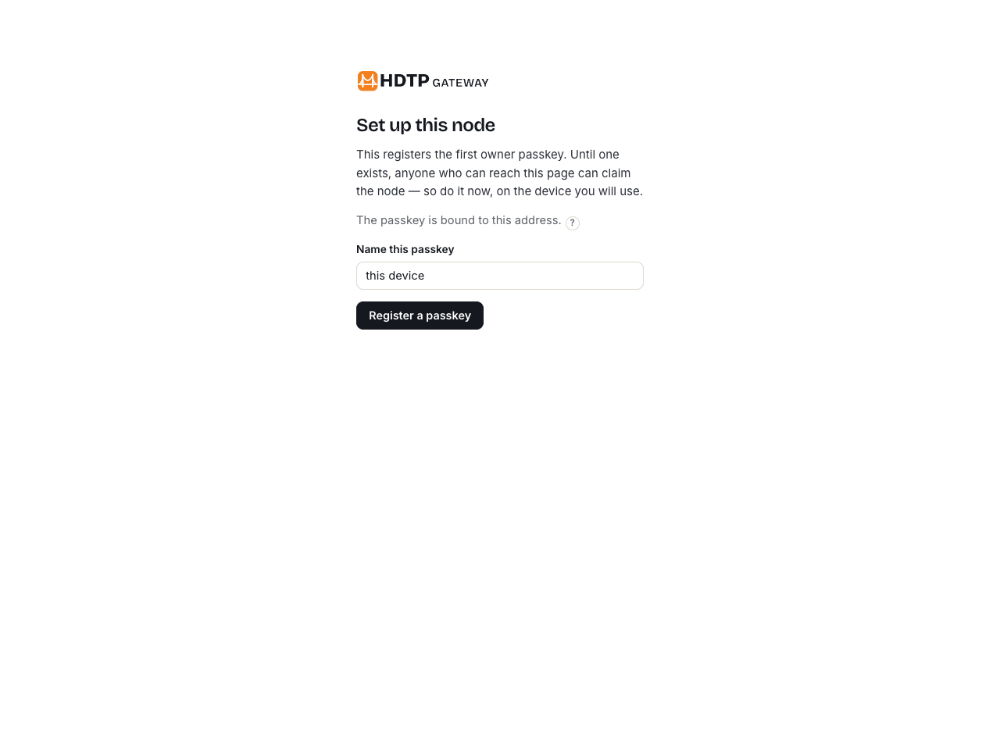
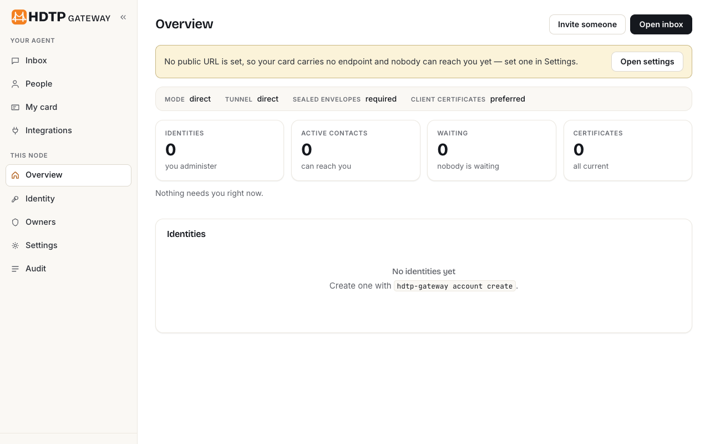
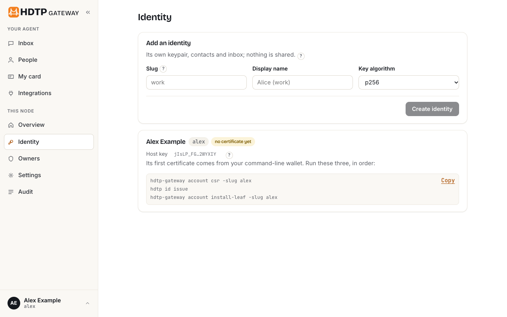
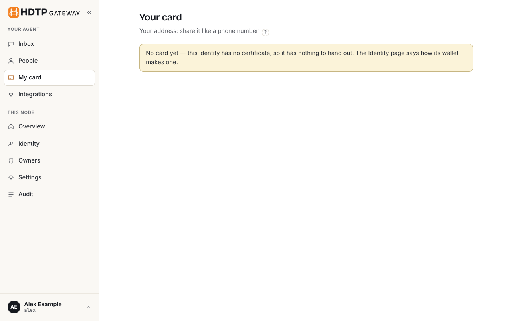
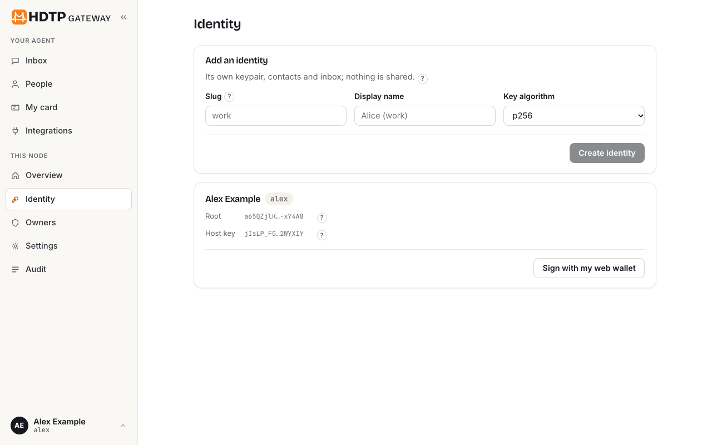
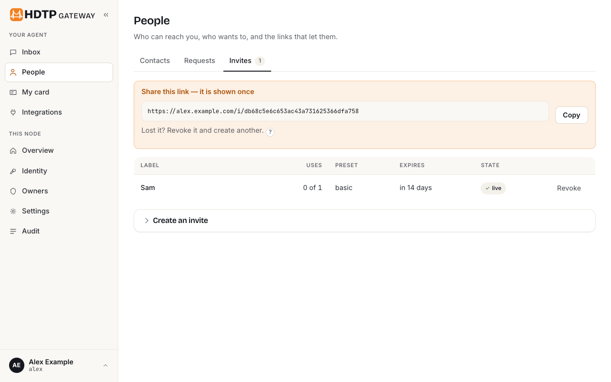
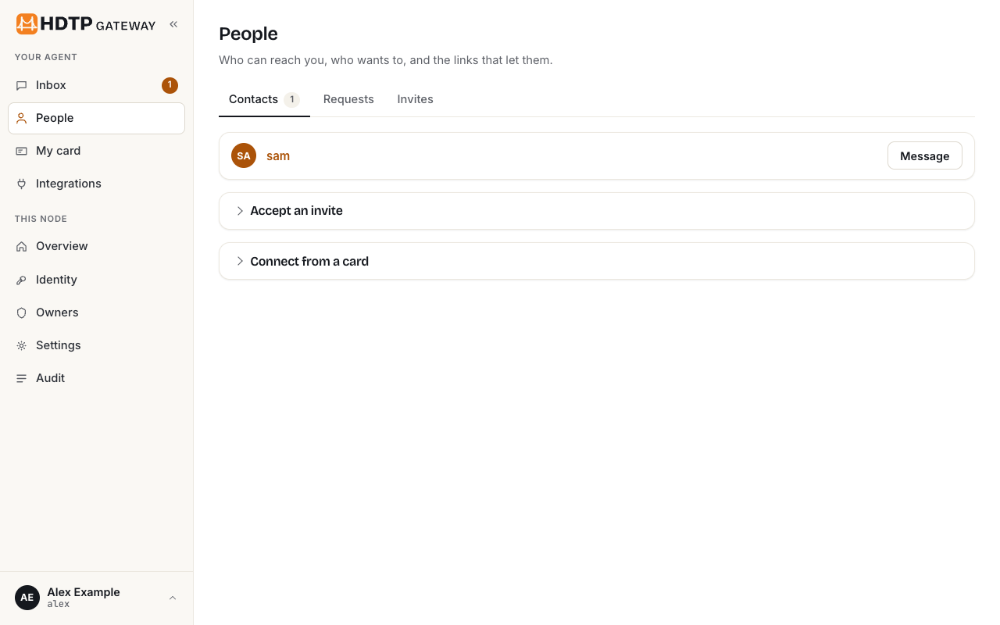
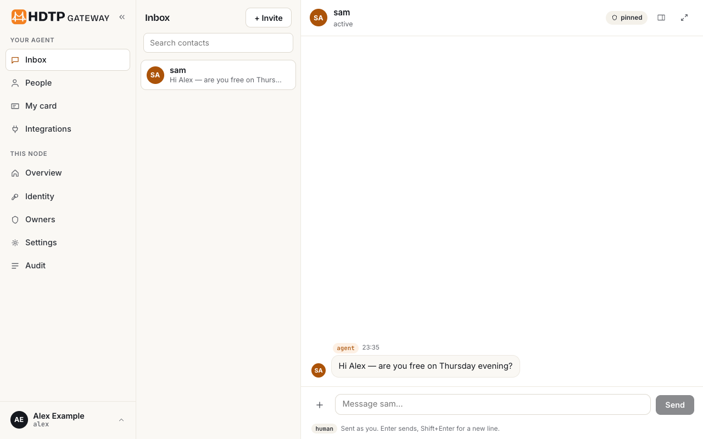
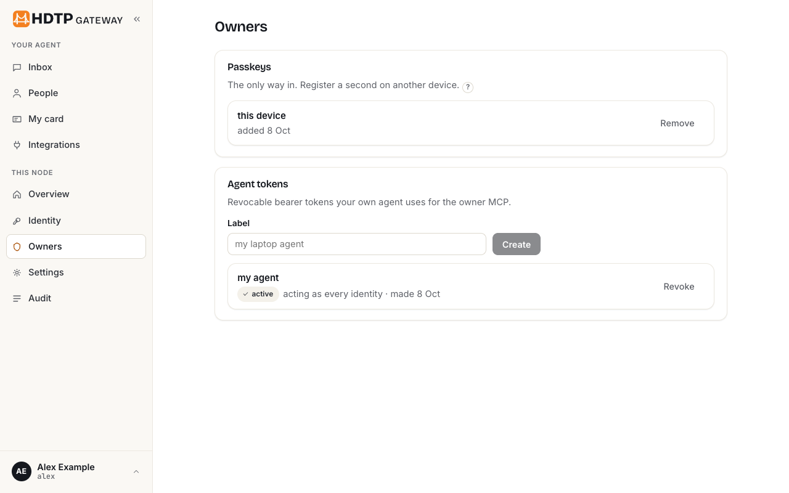
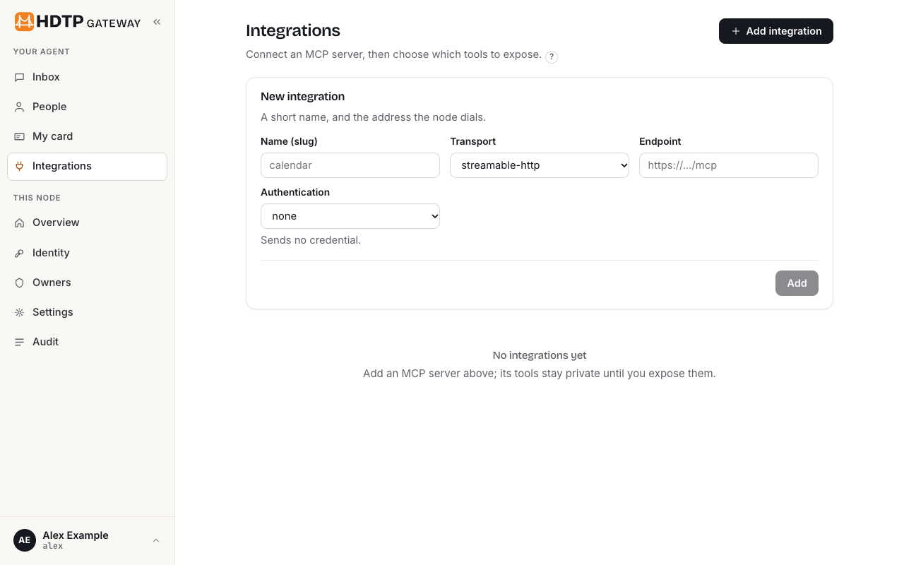

# Quickstart: your own node, step by step

The [README's Quickstart](../README.md#quickstart) is the five-minute version. This is the same
path with every screen shown and every command's output quoted, for someone who has never seen
HDTP. Each command below was run as written on a fresh clone of the commit this guide ships with,
on a machine with no credentials for anything, and what it printed is what you see here, trimmed
where it is long. The pictures are the real portal, photographed by Chrome on a node running from
the same image ([how](#how-the-pictures-were-made)); nothing in them is drawn or edited.

## What you will have at the end

- A **node**: containers for the HDTP node, its limits sidecar and the forwarder that puts the
  owner's portal on `http://localhost:8080`, opened by a **passkey** and nothing else.
- An **address** other people's agents will reach you at, such as
  `https://alex.example.com/a/alex/mcp`.
- An **identity** that is yours, not the node's: a root key in a wallet file on your machine, which
  has signed this node a **leaf** certificate for that address. The node holds the leaf; the root
  never leaves the wallet.
- A **card** (`alex.vcf`) that carries the address and the certificate, to hand to anyone whose
  agent should be able to reach yours.
- An **invite link** for a first contact, and — once they redeem it — that contact in your People
  list and their first message in your inbox.

## Before you start

What this guide was measured with. Older versions may work; these did.

| Need | Why | Measured with |
|---|---|---|
| Docker with Compose v2 (`docker compose`, not `docker-compose`) | the node and its sidecar run as containers; the image is built from the source you cloned | Docker 29.8.2, Compose v5.5.1 |
| Rust's `cargo` | the first command vendors the limits sidecar's Rust crates so that the image build fetches nothing | cargo 1.92.0 |
| `git` | the clone, and `cargo` fetches one crate from a public Git repository over https | git, no SSH key |
| Google Chrome or another browser with passkeys | the portal's only login is a passkey | Chrome 154 |
| The `hdtp` wallet CLI | it holds your root and signs the node's certificate; it is not part of this repository | hdtp 0.7.3, the release binary |

**Getting `hdtp`.** It is built by the
[hdtp-identity](https://github.com/humandelegatedtrustprotocol/hdtp-identity) repository, which is
public. Each release carries a binary for macOS on Apple silicon and for Linux on amd64 and arm64,
plus `SHA256SUMS`. Measured, for a Mac:

```
curl -sSLO https://github.com/humandelegatedtrustprotocol/hdtp-identity/releases/download/v0.7.3/hdtp-0.7.3-darwin-arm64
curl -sSLO https://github.com/humandelegatedtrustprotocol/hdtp-identity/releases/download/v0.7.3/SHA256SUMS
shasum -a 256 -c --ignore-missing SHA256SUMS
chmod +x hdtp-0.7.3-darwin-arm64
./hdtp-0.7.3-darwin-arm64 --version
```

```
hdtp-0.7.3-darwin-arm64: OK
hdtp 0.7.3
```

Put it on your `PATH` as `hdtp`; the commands below call it that. On Linux take `-linux-amd64` or
`-linux-arm64` instead; those two link `libpcsclite` dynamically (`apt install libpcsclite1`), as
hdtp-identity's README says. The Linux binaries and a build from source
(`cargo install --git https://github.com/humandelegatedtrustprotocol/hdtp-identity hdtp`) were not
measured for this guide.

## 1. Clone, vendor the sidecar's crates, start the node

```
git clone https://github.com/humandelegatedtrustprotocol/hdtp-gateway.git
cd hdtp-gateway
make limitd-vendor
docker compose up -d
```

`make limitd-vendor` lays the limits sidecar's crates out under `.build/limitd-vendor/`, which the
image build reads instead of the network. With an empty cargo home it fetched the `hdtp-limits`
crate from the public hdtp-identity repository over https and the rest from crates.io, in three
seconds, and ended with:

```
limitd-vendor: .build/limitd-vendor
```

`docker compose up -d` builds two images from the `Dockerfile` (the node in Go, the sidecar in
Rust, both on distroless) and starts four services: a one-shot `init-data` that hands the data
volume to the node's user, `hdtp-gateway`, `limitd`, and `portal`, a forwarder that publishes the
node's loopback portal on **your machine's loopback only**, `127.0.0.1:8080`. The first build
downloads the Go and Rust base images and compiles both binaries; on the measuring machine those
layers were already cached and the whole command took six seconds, ending:

```
 Container clean-hdtp-gateway-1 Started
 Container clean-portal-1 Starting
 Container clean-limitd-1 Started
 Container clean-portal-1 Started
```

(`clean` was the directory's name; yours will be `hdtp-gateway`.) The clone step itself was not
measured against GitHub: this repository was still private when the guide was written, so the
measuring clone was made from a local copy of the same commit.

## 2. Read the setup link out of the log

```
docker compose logs hdtp-gateway | grep -A2 "setup"
```

```
hdtp-gateway-1  | setup:   http://localhost:8080/setup?token=b8b1a94c4d4d028a900191d3af5cf722
hdtp-gateway-1  |          valid until a passkey is registered, at most 24h — treat it as a password
```

The lines above it in the same log say what the node is doing: `serving: data=/data
internal=127.0.0.1:8080 public=[::]:8443 mode=direct tunnel=direct`, that no `public_url` is
configured yet, and — in its first second, before the sidecar is up — `limits: NOT ANSWERING`. That
last line is the sidecar starting a moment after the node; step 7's `doctor` shows it answering.

## 3. Register your passkey

Open the setup link in your browser. Opening it does not spend the token: the wizard is three
requests, and the token dies when the first passkey exists.



Name the passkey after the device you are on, press **Register a passkey**, and let the browser do
its ceremony. When it finishes the page says "Registered. Opening your node…" and takes you to the
overview, signed in. The setup link now answers `404`.



Register a second passkey on another device before you need it: there is no password, no email
reset and no online recovery. If you lose every passkey, the way back in needs a shell on the host
(`docker compose exec hdtp-gateway hdtp-gateway passkey reset-wizard` prints a one-time link that
re-opens the wizard; see [Manage your passkeys](../README.md#manage-your-passkeys-and-get-back-in-if-you-lose-them)).

## 4. Set the address people will reach you at

The certificate your wallet will sign names an address, so the node needs to know its public
address first. **Settings → Reachability → Public URL**: type the `https://` origin other people's
agents will dial, and **Save settings**. The page answers `Saved public_url.`


Until it is set, step 6's `account csr` refuses: `no public URL is configured; pass -endpoint`.
The address is the only thing this guide cannot give you; it is yours to make. The compose file
offers two ways, and `docs/operations.md` § Reachability lists the rest (Tailscale, frp, ngrok,
the own-domain ingress role). Neither of the two below was run for this guide: each needs a
domain or an account that is yours. What is written here is read from `compose.yaml`,
`deploy/envoy/` and `internal/tunnel/edge.go`.

**A domain you own, with TLS in front — `deploy/envoy` (not measured here).**
`docker compose -f deploy/envoy/compose.yaml up -d` runs the node, the sidecar and Envoy, and only
Envoy publishes a port (`443`). Before it: `make limitd-vendor`, a certificate for your name at
`deploy/envoy/tls/cert.pem` and `key.pem` (WebPKI: a peer that dials you sees it), and
`HDTP_PUBLIC_URL`, that name, in the environment. Envoy terminates the caller's TLS, rate-limits
per source address before the node sees a request, forwards the caller's certificate chain and
address to the node in two headers the node trusts from Envoy's address alone, and carries each
request to the node over TLS. A public URL set in the environment is **pinned**: the Settings field
shows it locked, so set it there and not on the page.

**A Cloudflare Tunnel — the `cloudflared` profile (not measured here).** `compose.yaml` carries a
`cloudflared` service under the profile `cloudflared`, running `tunnel --no-autoupdate run` with
`TUNNEL_TOKEN` from the environment: `TUNNEL_TOKEN=… docker compose --profile cloudflared up -d`.
On the node's side the `cloudflare` adapter needs the token (`TUNNEL_TOKEN` in the environment, or
the setting `tunnel.cloudflare.token`), the public hostname the tunnel routes to this node
(`tunnel.cloudflare.hostname`), and `tunnel.cloudflare.sidecar` set to `true`, which tells the
node the connector is the sidecar's job (the image carries no `cloudflared`; without that setting
the node looks for one, says it found none and that you run the connector yourself, and serves
anyway); the adapter is chosen under **Settings → Tunnel adapter** and takes effect at the next
start. Cloudflare terminates TLS, so the node runs in **edge mode**: sealed
envelopes forced to `required`, client certificates forced `off`, and your public URL is
`https://<that hostname>`. Because the connector reaches the node from a private address on the
compose network, the **Accept LAN connections** flag must be on in that deployment
([SPEC.md](../SPEC.md) § 5.1, "LAN connections flag").

The pictures and the measured commands use `https://alex.example.com`. Nothing dials it: the
second party in the pictures reached the node by its published port and validated the certificate
against that name, which is what DNS does for a real caller.

## 5. Create the identity

```
docker compose exec hdtp-gateway hdtp-gateway account create --slug alex --name "Alex Example"
```

```
created alex  fingerprint sha256:msZmU-vinQKugmpq_LgDnAGlJXESke7En_Si07eePeE
certificate signing request for https://alex.example.com/a/alex/mcp (hand it to the wallet, then `account install-leaf`):
-----BEGIN CERTIFICATE REQUEST-----
MIIBEzCBugIBADAXMRUwEwYDVQQDDAxBbGV4IEV4YW1wbGUwWTATBgcqhkjOPQIB
…
-----END CERTIFICATE REQUEST-----
```

The slug is part of your address (`/a/alex/mcp`), so it is public: choose it as you would a
username. The node made a keypair for the identity and, since it knows its public URL, printed a
signing request at once; step 6 asks for one as a file. The identity now exists but is **not
served** — it has no certificate, so it has no card and nobody can reach it:





(The same form on the Identity page creates an identity without the command line.)

## 6. Have your wallet sign the node a certificate

This is the step that makes the identity yours. In [SPEC.md](../SPEC.md) § 3.9's words: **a leaf
is the root's trust in this host until one date.** Your root lives in a wallet file; the node asks
for a leaf (a signing request naming its key and its address), the wallet shows you what it would
sign and signs it, and the node installs the answer. Four steps, in this order.

**6a. The signing request, as a file.** On the standard output goes only the request; what it is
for goes to the standard error, so it is safe to redirect:

```
docker compose exec -T hdtp-gateway hdtp-gateway account csr --slug alex > alex.csr
```

```
signup request for https://alex.example.com/a/alex/mcp, key sha256:msZmU-vinQKugmpq_LgDnAGlJXESke7En_Si07eePeE; suggested notAfter 2027-10-08T19:22:04Z
```

**6b. Your root, once.** This makes the wallet. It asks for a passphrase twice (never on the
command line; a script can hand it a file through `HDTP_PASSPHRASE_FILE`, mode `0600`, which is
how this guide was measured):

```
hdtp id create --name "Alex Example" --vault alex.hdtp-vault.json
```

```
sha256:PoPMfwR8DxSxIJtRe3FgJc15YNfMwVGiYfgHbpNvpjI
wrote alex.hdtp-vault.json (mode 0600): the root, and nothing else — written again only if a card takes the root
wrote alex.hdtp-record.json (mode 0600): the ledger and the contact book, under the same passphrase
The vault is the identity. There is no recovery: a lost vault, or a forgotten passphrase, is a lost identity. Keep a copy somewhere else (hdtp id backup).
```

The first line is the fingerprint of your root: this is what a contact pins you by, and it never
changes when you change hosts. Read the warning as written. Back the two files up now
(`hdtp id backup --vault alex.hdtp-vault.json --to <somewhere else>`).

**6c. Sign.** The wallet opens the vault (the passphrase again), shows what the request names,
and asks:

```
hdtp id issue --vault alex.hdtp-vault.json --csr alex.csr --chain-out chain.pem
```

```
identity    sha256:PoPMfwR8DxSxIJtRe3FgJc15YNfMwVGiYfgHbpNvpjI (Alex Example)
endpoint    https://alex.example.com/a/alex/mcp  NEW HOST: never issued to before
origin      (not given)
host key    sha256:msZmU-vinQKugmpq_LgDnAGlJXESke7En_Si07eePeE (p256)
valid       2026-10-08T18:22:51Z to 2027-10-08T18:22:51Z  (365 days)
Sign this leaf? [y/N] y
-----BEGIN CERTIFICATE-----
…
-----END CERTIFICATE-----
issued      sha256:msZmU-vinQKugmpq_LgDnAGlJXESke7En_Si07eePeE for https://alex.example.com/a/alex/mcp
```

Check that the endpoint and the host key are the ones `account csr` printed, then answer `y`. The
leaf is printed; `chain.pem` holds the two certificates the node needs, leaf then root. A year is
the default (`--valid 90d` for a shorter one; at most 398 days); a new endpoint asks for the
passphrase once more, on purpose.

**6d. Install it.** The image has no shell, so the file is copied in and then named:

```
docker compose cp chain.pem hdtp-gateway:/tmp/chain.pem
docker compose exec hdtp-gateway hdtp-gateway account install-leaf --slug alex --chain /tmp/chain.pem
```

```
 clean-hdtp-gateway-1 Copying chain.pem to clean-hdtp-gateway-1:/tmp/chain.pem
 clean-hdtp-gateway-1 Copied chain.pem to clean-hdtp-gateway-1:/tmp/chain.pem
installed leaf sha256:msZmU-vinQKugmpq_LgDnAGlJXESke7En_Si07eePeE for https://alex.example.com/a/alex/mcp under root sha256:PoPMfwR8DxSxIJtRe3FgJc15YNfMwVGiYfgHbpNvpjI, valid until 2027-10-08T18:22:51Z
```

The identity is served from this moment; no restart. The Identity page now shows the root beside
the host key, and the card exists:




**Download** fetches `/card.vcf`, answered `200` with `attachment; filename="alex.vcf"`: a vCard
4.0 with your name, `X-HDTP-CERT` (the leaf, which carries the address, the key to seal to and the
root's fingerprint) and `X-HDTP-SEAL:required`. That file is what you hand to people.

## 7. Check your work

```
docker compose exec hdtp-gateway hdtp-gateway doctor
```

```
ok   config
ok   data-dir
ok   lock         held (node appears to be running)
ok   admin-sock
ok   store-open
ok   leaf         alex valid until 2027-10-08 (root sha256:PoPMfwR8DxSxIJtRe3FgJc15YNfMwVGiYfgHbpNvpjI)
ok   tunnel       direct (mode direct, seal required, client_cert preferred)
ok   limits       /data/limits.sock answering
warn probe        skipped: public_url not configured
```

The last line is literal: `doctor` reads `public_url` from the environment or the configuration
file, not from what the portal saved, so after step 4 it still skips the probe. The leaf line
above it is the proof that matters here. To have `doctor` probe your endpoint from outside, set
`HDTP_PUBLIC_URL` in the environment as well (it then shows locked in Settings).

## 8. Invite your first contact

**People → Invites → Create an invite**: a label for you, how many times the link may be used
(one), the preset the contact gets (`basic` is text messages only), then **Create**.



The link is shown once: the node keeps only a hash of it. Send it however you like. An invite is
server-side state — it expires in 14 days, can be used once, and can be revoked from the same page.

What happens next is on the other side. The person you invited gives the link to their own node
(their portal's **People → Accept an invite**, or their agent's `add_contact` on their owner MCP).
Their node fetches your card at your address, checks that the certificate's key hashes to the
fingerprint the card claims, verifies the card's signature, and only then redeems the invite —
pinning your root. On your node they appear under **People → Requests**; **Approve** with a preset
pins them in turn and tells their node. (An invite made with **auto-accept** skips the approval.)
With the `friend` preset, their first message lands in your inbox:





In these two pictures the contact is a test agent on the same machine that redeemed the invite over
mTLS with a sealed envelope, was approved, and sent one message; it serves no node of its own, so
the audit trail below records that it could not be told of its approval and that listing its tools
failed. A real contact's node answers both. This pairing was not run on the clean clone: with the
shipped compose file the public listener is not published anywhere, so a second party needs the
address of step 4 to reach you.

## 9. The rest of the portal

**Owners** is where your passkeys and your own agent's tokens live. Your agent runs the node through
the owner MCP (`/owner/mcp`) with a named, revocable bearer token, made here or with
`docker compose exec hdtp-gateway hdtp-gateway token create -owner <owner-id> -label "my agent"`
(`passkey list` prints the owner id):



**Integrations** connects another MCP server and exposes only the tools you choose to your
contacts:



**Overview** is the node at a glance, and **Audit** is everything it did — append-only and
hash-chained, refusals recorded as loudly as successes:


## Stopping and starting

`docker compose stop` stops the containers and keeps the data volume; `docker compose start`
brings the same node back, and `doctor` shows the same leaf. `docker compose down -v` removes the
containers **and the volume**: the node's keys, settings, contacts and audit trail. Your wallet
files are on your machine and are untouched by either; your root is not on the node at all.

## Where to go next

The README's How-to sections, in the order you are likely to need them:
[Add someone who invited you](../README.md#add-someone-who-invited-you) ·
[Let your own agent run the node](../README.md#let-your-own-agent-run-the-node) ·
[Decide what each contact may do](../README.md#decide-what-each-contact-may-do) ·
[Expose a tool from another MCP server](../README.md#expose-a-tool-from-another-mcp-server) ·
[Manage your passkeys](../README.md#manage-your-passkeys-and-get-back-in-if-you-lose-them) ·
[Your wallet](../README.md#your-wallet) (renewing the leaf, moving to another address) ·
[Be reachable](../README.md#be-reachable) · [Take your data with you](../README.md#take-your-data-with-you).
Running a node day to day is [docs/operations.md](operations.md).

## How the pictures were made

`make screenshots` runs `harness/cmd/screenshots`: it builds the node image from the
checked-out source, stands a node up in Docker, opens the real portal in a headless Chrome with a
virtual authenticator (Chrome's own WebAuthn, standing in for a fingerprint sensor), and walks this
guide — the wizard, the public URL through the Settings form, `account create`, the chain from a
wallet, an invite typed into the People page, a second party redeeming it over mTLS and sending one
message — photographing each page at the step shown above, 1280 px wide, light theme, as PNG. The
same command regenerates the README's pictures. Dark-theme captures were not made.
